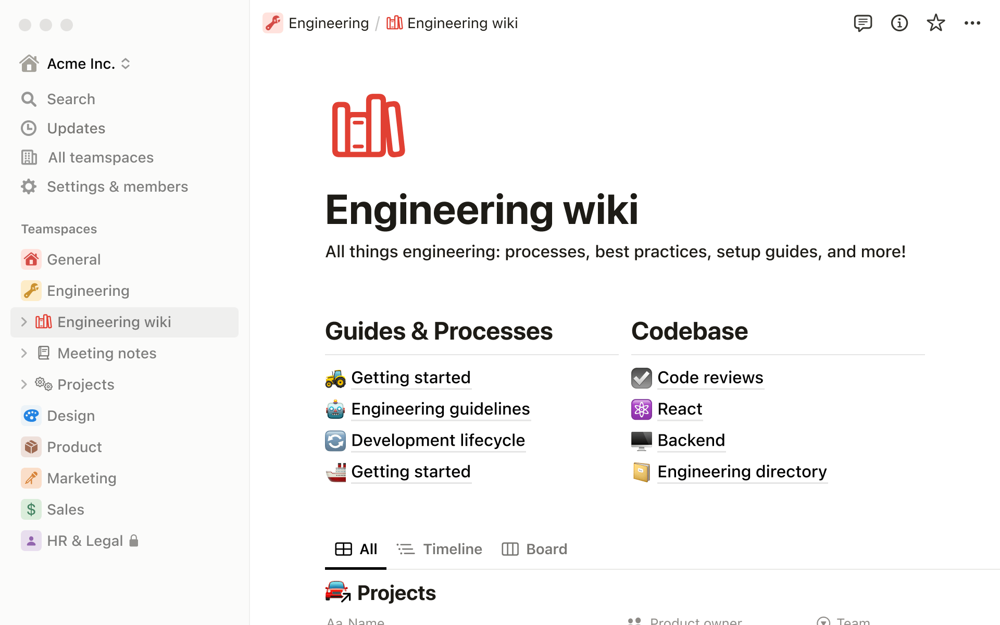

# Công cụ cần thiết

## Laptop / PC

- Để học lập trình cũng như làm việc trong ngành IT cần có cho mình một chiếc laptop / máy tính bàn (PC) với cấu hình vừa đủ để có thể chạy được các chương trình code một cách mượt mà

## Vở ghi keyword / thuật ngữ chuyên ngành

- Với những người mới trong quá trình học sẽ gặp những thuật ngữ chuyên ngành bằng tiếng anh. Để làm quen ta có thể ghi chú lại và học sau này, nâng cao kĩ năng tiếng anh của bản thân

## Account

- Nên tạo một tải khoản gmail rồi sau đó dùng tài khoản này để xác thực hết các tài khoản bên dưới
- Github: Đăng kí account tại [Github](https://github.com)
- Trello: Đăng kí account tại [Trello](https://trello.com/vi) (Có thể tải app cho win + mac)
- Notion: Đăng kí account tại [Notion](https://notion.so) (Có thể tải app cho win + mac)

## Trello [(Download)](https://trello.com/platforms?&aceid=&adposition=&adgroup=142092507256&campaign=18416577513&creative=632019849024&device=c&keyword=download%20trello&matchtype=e&network=g&placement=&ds_kids=p73326097897&ds_e=GOOGLE&ds_eid=700000001557344&ds_e1=GOOGLE&gclid=EAIaIQobChMIn8nsxpaJ_gIVEVdgCh1gCwOzEAAYASABEgLrbfD_BwE&gclsrc=aw.ds)

- Ứng dụng giúp quản lý công việc cá nhân hàng ngày, giúp nắm bắt được khối lượng công việc thực hiện

  

## VSCode (https://code.visualstudio.com)

- Công cụ dùng để soạn thảo code. Giống như các trình soạn thảo văn bản khác như MS Word, VScode sẽ hỗ trợ thêm tính năng giúp mình viết code được thuận tiện hơn như gợi ý code

  

## Notion (https://www.notion.so/desktop)

- Ứng dụng dùng để note, ghi chú lại những nội dung cần thiết như vở truyền thống, lần này sẽ là dùng app

## Github (https://github.com)

## Git (https://git-scm.com)

- Một tool chạy trong máy dùng để tương tác với các bên cung cấp dịch vụ lưu trữ code như github, gitlab,...
- Dùng để gửi code từ dưới máy của mình lên lưu trữ trên github, gitlab

  

## NodeJS [(Download)](https://nodejs.org/en)

- Môi trường dùng để chạy và thực thi các chương trình code (Sẽ tìm hiểu sau)
- Khi download chọn bản `Recommend for Most Users`

  
