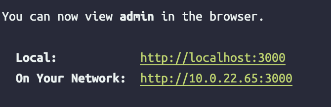

# Domain / URL / Hosting

## Domain

- Là phần tên chính của website trong một đường dẫn url dài ngoằng. Giúp ta nhận diện được website đó là của thương hiệu hay công ty nào. Tác dụng của domain này thường đại diện thay cho địa chỉ IP (rất khó nhớ) của server đang chạy website đó và sẽ được truy cập thông qua request gửi từ phía client

- Domain name thường được quản lý bởi các cơ quan đăng kí tên miền. Bất kì cá nhân/công ty nào muốn tạo một website đều sẽ đăng kí một tên miền với các cơ quan này.

- Có 3 thành phần quan trọng:
  - Type of server: Web server www
  - Subdomain
  - Host name / Domain name
  - Top-level domain: Phần cuối của domain name đại diện cho loại website (com, org, gov, edu, …)

## Domain hoạt động như thế nào?


## URL

Là một chuỗi được hiển thị trên trình duyệt. Bao gồm cả domain name và toàn bộ cấu trúc của url path như protocol, subdomain, params, fragment… Ví dụ trong domain name ở dưới thì [`cloudflare.com`](http://cloudflare.com/) được gọi là domain name, `https` là protocol và `/learning/` là một path cụ thể nào đó trong website

```
https://client.cloudflare.com/page/group/...
```

## So sánh Domain & url

| Domain                                                                                           | URL                                                                                   |
| ------------------------------------------------------------------------------------------------ | ------------------------------------------------------------------------------------- |
| Thay thế dịa chỉ IP. Giúp nhận diện được website                                                 | Địa chỉ web. Nhưng nó sẽ là địa chỉ cụ thể để chuyển hướng trực tiếp tới trang web đó |
| Domain name là một chuỗi kí tự gần gũi và dễ hiểu với con người hơn thay vì 1 địa chỉ IP khó nhớ | Một dãy kí tự đầy đủ giao thức, world wide web, và cả domain của trang web            |

> Có thể nói domain như địa chỉ nhà và URL là toàn bộ chỉ dẫn điều hướng đến địa chỉ đó.

## DNS (Domain Name Server)


DNS là hệ thống phân giải tên miền, có nhiệm vụ chuyển đổi các domain name thành các địa chỉ IP tương ứng với tên miền đó (trong lúc mua hostname đã config domain name trỏ về địa chỉ IP của server) và ngược lại.

Vd: Giúp phân giải địa chỉ và tìm đến server chứa website khi user gõ url https://www.google.com.vn/ và yêu cầu truy cập thì DNS sẽ chịu trách nhiệm chuyển đổi chuỗi url đó thành địa chỉ IP kiểu 123.45.677.136 và ngược lại. Từ địa chỉ IP thành url.



## Hosting

Hosting là một không gian lưu trữ được chia nhỏ trong các máy server. Giúp đặt các website, app
Khi đăng kí dịch vụ hosting nghĩa là đang thuê một chỗ chứa trên server mà phía bán hosting cung cấp để upload project web của mình lên server để website có thể hoạt động được 24/7
Sự khác nhau giữa Hosting và Domain

- Sau khi mua hosting và tải project lên thì cơ bản website đang chạy trên một server. Người dùng có thể truy cập bằng cách nhập địa chỉ domain và url tương ứng vào trình duyệt web.

- Đối với bên cho thuê hosting thì họ sẽ có các hệ thống server lưu trữ cho người thuê/mua hosting. Tuỳ vào các gói do bên cho thuê đưa ra thì sẽ có khoảng lưu trữ với cấu hình phù hợp.

- Đối với người thuê hosting thì sau khi mua hosting sẽ upload project lên sau đó cấu hình cho domain trỏ về địa chỉ IP của server

- Lợi ích của hosting:
  - Dành cho kinh doanh, sẽ được nhiều người biết đến thông qua tên miền (domain) hoặc địa chỉ IP
  - URL sẽ thân thiện với người dùng hơn là dãy địa chỉ IP khó nhớ
  - Cần phải có hosting thì website của mình mới go global. Dữ liệu và mục đích của website mới được chia sẻ trên mạng và tiếp cận được mọi người
