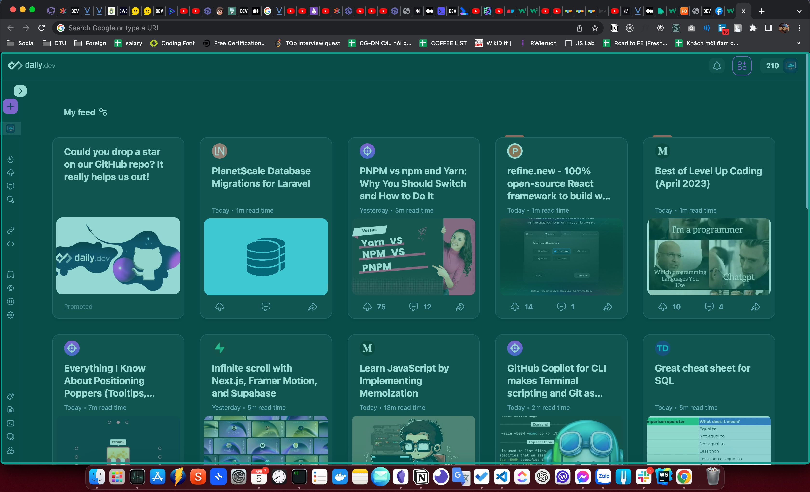
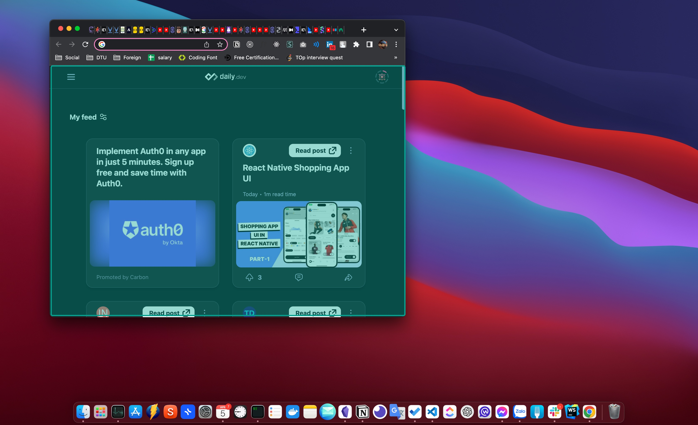
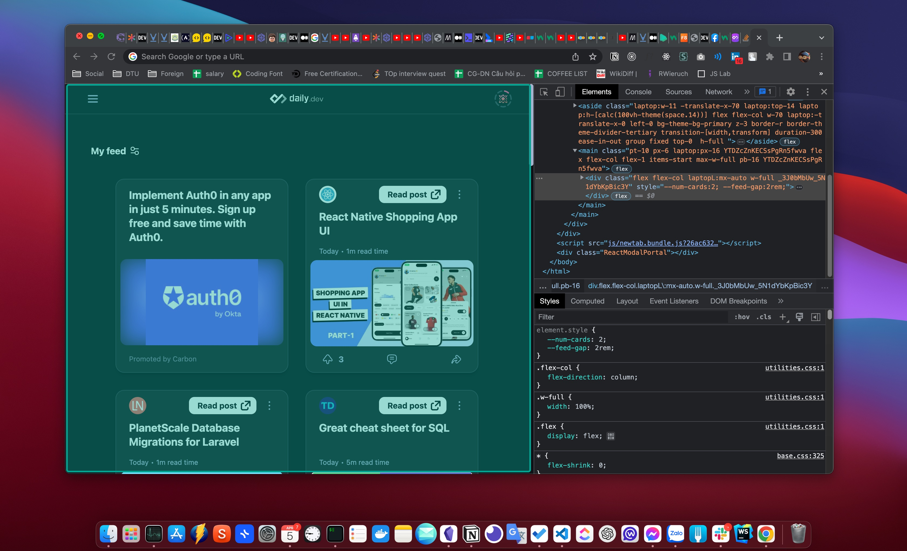

# Browser (Trình duyệt)

# Định nghĩa

- Browser là một ứng dụng hay một phần mềm được cài trên hệ điều hành máy tính, giúp người dùng có thể truy cập được những trang web thông qua mạng internet

- Các browser phổ biến hiện nay bao gồm: Chrome, MS Edge, Firefox, Opera,...

# Viewport

- Là phần có thể nhìn thấy được của màn hình, không bao gồm các cửa sổ bật lên như dev tool, thanh bookmark, thanh tiêu đề,...
- Giao diện của trang web sẽ chỉ hiển thị trên phần diện tích này và bố cục sẽ co giãn cho phù hợp với từng kích thước của trình duyệt

- Ở các hình bên dưới phần viewport được đánh dấu màu xanh

  
  
  

# Cách trang web được render lên trình duyệt

- Browser thông qua url trên thanh address gửi request đến server

- Server nhận request, xử lý và trả về response cho browser gồm file html chứa nội dung trang web và các link external resources như css, image, font, javascript và các util libraries.
