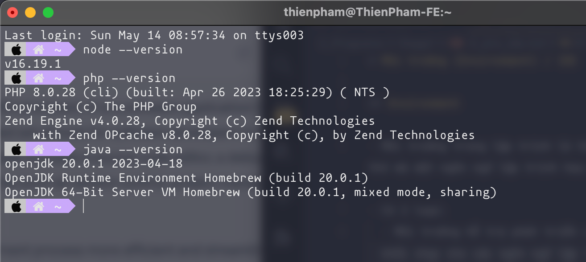
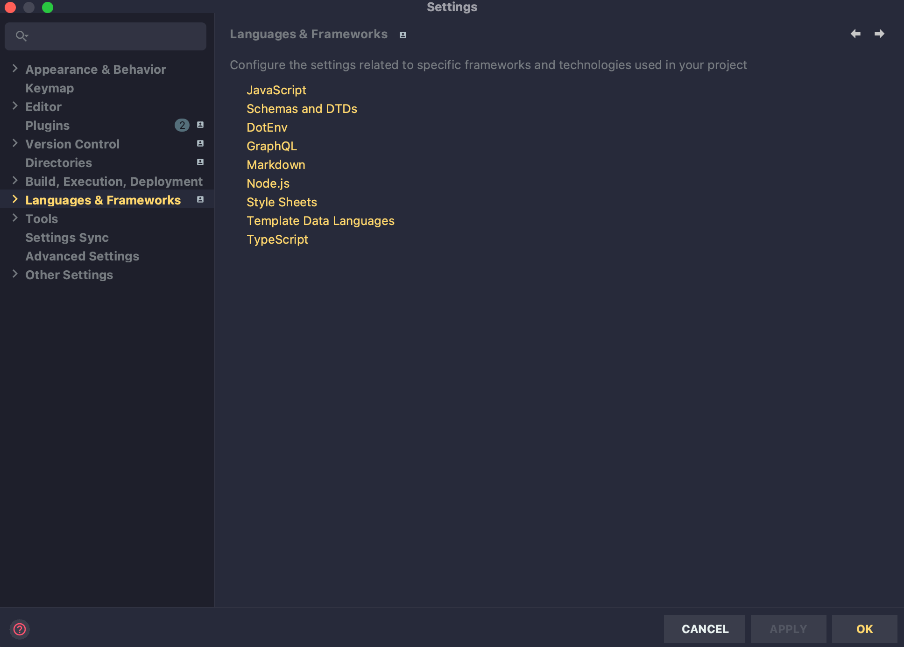

# Môi trường (Environment) / IDE

## Software Environment

- Hay còn gọi là Runtime Environment
- Dùng để chạy và thực thi các ứng dụng phần mềm, bảo đảm chúng hoạt động như một thể thống nhất và ổn định.
- Bao gồm các thành phần: phần mềm, phần cứng, hệ điều hành, các thư viện, tập tin hệ thống và các ứng dụng khác phụ trợ
- Các nôi trường này thường được cài đặt trên máy cá nhân của dev, và phải cài đặt riêng rẽ từng cái một

  

## Integrated Development Environment (IDE)

- Môi trường tích hợp phát triển cung cấp cho các nhà phát triển một tập hợp các công cụ tiện ích phục vụ việc lập trình như:

  - Code editor (VSCode, WebStorm,...)
  - Trình compiler (NodeJS, PHP compiler, Java JDK, ...)
  - Trình debugger gỡ lỗi
  - Trình quản lý phiên bản (git,...)
  - Trình quản lý thư viện (yarn, npm,..)
  - Trình gợi ý code - format code

- Môi trường tích hợp phát triển cho phép các lập trình viên phát triển ứng dụng dựa trên nhiều ngôn ngữ hay framework khác nhau mà không cần phải cài các biến môi trường riêng biệt vào máy. Giúp phát triển ứng dụng nhanh và hiệu quả hơn

  
