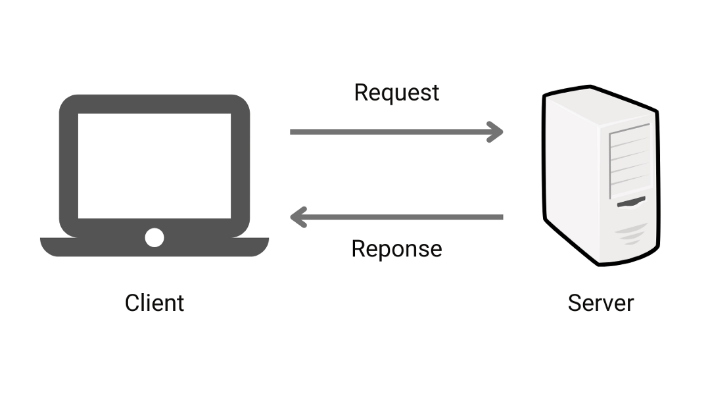

# Mô hình Client-Server

Đây là một mô hình kết nối truyền tải dữ liệu phổ biến và rất nhiều website trên thế giới hiện tại đang hoạt động theo mô hình này.

Để dựng được một mô hình kinh điển Client - Server ta cần ít nhất 2 máy tính. Một máy đóng vai trò là client và một máy đóng vai trò là server

- Client: Có thể là PC, laptop cá nhân, điện thoại hay bất cứ thiết bị nào dùng để gửi request thì đều được gọi là client.

- Server: Ngược lại với client, server cũng là một máy tính riêng biệt và có cấu hình đặc biệt. Dùng để xử lý request từ phía client và lưu trữ dữ liệu.

- Sau này khi có các hệ thống lớn và phức tạp. Ta cũng có thể có nhiều máy client và máy server được kết nối với nhau

> Vai trò của 2 máy trong mô hình này vẫn có thể đổi ngược cho nhau (client thành server và server thành client)
