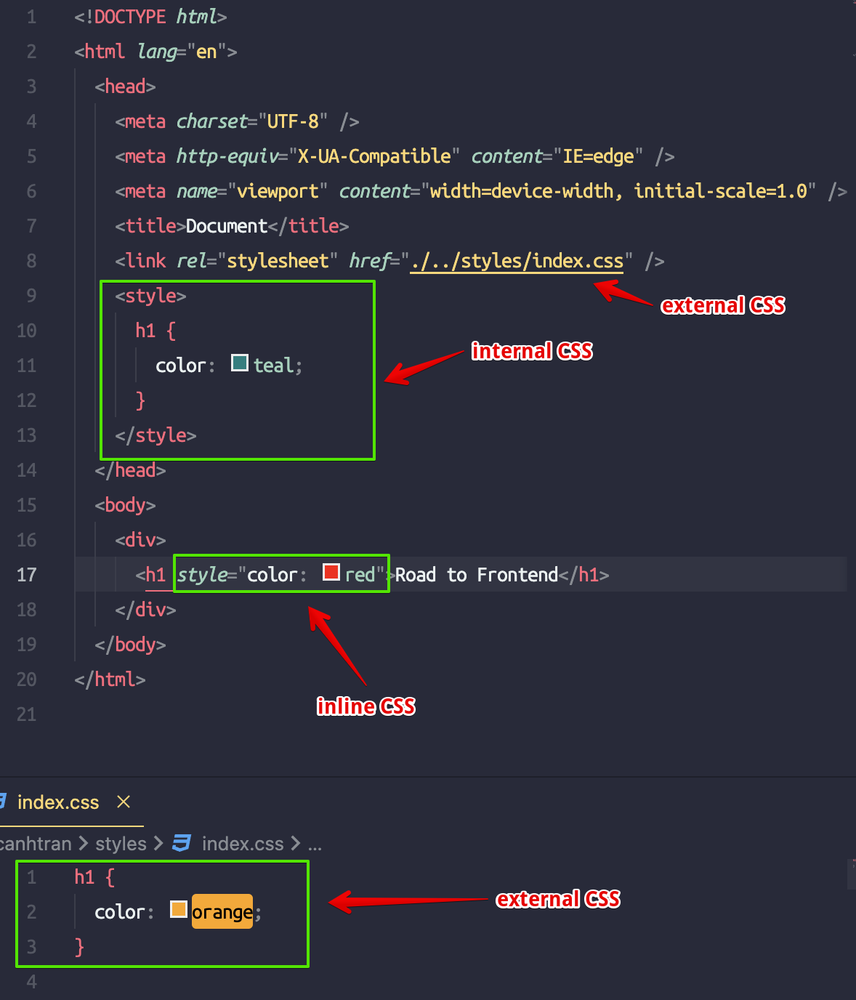

# Độ ưu tiên CSS

https://developer.mozilla.org/en-US/docs/Web/CSS/Specificity

## Định nghĩa

- CSS cung cấp nhiều loại selector và cách sử dụng nó trong file CSS. Nếu như có các selector giống nhau nhưng thuộc tính khác nhau thì cái nào sẽ được áp dụng trước và độ ưu tiên giữa chúng sẽ như thế nào ?

```html
<html>
  <head>
    <style>
      h1 {
        color: blue;
      }

      .heading {
        color: red;
      }

      #heading {
        color: green;
      }
    </style>
  </head>
  <body>
    <h1 class="heading" id="heading">Hello See you again</h1>
  </body>
</html>
```

## Hoàn cảnh

- Trong lúc làm dự án, số lượng html và css cùng với bộ selector cho nó sẽ rất nhiều, nếu có một vài chỗ cần update nhưng khi sửa code thì element đó vẫn không thay đổi có thể lí do là đang có các selector khác có độ ưu tiên cao hơn chỗ selector mình sửa.
- Trong những file css dài và phức tạp thì ta không biết style nào đang apply cho element nào

=> Việc nắm được độ ưu tiên cho selector trong CSS sẽ giúp ta dễ dàng nhận biết được vấn đề, tìm được nguyên nhân và dễ dàng khắc phục

## Các loại độ ưu tiên

- Có 2 loại độ ưu tiên đó là `độ ưu tiên khi import file css vào file html` và `độ ưu tiên của các selector`

  ### Độ ưu tiên giữa các cách import css

  - `Inline style` có độ ưu tiên cao nhất để áp dụng css lên html element
  - 2 cách còn lại là `internal` và `external` sẽ có độ ưu tiên ngang nhau => Cách nào được viết ở dòng dưới thì sẽ được apply

  

  ### Độ ưu tiên giữa các Selectors

  - Để dễ hiểu thì ta có thể tính point để từ đó có thể biết được point càng cao thì độ ưu tiên càng cao => CSS cho selector đó sẽ được áp dụng

    | Selectors  | Points  |
    | ---------- | ------- |
    | !important | Maximum |
    | inline     | 1000    |
    | #id        | 100     |
    | .class     | 10      |
    | tagname    | 1       |
    | \*         | 0       |

  - Code ví dụ so sánh selector tag name và tag name + class

    ```html
    <!DOCTYPE html>
    <html lang="en">
      <head>
        <meta charset="UTF-8" />
        <meta http-equiv="X-UA-Compatible" content="IE=edge" />
        <meta name="viewport" content="width=device-width, initial-scale=1.0" />
        <style>
          /* Priority: 1 + 10 = 11  */
          h1.title {
            color: turquoise;
            color: turquoise !important; /* Priority: 11 + 999999  */
          }

          /* Priority:  1 + 100 = 101 */
          h1#win {
            color: red;
          }
        </style>
      </head>
      <body>
        <div>
          <h1 class="title" id="win">Road to Frontend</h1>
        </div>
      </body>
    </html>
    ```

> Độ ưu tiên của css được sắp xếp từ thấp đến cao:
> Tag name < class / attribute < id < inline < !important
