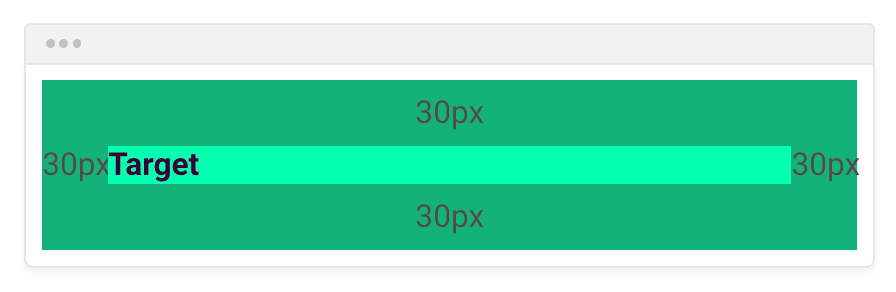

# Box Model

## Định nghĩa

- Khi code HTML ta đều cố gắng định nghĩa cho các element đó trở thành một box model trong layout, từ đó có thể dễ dàng thông qua các selector và các thuộc tính css để xử lý và quyết định cách nó hiển thị

## Thành phần

- Thành phần của một box model gồm có 4 phần:

  - `Content`: Phần nội dung của box model, có thể là text, hình ảnh, hay chỉ là khoảng trống,...
  - `Padding`: Phần khoảng cách giữa content đến border
  - `Border`: Là một đường bao bọc phần padding và content bên trong
  - `Margin`: Phần khoảng cách bên ngoài của box model. Giúp ngăn cách giữa box model này với box model khác trong layout

    

## Áp dụng trên layout


## Padding

- Là khoảng cách tính từ content đến border trong Box Model. Giúp content có khoảng cách với border mà không bị dính với nhau, ảnh hưởng đến thẩm mỹ UI.

  - `padding: 0`: Nếu không có padding. Content sẽ bị dính vào thành border.

    

  - `padding: 30px`: Padding khi được set value, content sẽ cách border một khoảng trông dễ nhìn hơn và UI đẹp hơn.

    

- Syntax:

  - Mặc định padding cung cấp các thuộc tính cho từng hướng của element `padding-top`, `padding-right`, `padding-bottom`, `padding-left`.

    ```css
    .title {
      padding-top: 10px;
      padding-right: 20px;
      padding-bottom: 30px;
      padding-left: 40px;
    }
    ```

  - Ngoài ra còn có một số shorthand linh hoạt trong các tình huống sử dụng:

    ```css
    .title {
      /* top/right/bottom/left */
      padding: 10px;
    }

    .title {
      /* top/bottom - left/right */
      padding: 10px 10px;
    }

    .title {
      /* top - left/right - bottom */
      padding: 10px 10px 10px;
    }

    .title {
      /* top/right/bottom/left */
      padding: 10px 10px 10px 10px;
    }
    ```

## Margin

- Là khoảng cách tính từ border ra bên ngoài phạm vi box model. Cũng có thể gọi là khoảng cách giữa các box model với nhau. Dùng để căn chỉnh khoảng cách giúp ta phân biệt được các element trong cùng một layout với nhau

- `margin: 0`: Nếu không có margin, các element sẽ dính và liền kề nhau.

  

- `margin: 30px`: Nếu có margin, element sẽ có khoảng cách với các element khác.

  

- Syntax:

  - Mặc định margin cung cấp các thuộc tính cho từng hướng của element `margin-top`, `margin-right`, `margin-bottom`, `margin-left`.

    ```css
    .title {
      margin-top: 10px;
      margin-right: 20px;
      margin-bottom: 30px;
      margin-left: 40px;
    }
    ```

  - Ngoài ra còn có một số shorthand linh hoạt trong các tình huống sử dụng:

    ```css
    .title {
      /* top/right/bottom/left */
      margin: 10px;
    }

    .title {
      /* top/bottom - left/right */
      margin: 10px 10px;
    }

    .title {
      /* top - left/right - bottom */
      margin: 10px 10px 10px;
    }

    .title {
      /* top/right/bottom/left */
      margin: 10px 10px 10px 10px;
    }
    ```

### Margin collapsing

- Xảy ra ở 2 phần tử liền kề nhau. Phần tử trên có margin-bottom và phần từ dưới có margin-top. Thì số margin nào lớn hơn sẽ được lấy và ignore cái còn lại
- Cách hay dùng ở đây là ta sẽ căn padding hay margin theo một chiều duy nhất (top hoặc bottom). Tránh việc element này căn top, element kia căn bottom dẫn đến việc bị collapsing

  

## Border

- Là phần biên giới ngăn cách giữa content + padding với bên ngoài

  

- Các thuộc tính cho border hay sử dụng:

  - border-width: Độ dày của border
  - border-style: Kiểu đường net của border (nét đứt, nét liền, nét gạch)
  - border-color: Màu border
  - border-radius: Bo viền border
  - border-sides: `border-side-width/style/color`: Style cho từng cạnh của border

    ```css
    p {
      border-top-style: dotted;
      border-right-style: solid;
      border-bottom-style: dotted;
      border-left-style: solid;
      border-top-width: 3px;
    }
    ```

  - Shorthand: Syntax viết tắt kết hợp của border-width, border-style, border-color
    ```css
    p {
      border: 5px solid red;
    }
    ```

## Box-sizing

https://www.youtube.com/watch?v=kAI0D5CJjpY


- Là thuộc tính dùng để điều chỉnh kích thước element trong việc hiển thị phụ thuộc vào việc tính toán width và height dựa trên content, padding, border

  - `box-sizing: content-box`: Default, width và height sẽ chỉ tính dựa trên kích thước của content
  - `box-sizing: border-box`: Width và height được tính toán dựa trên kích thước của content + padding + border nếu có

- Trường hợp sử dụng: Thường sử dụng với giá trị `border-box` trong việc khởi tạo dự án, setup một vài property global như: reset css, config box-sizing, ...

## width / min-width / max-width / height / min height / max height

https://www.w3schools.com/css/css_max-width.asp

```css

```
