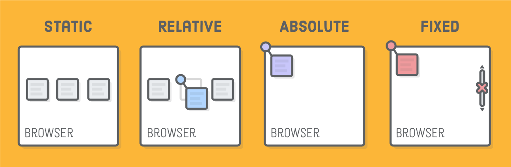
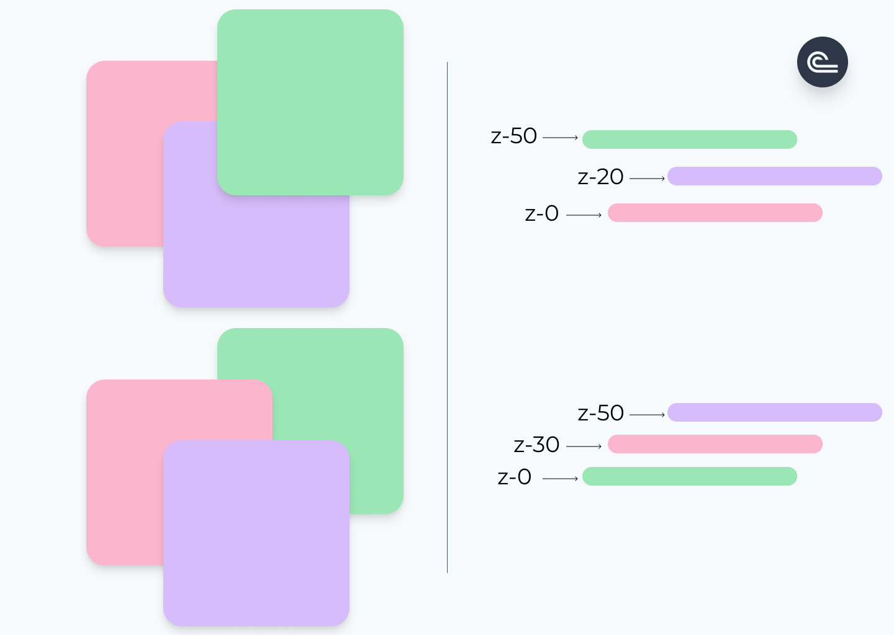
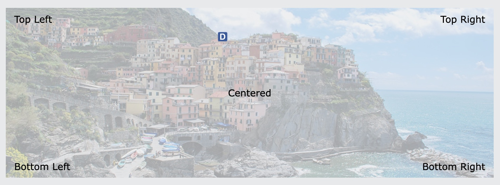

# CSS Position

https://developer.mozilla.org/en-US/docs/Web/CSS/position



## Định nghĩa

- Thuộc tính CSS position quyết định vị trí hiển thị của một element trên viewport của trình duyệt bằng việc căn chỉnh toạ độ 4 hướng top right bottom left
- CSS position cung cấp một vài giá trị phổ biến để sử dụng bao gồm: absolute, relative, fixed, static

## Normal flow

- Khái niệm này định nghĩa thứ tự hiển thị của các thành phần lên trang web. Giống như việc viết văn bản, ta sẽ viết theo chiều từ trái qua phải, từ trên xuống dưới thì flow của trang web cũng vậy. Nó cũng sẽ hiển thị từ trái qua phải và mặc định hiển thị từ trên xuống dưới

## position: static

- Đây là giá trị mặc định của thuộc tính. Element được set giá trị này sẽ nằm yên và không bị ảnh hưởng khi được set các thuộc tính định vị như `top, right, bottom, left, z-index`

## position: relative

- Element được set giá trị này sẽ có vị trí tương đối với vị trí gốc của nó dựa theo chỉ số top right bottom left
- Khi element đã được hiển thị ở vị trí khác rồi thì vị trí gốc ban đầu của nó trên layout vẫn được giữ nguyên. Giống như kiểu bay đi thôi chứ chỗ trống vẫn còn đó không có ai giành cả

## position: absolute

- Khác với relative, absolute sẽ làm cho element tách khỏi layout và các element khác sẽ nhanh chóng lấp vào chỗ trống của element bị tách đó dựa theo `normal flow`

- Element được set giá trị này sẽ có vị trí tuyệt đối so với phần tử cha gần nhất cũng được định nghĩa thuộc tính position (bất kể giá trị gì trừ `static`). Vị trí mặc định element là top, left của element cha

- Nếu không tìm thấy element cha có thuộc tính position, nó sẽ tìm thêm ra ngoài các element khác đến khi nào tìm được có phần tử có thuộc tính position

## position: fixed

- Cách hoạt động của thuộc tính này cũng giống như absolute. Element sẽ được tách khỏi layout và không bị ảnh hưởng kể cả có scroll. Sự khác biệt ở đây là element sẽ được cố định tại vị trí tương đối với element cha trực tiếp chứa nó và tương ứng với viewport

- Element được set giá trị này dựa vào chỉ số top right bottom left sẽ có vị trí tương đối với viewport,

## position: sticky

- Là sự kết hợp giữa `relative` và `fixed`. Tức là phần tử vẫn ở trạng thái bình thường trong layout nhưng khi được scroll đến vị trí đã định thì nó sẽ bắt đầu cố định lại và từ đó trở nên fixed

- Thuộc tính này hạn chế dùng vì hiện tại có một số trình duyệt vẫn chưa được hỗ trợ, nên nếu ta truy cập vào web bằng những trình duyệt đó thì thuộc tính này sẽ không hoạt động, rủi ro gây lỗi hoặc vỡ layout rất cao

## Z Index

- Đây là khái niệm không gian 3 chiều (trục Ox Oy Oz) áp dụng vào việc dàn layout web. Thuộc tính z-index sẽ giúp ta xếp lớp được các element khi chúng nằm chồng lên nhau. Cái nào xuất hiện trước, cái nào che lấp cái nào.

  

- Chỉ số z-index càng cao thì element sẽ càng nằm trên cùng. Chỉ số ngay tại browser viewport là 0, nếu element có chỉ số z-index âm thì sẽ không hiển thị, vì nó nằm sau viewport.

  

- Syntax:

  ```css
  .green-block {
    z-index: 1;
  }

  .orage-block {
    z-index: 2;
  }
  ```

## Các vị trí điển hình trong một phần tử element


