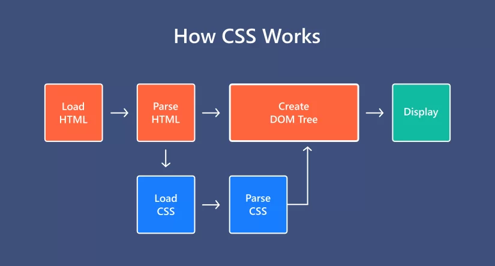

# CSS là gì ?

- Viết tắt của Cascading StyleSheet
- CSS là ngôn ngữ dùng để trang trí (style) cho các phần tử html
- Một element HTML khi hiển thị lên giao diện web sẽ là một phần thô. Và CSS sẽ quyết định cách mà một HTML element được hiển thị (theo phong cách nào, màu sắc như thế nào, vị trí ở đâu,...)

## Cách hoạt động

- Sau khi browser nhận được file html và trình duyệt bắt đầu parse HTML thành cây DOM, khi nào parse đến các link tải external resource cụ thể là css thì cùng thời điểm đó nó cũng sẽ load file CSS về và bắt đầu parse CSS thành CSSOM (Css Object Model) và apply lên các html element tương ứng theo độ ưu tiên css (css priority)
- `CSS is render-blocking`: Quá trình tải và thực thi CSS sẽ ngăn chặn việc hiển thị giao diện lên viewport cho đến khi xây dựng được CSSOM (render-blocking) chứ không ngặn chặn việc parser của browser parse code html thành cây DOM (parser-blocking)
