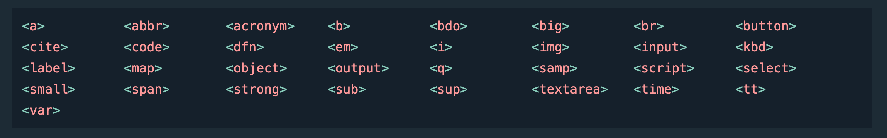

# CSS display

## Định nghĩa

- Display là một property của css, nó cung cấp các tuỳ chọn để hiển thị một phần tử trên trang web theo yêu cầu
- Một vài giá trị của property display hay sử dụng có thể kể đến như: 'none', 'flex', 'grid', 'inline', ...

## display: none

- Đúng như ý nghĩa của nó, none có nghĩa là không có gì. Html element khi được áp dụng thuộc tính này sẽ biến mất khỏi layout mà không để lại dấu vết

  ```css
  .my-element {
    display: none;
  }
  ```

## display: inline

- Chiều rộng sẽ bằng đúng phần content của element. Các element sẽ cùng nằm trên một hàng đến khi nào hết chiều rộng của viewport thì mới rơi xuống dưới
- Element có `display:inline` sẽ không thể set width, height, margin padding top-botto
- Element có `display:inline` có thể set được margin padding left-righ
- Tổng hợp các thẻ inline:

  

  

  ```html
  <!DOCTYPE html>
  <html>
    <head>
      <style>
        div {
          margin-top: 30px; /*  not work */
          margin-left: 50px; /*  works */
          padding-top: 10px; /*  not work*/
          padding-left: 10px; /*  works*/
          height: 100px; /*  not works */
          width: 100px; /*  not works*/
          background: teal;
          color: white;
        }
      </style>
    </head>
    <body>
      <div>The direction property</div>
      <div>The direction property</div>
      <div>The direction property</div>
    </body>
  </html>
  ```

## display: block

- Khác với display inline, thuộc tính này mặc định sẽ làm cho element mở rộng ra và chiếm trọn 1 dòng rộng bằng độ rộng của trình duyệt, đẩy hết các element khác xuống dòng
- Element có display block sẽ set được width height, padding margin top bottom left right đầy đủ
- Tổng hợp các thẻ html có display mặc định là block:

  

  

  ```html
  <!DOCTYPE html>
  <html>
    <head>
      <style>
        div {
          margin-top: 30px; /*  works */
          margin-left: 50px; /*  works */
          padding-top: 10px; /*  works*/
          padding-left: 10px; /*  works*/
          height: 100px; /*  works */
          width: 100px; /*  works*/
          background: teal;
          color: white;
        }
      </style>
    </head>
    <body>
      <div>The direction property</div>
      <div>The direction property</div>
      <div>The direction property</div>
    </body>
  </html>
  ```

## display: inline-block

- Là sự kết hợp của cả 2 thuộc tính display inline và display block
- Element có thuộc tính này sẽ vừa được hiển thị theo kiểu inline (không chiếm trọn một dòng) vừa có thể set được các thuộc tính như height width, margin padding top right bottom left như kiểu block

  

  ```html
  <!DOCTYPE html>
  <html>
    <head>
      <style>
        div {
          background: lightblue;
          color: white;
          border: 1px solid tomato;
        }

        div.first {
          display: inline-block;
          color: red;
          height: 50px; /* works */
          width: 120px; /* works */
          margin: 10px; /* works */
          padding: 10px; /* works */
        }
      </style>
    </head>
    <body>
      <div class="first">This is first div</div>
      <div>This is div</div>
      <div>This is div</div>
    </body>
  </html>
  ```

## display: float

- Thuộc tính này sẽ làm cho element trôi hẳn về một bên (trái hoặc phải)
- Ít phổ biến và chỉ dùng trong một số trường hợp cá biệt. Khi dùng xong lưu ý phải clear float đi không thôi nó sẽ làm tất cả phần layout còn lại trôi theo

  

  ```css
  img {
    float: right;
  }
  ```

  

  ```css
  img {
    float: left;
  }
  ```

## display: flex

- Xem thêm ở trang [Flexbox]()

## display: grid

- Xem thêm ở trang [Grid](/Programs/Stage2/)

## Lưu ý

### Magic Space ([link](https://viblo.asia/p/khoang-cach-bi-an-giua-cac-inline-block-elements-Do754qMXKM6))

- Đôi lúc giữa các element sẽ xuất hiện một khoảng trống khó hiểu mặc dù không có thuộc tính padding margin nào kiểm soát việc đó ví dụ như hình bên dưới. Đây không phải là lỗi mà đây là khoảng trống mặc định (như khoảng trống giữa các chữ cái trong một từ khi ta gõ văn bản)

  

  ```html
  <!DOCTYPE html>
  <html>
    <head>
      <style>
        div {
          background: lightblue;
          color: white;
          border: 1px solid tomato;
          display: inline;
          color: red;
        }
      </style>
    </head>
    <body>
      <div class="first">This is div</div>
      <div class="first">This is div</div>
      <div class="first">This is div</div>
    </body>
  </html>
  ```

- Cách khắc phục:
  

  - Viếc các thẻ liền kề nhau: Cách này sẽ làm code nằm hết lên một dòng và trở nên khó đọc với dev

    ```html
    <!-- prettier-ignore -->
    <body>
      <div class="first">This is div</div><div class="first">This is div</div><div class="first">This is div</div>
    </body>
    ```

  - Sử dụng margin với số âm
  - Set thuộc tính font-size
