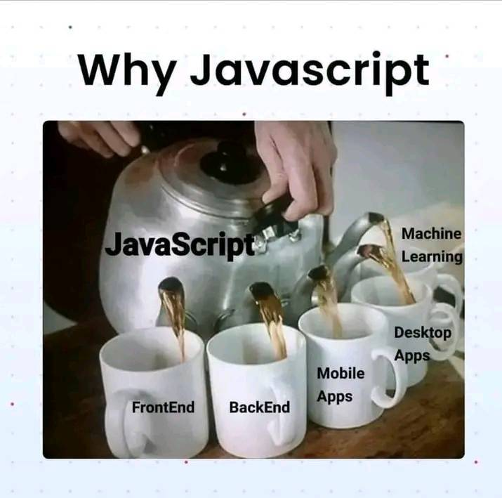
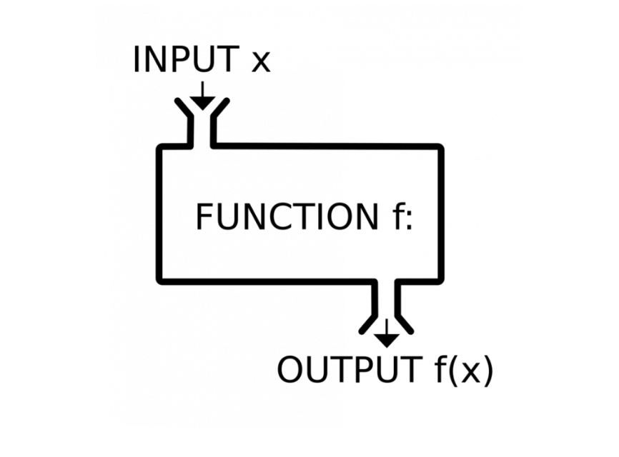

# Introduction

- JS là ngôn ngữ lập trình được tạo ra năm 1995 bởi Brendan Eich dùng để khiến trang web trở nên "sống động hơn", tương tác được với người dùng thông qua những xử lý theo yêu cầu của người dùng và tính toán đưa ra sự thay đổi trên giao diện web

- Ưu điểm:

  - Chỉnh sửa cấu trúc HTML và thay đổi content của nó
  - Can thiệp vào style css và thay đổi các giá trị
  - Làm cho element có thể phản ứng lại với hành động của user dựa trên việc gán các sự kiện và thêm hàm xử lý theo các sự kiện đó
  - Gửi request lên server để lấy dữ liệu
  - Lưu trữ dữ liệu phía client (local storage, session storage, ...)

- Nhược điểm:

  - JS chạy trong browser bị hạn chế vì tính năng của nó như con dao hai lưỡi có thể bị kẻ xấu lợi dụng thể gây thiệt hại ngược lại cho user (XSS,...)
  - Không truy cập được vào chức năng của hệ điều hành trên máy
  - Có thể kích hoạt tính năng mở camera, loa, location nhưng chỉ khi được user cấp quyền để hoạt động

    ```js
    let secret_mediaDevices = navigator.mediaDevices;
    secret_mediaDevices.getUserMedia({
      audio: true,
      video: true,
    });
    ```

- JS là ngôn ngữ có phân biệt chữ hoa - thường:

  - Một biến tên `myVariable` sẽ khác biến tên `myvariable`
  - Một giá trị `myValue` sẽ khác giá trị `myvalue`

## Vì sao lại là JavaScript ?

- Khi JS được tạo ra, tên ban đầu của nó là "LiveScript". Tất nhiên `java` và `javascript` là 2 ngôn ngữ khác nhau hoàn toàn, thời gian này `Java` là một ngôn ngữ mạnh và phổ biến. Nên người tạo ra ngôn ngữ này sẽ quyết định "dựa trend" Java như một phiên bản mới của Java, từ đó cái tên JavaScript ra đời

- JS ngày nay không chỉ chạy được trên trình duyệt, nhờ một môi trường thực thi (NodeJS) JS bây giờ có thể chạy đa nền tảng như ở phía server hoặc các thiết bị khác. Nhờ đó dev chỉ cần thành thạo một ngôn ngữ JS thì đã có thể phát triển ứng dụng trên mọi nền tảng mà không cần phải học thêm ngôn ngữ lập trình hay công nghệ đặc thù dành riêng cho nền tảng đó.

  

## JavaScript được thực thi như thế nào trên trình duyệt ?

- Code JavaScript được compile bằng browser engine, được gọi là "JavaScript Virtual Machine". Các trình duyệt khác nhau sẽ có các tên engine khác nhau:

  - Chrome, Opera, Edge: V8 engine
  - Firefox: SpiderMonkey
  - Safari: Nitro và SquireelFish
  - IE: Chakra

  => Đó là lí do khi có các tính năng mới của ngôn ngữ, JS, HTML CSS, sẽ có những browser chưa được support hoàn toàn. Tính năng mới sẽ hoạt động không ổn định hoặc gây lỗi nếu sử dụng

- Quá trình thực thi code:
  - Khi trình duyệt tải file html, nó sẽ tải theo các file js về và tuỳ vào option sẽ quyết định thứ tự mà những file js đó được thực thi
  - Browser engine sẽ compile code JS
  - Convert code JS thành ngôn ngữ máy
  - Chạy và thực thi code đã biên dịch

## Single thread or Multi thread ?

- Bản chất JS là một ngôn ngữ đơn luồng (single thread). Tức là ở một thời điểm nó chỉ có thể thực hiện được một tác vụ. Đặc điểm của loại ngôn ngữ single-thread là khi thực hiện những tác vụ cần tốn thời gian để hoàn thành thì thread chính của chương trình (main-thread) sẽ bị block
- Vd: Khi có 1 request API và phải đợi 1 khoảng thời gian để có data trả về thì trong lúc đó, main-thread hoạt động của chương trình bị block → Dẫn đến trình duyệt bị đơ lag, không tương tác được ⇒ Cũng là 1 lí do để js sử dụng đến **cơ chế bất đồng bộ**

```
=> JS vừa là ngôn ngữ lập trình đơn luồng vừa là ngôn ngữ lập trình đa luồng
```

## Import JavaScript

- Có 2 cách để có thể sử dụng JS trong html:

  - **External**: Import các file js từ bên ngoài vào:

    ```html
    <script src="https://javascript.info/main-script.js"></script>
    <script src="./code/script/main.js"></script>
    ```

  - **Internal**: Viết code JS trực tiếp trong file HTML

    ```html
    <script>
      console.log('Say Hello Javascript');
    </script>
    ```

    \*\*Lưu ý: Thẻ `<script></script>` có thể đặt ở trong thẻ `<head></head>` và `<body></body>` nhưng để tối ưu thì sẽ đặt ở dòng cuối cùng của content trong thẻ `<body></body>`. Chi tiết xem tại bài [Script tag deep dive](2_script-tag-deep-dive.md)

    ```html
    <html>
      <head>
        <!-- Can put here -->
        <script></script>
      </head>
      <body>
        ...
        <!-- Can put here - Better performance -->
        <script></script>
      </body>
    </html>
    ```

## Run and Execute JavaScript

- JS hiện nay có thể thực thi được ở các nền tảng khác nhau:
  - Trên browser
  - Thực thi thông qua môi trường NodeJS

## Programming style

Trong suốt lịch sử phát triển lâu dài của việc phát triển phần mềm. Sẽ có rất nhiều mô hình lập trình hay các design pattern được thiết kế ra để tối ưu. Tuỳ theo đặc thù và công nghệ áp dụng vào phát triển phần mềm thì việc chọn concept lập trình phù hợp sẽ giúp việc tiếp cận và xây dựng được tối ưu

### Functional Programming

- Là concept chú trọng vào việc phát triển phần mềm bằng cách viết ra các chức năng thuần tuý (các hàm) có ưu điểm là các khối xử lý độc lập và tái sử dụng phụ thuộc vào input, thuận lợi cho việc cập nhật logic và debug sửa lỗi.
- Trong Functional Programming, sử dụng chủ yếu các biểu thức và khai báo thay cho quá trình thực thi câu lệnh. Do đó, giá trị đầu ra trong lập trình này thường chỉ phụ thuộc vào các tham số đã truyền cho hàm

  

### OOP Programming

- Khác với functional programming. Lập trình hướng đối tượng chú trọng vào việc xây dựng đối tượng và các phương thức cũng như trạng thái chia sẻ dữ liệu xung quanh nó hay giữa nó và các đối tượng khác trong hệ thống
