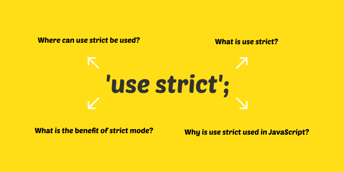
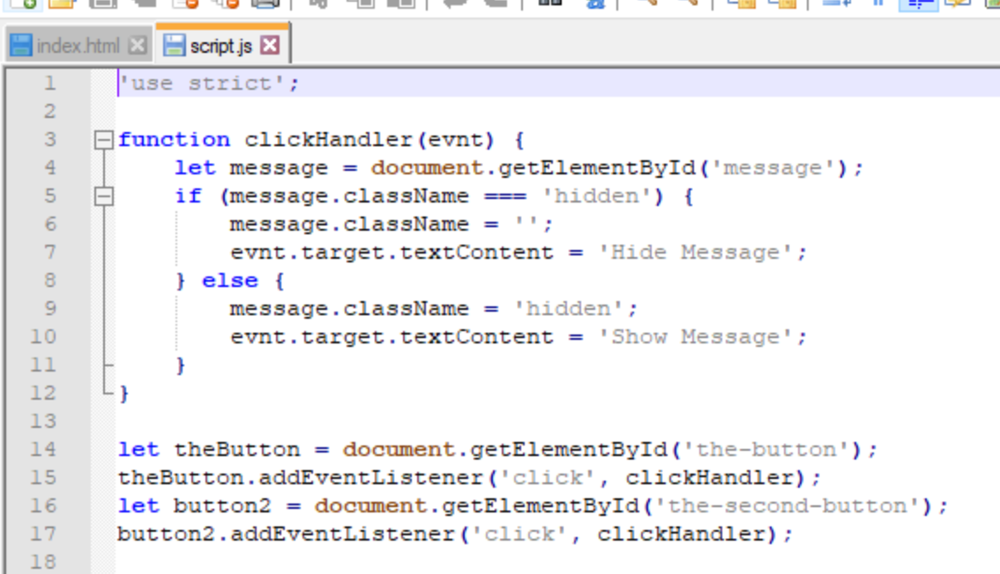

# Strict mode



JS vốn dĩ là một ngôn ngữ linh hoạt và dễ sử dụng, cũng như không có bất kì ràng buộc nào chặt chẽ trong việc code như kiểu dữ liệu và cách khai báo biến,...

Strict mode là một chế độ trong javascript giúp kiểm soát code bằng cách sự dụng một vài rules, nguyên tắc nghiêm ngặt hơn, chặt chẽ hơn.

## Feature chính

- Variable declaration:

  - Biến phải được khai báo trước khi sử dụng bằng các keyword dùng để khai báo như `var, let, const`

- Scope
  - Biến khi khai báo không cẩn thận, không định nghĩa phạm vi cho nó từ đầu thì sau này khi hệ thống lớn lên sẽ rất dễ gây ra lỗi và rất khó để tìm, các biến khi đó sẽ xung đột scope với nhau và gây ảnh hưởng, thay đổi giá trị của nhau không thể kiểm soát được

## Syntax

- Sử dụng keyword 'use strict' ở line đầu tiên của file -> Strict mode sẽ có hiệu lực với những line code từ line thứ 2 trở đi.
- Có thể sử dụng 'use-strict' ở phạm vi 1 hàm

  ```js
  function sayHello() {
    'use strict';
    // Strict mode có hiệu lực trong phạm vi hàm này
  }
  ```

- Một file js khi đã khai báo strict mode thì sẽ không có cách nào để loại bỏ hay disable nó.

## Trường hợp sử dụng

- Thường dùng trong source code của các thư viện

  

- Sau này tuỳ vào đặc điểm của dự án mới sử dụng, vì ngày nay đa phần các rủi ro về code khi không dùng strict mode đã được cover trong các ngôn ngữ cao hơn như TypeScript hay các trình quét lỗi như ESlint... hay trong ES6 của JS có hỗ trợ OOP (Class và Module) tích hợp sẵn strict mode chứ không nhất thiết phải dùng 'use strict' cho toàn file một cách cứng nhắc.

## Ví dụ

- Xem ở [Demo Strict Mode](./../_demo/strict-mode.js)

## Kết luận

- Strict mode cũng như các thư viện hay NNLT có tính năng kiểm soát và cảnh báo nguy cơ lỗi đều là cố gắng giúp ta đạt được mục đích:
- Khai báo biến đúng cú pháp và mục đích sử dụng
- Khai báo biến ở phạm vi local nhất có thể, hạn chế khai báo global
- Tránh trùng lên dẫn đến lỗi logic và giá trị bị ghi đè không mong muốn
