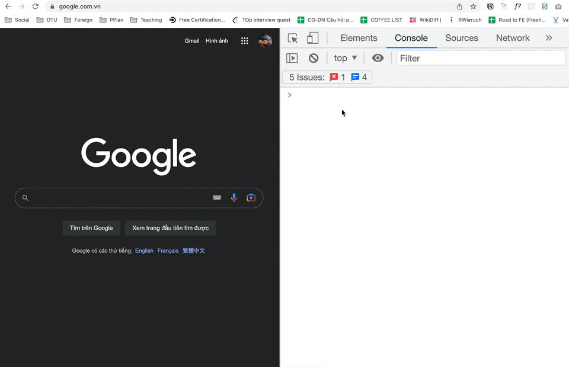
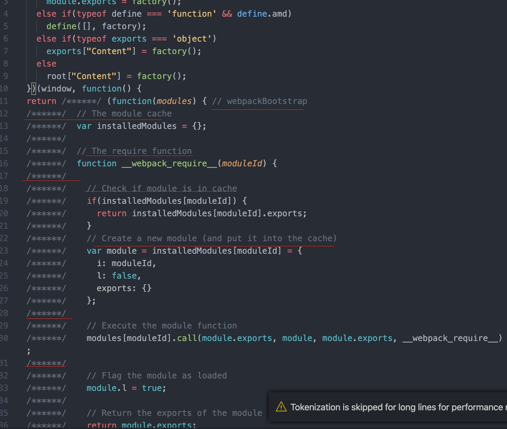
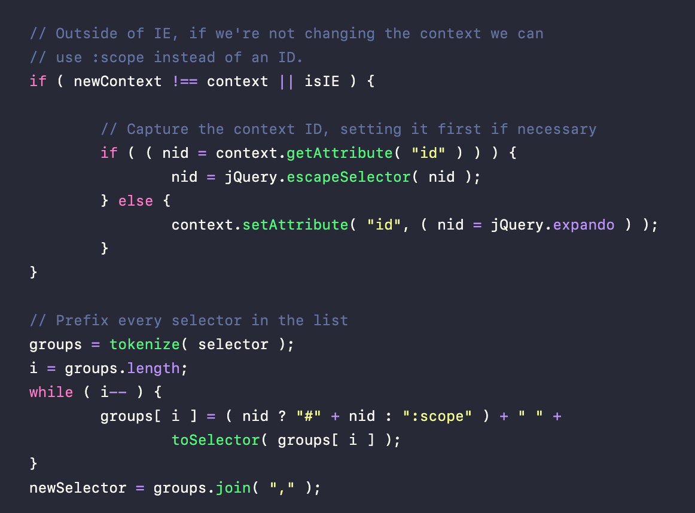
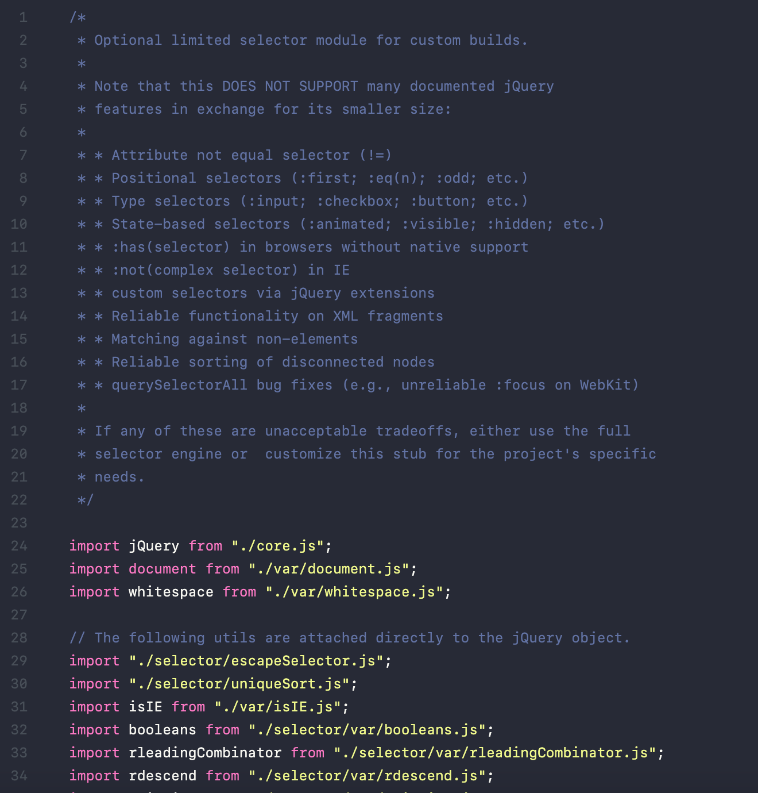

# Code Structure

- 1 file code sẽ được cấu tạo từ các thành phần
  - Statement
  - Các statement sẽ tạo thành một khối lệnh hay một hàm
  - Nhiều hàm được khai báo trong một file js => Functional programming

## Statement

- Là một cấu trúc syntax dùng để biểu diễn cho một hành động cụ thể
- Statement hay còn gọi là một câu lệnh
- Một tập các statement phối hợp với nhau theo một logic thì sẽ được gọi là một hàm (function)
- Vd: Khi viết `alert('hello')` thì statement này sẽ ra lệnh cho máy tính hiện hộp thoại cảnh báo có nội dung 'hello'



## Block code

- Một block code được phân định trong cặp dấu `{}`. Không cần biết bên trong cặp dấu có statement hoặc không có statement
- Dùng để gom nhóm (group) một hoặc nhiều câu lệnh lại để thực hiện một hoặc một chuỗi hành động có mục đích
- Đại diện cho thành phần này gồm các câu lệnh điều kiện if else hoặc câu lệnh lặp for hay các lời gọi hàm và có nhiều hàm con thực thi bên trong
- Block code thường được tạo ra bởi khối lệnh điều kiện (if else, while, do while), vòng lặp (for, ...), hàm (function)

  ```js
  if (weather === 'rain') {
    console.log('I will at home');
  } else {
    console.log('I will go to coffee shop');
  }

  for (let i = 0; i < 100; i++) {
    console.log(i);
  }

  function doExampleForNewKnowledge() {}
  ```

## Semicolons (;)

- Dấu `;` dùng để kí hiệu kết thúc một câu lệnh
- Trong một file gồm nhiều dòng code thì các câu lệnh sẽ ngăn cách với nhau bằng dấu `;`.
- Ở nhiều ngôn ngữ nếu không có dấu `;` thì sẽ báo lỗi. Riêng JS có hỗ trợ không cần thêm `;` vì nó đã ngầm định thêm vào. Nhưng theo quy ước thì vẫn nên thêm để code dễ đọc hơn

```
alert('Hello')
alert('World')

alert('Hello');
alert('World');
```

## Comment

- Càng comment ít càng tốt
- Vốn dĩ code clean là code dễ đọc và không cần phải comment gì thêm
- Chỉ comment khi thực sự cần thiết:

  - Viết document hướng dẫn flow cho chỗ code đó nếu nó có logic phức tạp
  - Các yếu tố cần setup trước để chỗ code đó có thể hoạt động được
  - Một số convention project bắt buộc khai báo code author, mục đích của đoạn code,...

    

- Có 2 loại comment

  - Comment single line (//)

    ```js
    // console.log('this line is commented')
    ```

    

  - Comment multiple lines (/\*\* \*/)
    ```js
    /**
     * Comment line 1
     * Comment line 2
     * ...
     */
    ```
    
