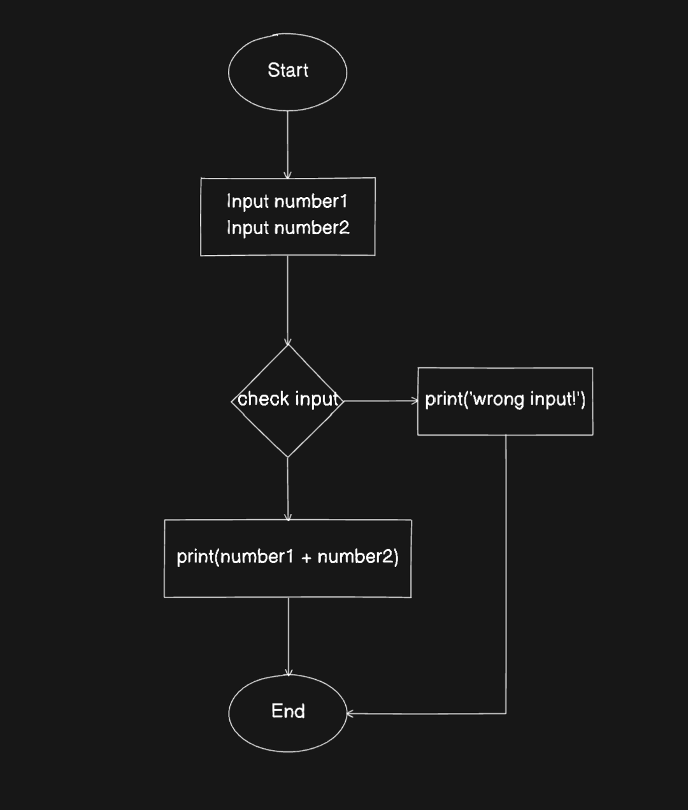
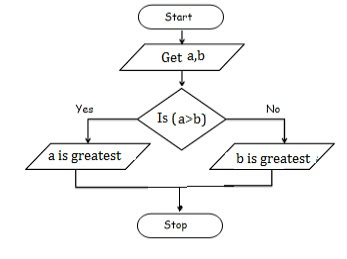

# Pseudo code

## Định nghĩa

- Pseudo code là cách define và triển khai giải pháp xử lý vấn đề của lập trình viên bằng một chương trình giả, code giả trước khi triển khai vào code thật

- Sự khác nhau ở đây là dev có thể dùng bất cứ ngôn ngữ nào để mô tả các step xử lý vấn đề, pseudo code này dùng để đọc-hiểu, không phải là một chương trình có thể compile để máy tính đọc hiểu và thực thi được

## Ví dụ

Viết một chương trình tính tổng, nhận vào 2 số nguyên khác 0 và trả ra kết quả của chúng

- Cách giải quyết (thuật toán):

  - Nhận vào 2 số nguyên
  - Kiểm tra xem 2 số đó có hợp lệ không
  - Nếu đúng thì cộng lại rồi trả ra kết quả
  - Nếu sai thì in ra thông báo "Wrong input!"

- Dựng sơ đồ khối

  

- Viết pseudo code:

  ```js
    START
      INPUT number1
      INPUT number2

      IF number1 IS INT AND number2 IS INT
        PRINT number1 + number2
      ELSE
        PRINT "Wrong input!"
    END

  ```

- Triển khai thành code thật

  ```js
  const number1 = Number(prompt('Input number 1: '));
  const number2 = Number(prompt('Input number 2: '));

  if (!isNaN(number1) && !isNaN(number2)) {
    alert(number1 + number2);
  } else {
    alert('Wrong input!');
  }
  ```

## Thực hành

- Phân tích, dựng sơ đồ khối và viết code giả cho vấn đề: Hỏi tuổi của người dùng, nếu tuổi dưới 8 in ra "Trẻ em", tuổi dưới 20 in ra "Thiếu niên", tuổi trên 20 in ra "Trưởng thành". Tuổi không hợp lệ sẽ in ra "Tuổi không hợp lệ"

- Phân tích, dựng sơ đồ khối và viết pseudo code cho vấn đề: Xác định một số là số chẳn hay số lẻ

- Phân tích, dựng sơ đồ khối và viết code giả cho việc call api lấy dữ liệu từ url 'https://jsonplaceholder.typicode.com/todos/1' và lấy data về, biết rằng data trả về có dạng:

  ```json
  {
    "userId": 1,
    "id": 1,
    "title": "delectus aut autem",
    "completed": false
  }
  ```

  Hãy show title và trạng thái hoàn thành, nếu giá trị false sẽ hiển thị "Chưa hoàn thành", ngược lại hiển thị "Đã hoàn thành"

## Tham khảo

- Sơ đồ khối của bài toán tìm số lớn hơn

  
