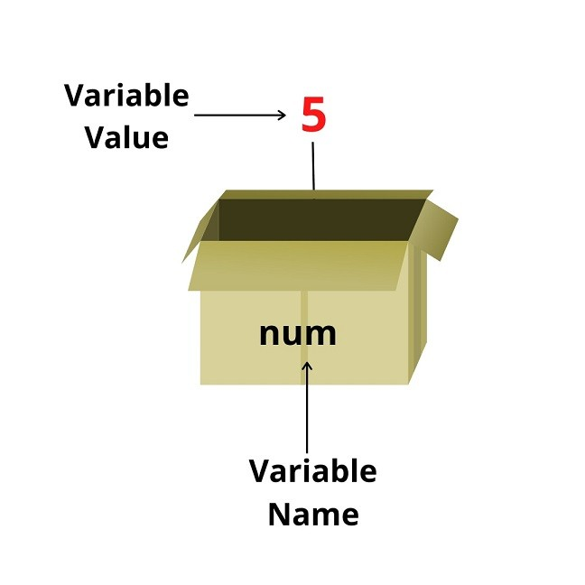

# Variable - JS data types

## Variable (Biến)

- Khi một ứng dụng hoạt động, nó sẽ khởi tạo dữ liệu cần thiết để chương trình hoạt động ổn định và những dữ liệu đó được xử lý tuỳ theo các mục đích khác nhau đã được lập trình sẵn
- JS cũng như các ngôn ngữ khác sẽ dùng biến để lưu trữ những thông tin và dữ liệu đó. Các biến này sẽ được đặt tên sao cho dễ nhớ và dễ nhận biết nó đang lưu trữ dữ liệu gì
- JS cung cấp 4 cách để khai báo một biến, chia làm 2 nhóm - khai báo biến có thể gán lại giá trị và biến không thể gán giá trị:

  - Sử dụng keyword `var` (Gán lại được giá trị)
  - Sử dụng keyword `let` (Gán lại được giá trị)
  - Sử dụng keyword `const` (Không gán lại được giá trị)
  - Không sử dụng keyword nào cả - Cách này không được khuyến khích sử dụng

    ```js
    var fullName = 'John Wick';
    const GUNS_COUNT = 1000;
    let age = 30;
    address = 'New York';
    ```

  > Lưu ý: keyword `const` sau này khi làm việc với JS thì không những dùng để định nghĩa biến hằng mà còn dùng để định nghĩa cho các biến bình thường tránh bị thay đổi giá trị mà không kiểm soát được. Sự khác nhau giữa var, const, let cũng sẽ được tìm hiểu ở phần ES6

- Các bước để khai báo ra một biến:
  - Định nghĩa loại biến
  - Đặt tên cho biến
  - Gán giá trị cho nó



> Một biến như một hộp chứa và lưu trữ dữ liệu trong đó

```js
// Khai báo một biến tên là age
let age;

// Lúc này giá trị được lưu vào ô nhớ và liên kết với biến age (gán giá trị cho biến)
age = 30;

// Tại thời điểm này khi sử dụng biến age, thì nó sẽ có giá trị là 30
console.log(age); // 30

// Cách viết ngắn gọn:
let age = 30;

// Khi biến đang chứa giá trị mà ta lại gán cho biến một giá trị khác, thì nó sẽ xoá giá trị cũ và gán lại giá trị mới cho biến
age = 50;
```

## Data types

- JS hiện đang hỗ trợ các kiểu dữ liệu:

  - Symbol (Ít dùng)

    ```js
    const id = Symbol('id');
    ```

  - Object

    ```js
    const developer = {
      domain: 'frontend',
      age: 30,
    };

    const myFriend = {};
    ```

  - Array

    ```js
    const technicals = ['html', 'css', 'javascript'],

    const emptyArray = [];
    ```

  - String

    ```js
    const simpleString = 'Today is a nice  day to learn';

    const emptyString = '';
    ```

  - Number
    ```js
    const age = 30;
    ```
  - BigInt (Ít dùng - Dùng trong mã hoá, crypto với giá trị lớn)
    ```js
    const superBig = 9999999999999999;
    ```
  - Boolean
    ```js
    const isLoggedIn = false;
    const isAlive = true;
    ```
  - Null
    ```js
    const nothing = null;
    ```
  - Undefined

    ```js
    const something; // undefined

    const explicitVar = undefined;

    ```

- JS là ngôn ngữ có kiểu dữ liệu động nên tuỳ vào giá trị khai báo biến ta gán cho nó mà nó sẽ tự xác định kiểu dữ liệu của biến

  ```js
  let counter = 120; // counter is a number
  counter = false; // counter is now a boolean
  counter = 'foo'; // counter is now a string
  ```

## typeof

- Keyword này sẽ giúp ta xác định được kiểu dữ liệu của một biến bằng cách trả về kiểu dữ liệu dưới dạng chuỗi
  ```js
  typeof undefined; // 'undefined'
  typeof 0; // 'number'
  typeof 10n; // 'bigint'
  typeof true; // 'boolean'
  typeof 'hello'; // 'string'
  typeof Symbol('id'); // 'symbol'
  typeof Date; // 'object'
  typeof null; // 'object'
  typeof alert; // 'function'
  ```

## Các loại kiểu dữ liệu

### Kiểu nguyên thuỷ (primitive type)

- Bao gồm boolean, number, string, null, undefined, symbol
- Các biến thuộc loại kiểu dữ liệu này sẽ được đánh giá là đơn giản và sẽ được lưu trữ trực tiếp giá trị trong bộ nhớ.

### Kiểu tham chiếu (reference type)

- Bao gồm: object, function
- Khi gọi biến thì sẽ trỏ đến địa chỉ ô nhớ mà biến đang lưu -> Lấy giá trị thực sự đang chứa trong địa chỉ đó ra
- Các biến thuộc loại kiểu dữ liệu này sẽ lưu trữ địa chỉ tham chiếu đến ô nhớ lưu giữ giá trị thực sự của nó
- Với những phép gán cho object hay array thì JS sẽ copy địa chỉ tham chiếu đó => Khi 2 biến là bản sao kiểu dữ liệu tham chiếu của nhau mà có một biến thay đổi giá trị thì giá trị của biến kia cũng sẽ đổi theo

### Primitive Wrapper Object (PWO)

- Primitive Wrapper Object là một loại Object đại diện cho kiểu dữ liệu nguyên thuỷ gồm number, string, boolean. Được JS tự động tạo ra tạm thời để wrap giá trị nguyên thuỷ và cung cấp các methods hay properties cần thiết để làm việc với giá trị đó. Object tạm thời này sau khi thực hiện xong line code hoặc thực hiện xong tác vụ thì sẽ được giải phóng khỏi bộ nhớ ngay lập tức và giá trị primitive ban đầu sẽ được sử dụng lại

- String Object: Khi một giá trị string primitive cố gắng truy cập một properties (length) hay gọi một hàm (split). Thì JS sẽ tự động convert hoặc wrap giá trị này bởi một object String. Từ đó có thể truy cập được properties hoặc gọi đc hàm built-in.

  ```js
  const str = 'Hello';
  console.log(str.length); // Accessing a property on the primitive string
  ```

- Number Object: Tương tự như String Object, cũng sẽ convert hoặc wrap giá trị number primitive lại và có thể gọi được hàm của Number. sau khi thực hiện xong thì được giải phóng

  ```js
  const num = 42;
  console.log(num.toString()); // Calling a method on the primitive number
  ```

- Boolean Object:

  ```js
  const bool = true;
  console.log(bool.valueOf()); // Calling a method on the primitive boolean
  ```

- Đoạn code phía trên sẽ tương đương với:

  ```js
  let language = 'JavaScript';
  let temp = new String(language);
  str = temp.substring(4);
  temp = null;
  ```

- So sánh giữa Primitive Wrapper Object (implicit) và Reference Data Type(explicit):

  - Biến kiểu reference khi tạo ra sẽ được lưu trong bộ nhớ heap cho đến khi được giải phóng
  - Biến sau khi được wrap lại bằng Primitive Wrapper Object sẽ chỉ có tác dụng trong 1 line code. Hết line code thì biến cũng được giải phóng luôn

    ```js
    let s = 'JavaScript';
    s.language = 'ECMAScript'; // wrapped by PWO -> assigned for s.language -> and release immediately
    console.log(s.language); // undefined
    ```

> => Tổng kết lại:
> Ta sẽ không tạo ra biến PWO bằng keyword new với vài lí do:
>
> - Ảnh hưởng đến hiệu năng: biến PWO bản chất cũng là object và cần thêm bộ nhớ và thời gian để truy cập và xử lý.
> - Một số JS Engine trên trình duyệt (Như V8 của chrome) sẽ không được tối ưu để xử lý PWO
> - Với các kiểu dữ liệu primitive recommended nên làm việc trực tiếp với nó thay vì cố gắng tạo một kiểu dữ liệu object cho nó một cách rõ ràng (explicit) vì ngầm định JS đã tự động tạo một PWO để wrap giá trị primitive đó rồi.

### Reference link: https://www.javascripttutorial.net/javascript-primitive-wrapper-types
