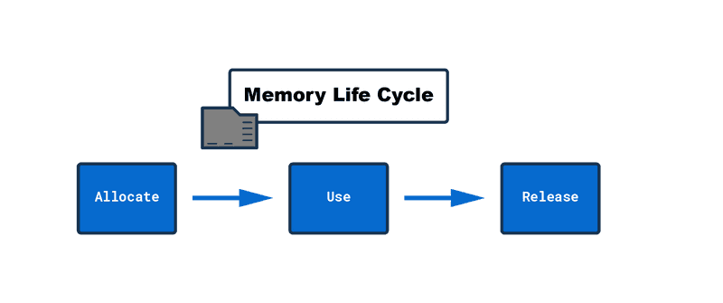
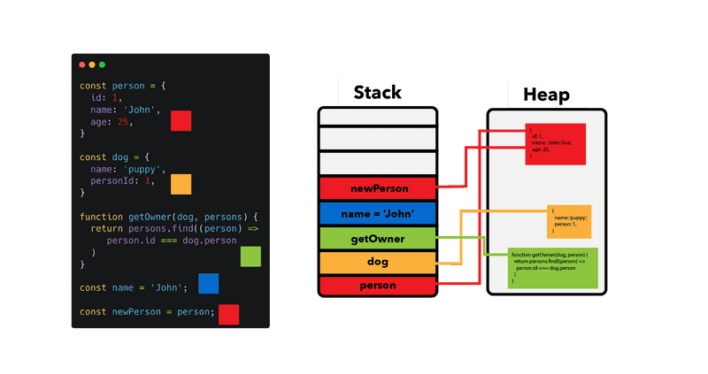
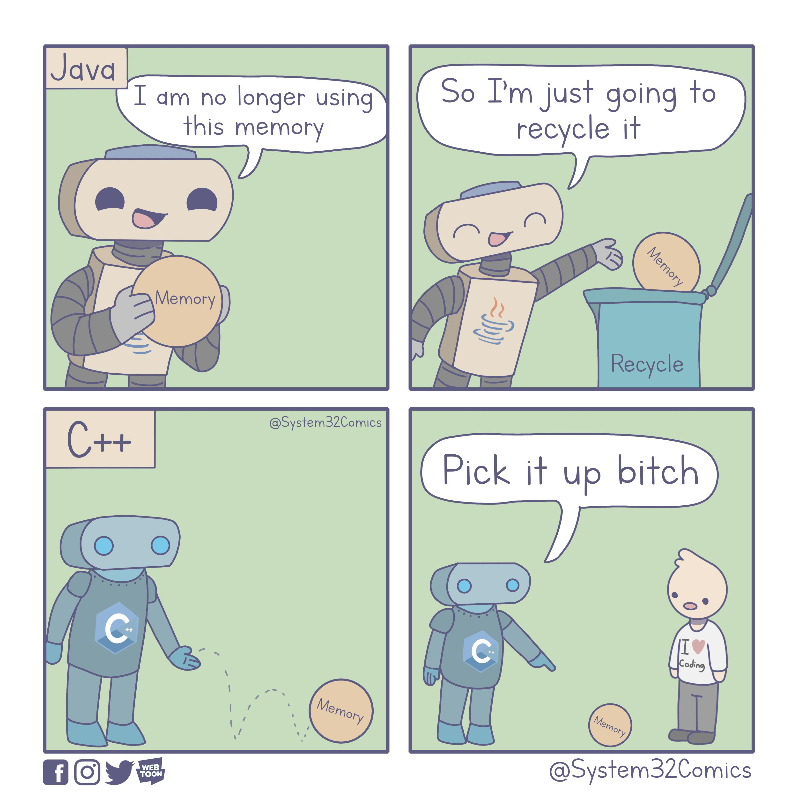

# Bộ nhớ Stack - Heap

Các ngôn ngữ lập trình bao gồm cả JS cần sử dụng đến sức mạnh phần cứng, cụ thể ở đây là vùng nhớ của máy tính để có thể lưu trữ dữ liệu. Vùng nhớ này chia làm 2 loại là **stack memory** và **heap memory** là gọi chung là những cấu trúc dữ liệu dùng để lưu trữ

## Memory life cycle

Dữ liệu lưu trữ trên bộ nhớ trải qua 3 giai đoạn: Cấp phát - Sử dụng - Giải phóng

- **Allocate**: Khi bắt đầu gán giá trị cho một biến hay define một function / object thì sẽ được cấp phát bộ nhớ.
- **Use**: Khi tương tác với biến thông qua dòng code thì chính là ta cũng đang sử dụng bộ nhớ: Truy cập giá trị, thay đổi giá trị và ghi vào bộ nhớ giống như truy cập biến, thay đổi giá trị biến và ghi vào bộ nhớ.
- **Release**: Khi bộ nhớ không còn được sử dụng nữa, nó sẽ được JS Engine cụ thể là Garbage Collector kiểm tra xử lý để giải phóng không gian bộ nhớ để sử dụng cho mục đích khác.

## Stack memory (Static memory)

- Là một vùng nhớ nhỏ, có kích thước cố định, dùng để chứa / theo dõi các khai báo biến và lời gọi hàm
- Là nơi dùng để lưu trữ các dữ liệu tĩnh (static data) bao gồm các giá trị nguyên thuỷ (primitive data type - string, number, boolean, null, undefined) và các reference trỏ đến các function, object được lưu bên bộ nhớ heap
- Việc cấp phát bộ nhớ trong stack được gọi là cấp phát bộ nhớ tĩnh vì các data đều có thể đoán trước được size của nó. Data dạng primitive thường có data size cố định, vì thế có thể biết được số bộ nhớ cần cấp phát
- Bộ nhớ sẽ được cấp phát ngay trước khi code được thực thi
- Giới hạn cấp phát bộ nhớ tuỳ thuộc vào từng engine của browser khác nhau
- Stack memory sẽ có tốc độ truy cập dữ liệu nhanh hơn heap memory

## Heap memory (Dynamic Memory)

- Đây là vùng nhớ động và JS Engine trên browser không cấp phát bộ nhớ cố định cho nó
- Vùng nhớ này dùng để lưu trữ các dữ liệu phức tạp và dạng tham thiếu như object, function.
- Không giống như stack memory. Việc cấp phát bộ nhớ của heap không biết trước được data size nên sẽ không có giới hạn cụ thể. Cần bao nhiêu cấp bấy nhiêu -> Việc cấp phát bộ nhớ trong stack được gọi là cấp phát bộ nhớ động
- Bộ nhớ được cấp khác trong quá trình chạy (runtime)

## Kết luận

- Stack và heap hoạt động cùng nhau để quản lý bộ nhớ trong JS

## Garbage Collection

- Được thực hiện bởi Garbage Collector. Dọn dẹp dữ liệu không dùng đến nữa và loại bỏ ra khỏi bộ nhớ.
- Đối với các ngôn ngữ bậc thấp như C++ thì dev tự xoá dữ liệu không dùng tới một cách thủ công bằng code (pointer). Đối với ngôn ngữ bậc cao như Java hay JS thì nó sẽ tự động làm việc này
- Sử dụng nhiều thuật toán để nhận biết khi nào thì data không được dùng nữa để giải phóng bộ nhớ. Trong đó có:

  - _Reference-counting_: Thuật toán đơn giản nhất. Kiểm tra xem data có còn được reference tới nữa không. Nếu không thì dọn. Thuật toán này đi kèm vấn đề là tham chiếu vòng tròn => Dễ bị bỏ sót, đó là lí do sinh ra thêm thằng ở dưới.

  - _Mark and sweep_: Thuật toán này tân tiến hơn. Hoạt động bằng cách tìm kiếm các object không thể tiếp cận hay truy cập (unreachable) từ global object(root object) - Là window của browser hay global của NodeJS.

    Sau khi `mark` các object không thể tiếp cận thì nó sẽ bắt đầu `sweep` các object đó ra khỏi bộ nhớ, việc này không xảy ra ngay lập tức mà diễn ra vào cuối chu kì của thuật toán.

- Garbage Collection hiện nay vẫn còn nhiều hạn chế vì vẫn chưa có thuật toán nào thực sự tối ưu cho việc detect một biến dữ liệu khi nào thì không còn được sử dụng nữa. Nên thỉnh thoảng vẫn xảy ra hiện tượng tràn bộ nhớ gây treo hay crash ứng dụng

> Link tham khảo:
>
> - https://felixgerschau.com/javascript-memory-management
