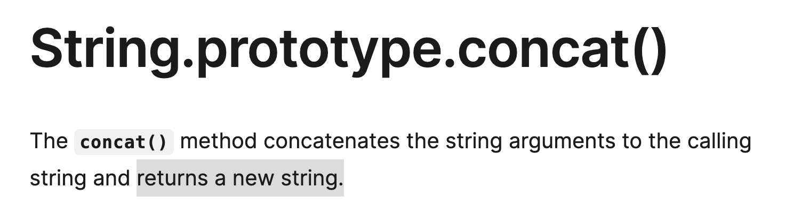
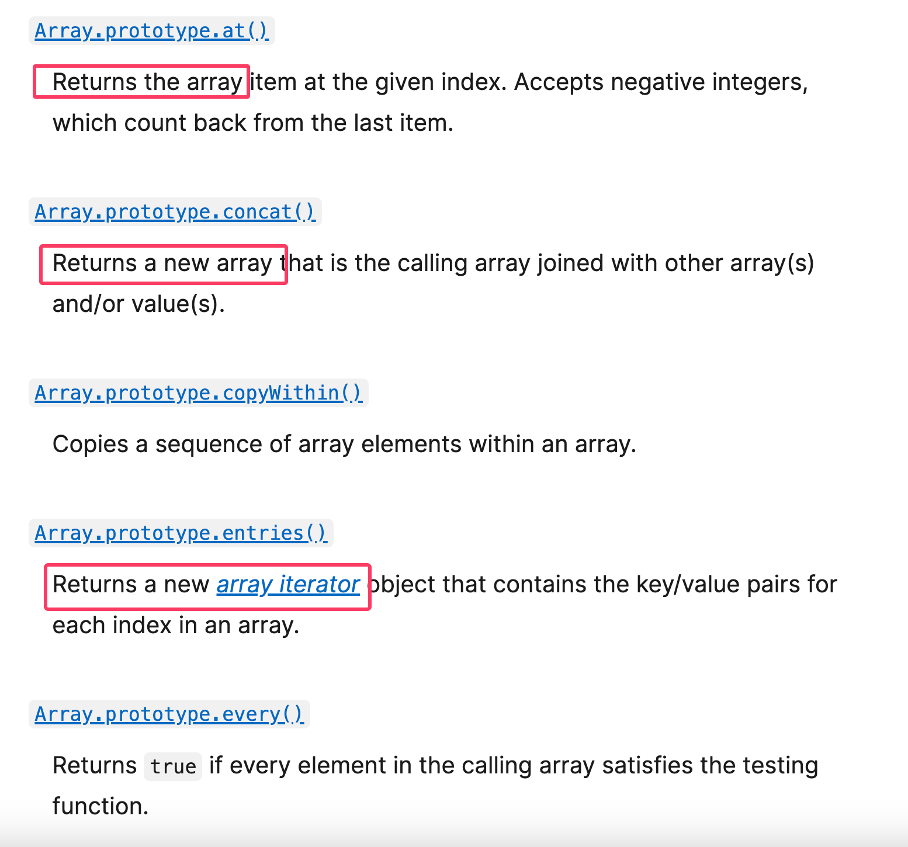

# Mutable & Immutable

Trong JS, thuật ngữ mutable hay immutable biểu thị cho khả năng có thể thay đổi giá trị của một biến sau khi nó được tạo ra.

## Immutable

- Những giá trị bất biến sau khi được tạo ra thì ta không thể thay đổi giá trị ban đầu của nó. Bất cứ tác vụ hay phép tính nào để cập nhật giá trị sẽ tạo ra một biến mới
- Trong JS những kiểu data nguyên thuỷ như boolean, number, string sẽ có cơ chế immutable.
- Ở vd bên dưới khi ta thực hiện gọi một hàm để nối string thì string mới sẽ luôn luôn được tạo ra và không gây ảnh hưởng gì đến string ban đầu:

  ```js
  let str1 = 'Hello';
  let str2 = str1 + ' World'; // Concatenation creates a new string
  console.log(str1); // Output: 'Hello'
  console.log(str2); // Output: 'Hello World'
  ```

  ```js
  let num = 10;
  num.toFixed(2); // "10.00"
  console.log(num); // 10
  ```

## Mutable

- Khi một biến được tạo ra, việc thay đổi giá trị như thêm sửa xoá thuộc tính,... sẽ được thực hiện trực tiếp trên biến đó mà không cần tạo biến mới
- Các kiểu dữ liệu tham chiếu như object, array, function sẽ có cơ chế immutable

  ```js
  let collection = ['iPhone'];

  collection.push('Macbook');
  console.log(collection); // ['iPhone', 'Macbook']
  ```

  ```js
  const student = {
    name: 'uni',
    age: 12,
  };

  student.name = 'ple';
  delete student.age;

  console.log(student); // { name: 'ple' }
  ```

## Kết luận

Việc hiểu về tính bất biến trong JS có thể giúp ta làm việc tốt với các kiểu dữ liệu, thực hiện các phép thay đổi và kiểm soát được side effect cũng như rủi ro gây lỗi cho chương trình. Tính bất biến sẽ luôn được ưu tiên trong việc code JS và functional programming bằng cách tự động (kiểu reference type) và thủ công (dev tự tạo ra một biến mới để thao tác thay vì dùng trực tiếp biến ban đầu)

Một số phương thức tương tác với dữ liệu cũng sẽ hoạt động theo kiểu immutable, sẽ luôn trả về giá trị mới và không làm thay đổi giá trị cũ.





# Tham khảo

- https://www.freecodecamp.org/news/mutability-vs-immutability-in-javascript

- https://blog.devgenius.io/mutable-and-immutable-in-javascript-78a3cbc6187c
