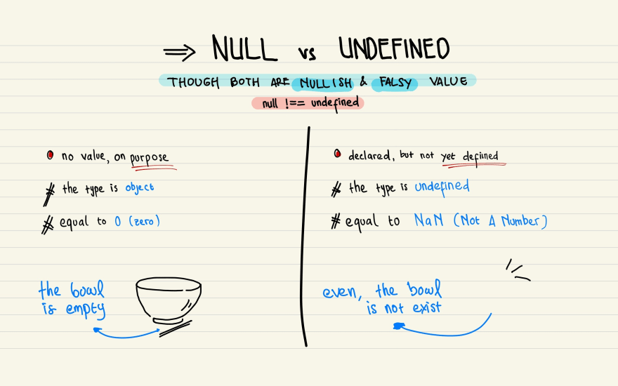

# null & undefined

  
  https://javascript.plainenglish.io/why-does-javascript-have-both-null-and-undefined-6a42fcca9301

## Null là gì ?
- Kiểu dữ liệu null đại diện cho một giá trị không tồn tại một cách có chủ đích và giá trị của nó cũng là null luôn.

## Undefined là gì ?


## Phân biệt null vs undefined

- Biến có kiểu dữ liệu null hoặc undefined đều đại diện cho việc dữ liệu bị rỗng hoặc hiện không có sẵn.

- Điểm khác nhau:

  - `undefined`: Đại diện cho các biến chưa được gán giá trị hay không có giá trị liên kết với biến. undefined sẽ mặc định được gán trong các trường hợp:

    - Biến được khởi tạo nhưng chưa gán giá trị

      ```js
      let x;
      console.log(x); // undefined
      ```

    - Giá trị trả về của một function
      ```js
      function sum(a, b) {
        const sum = a + b;
      }
      console.log(sum(3, 4)); //undefined
      ```
    - Truy cập vào một thuộc tính của object / phần tử của array không tồn tại

      ```js
      const nums = [1, 3, 4];
      console.log(nums[10]); // undefined
      const obj = { name: 'John' };
      console.log(obj.age); // undefined
      ```

      -

  - `null`: Đại diện cho việc giá trị của biến mà nó liên kết không tồn tại

    ```js
    let y = null;
    console.log(y); // null
    ```

  - Check với `typeof`:

    ```js
    console.log(typeof undefined); //undefined
    console.log(typeof null); //object
    ```

  > Giải thích cho việc vì sao null là primitive value mà typeof lại cho kết quả "object" ?
  >
  > -> Hiện tại nó đang là bug trong suốt quá trình phát triển của JS và nó không thể fix vì sẽ làm hỏng rất nhiều script khác nên quyết định giữ lại
  >
  > - Link tham khảo:
  >   - https://developer.mozilla.org/en-US/docs/Web/JavaScript/Reference/Operators/typeof#typeof_null
  >   - https://javascript.plainenglish.io/why-does-javascript-have-both-null-and-undefined-6a42fcca9301

  - Giá trị toán học:

    ```js
    console.log(undefined + 1);
    //NaN
    console.log(null + 1);
    //1
    ```