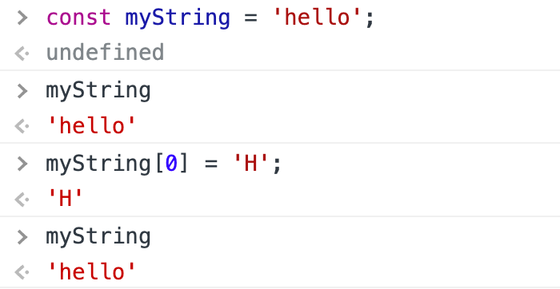
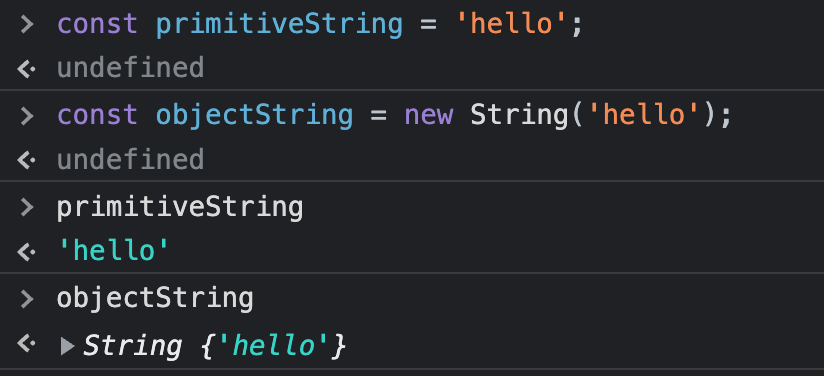
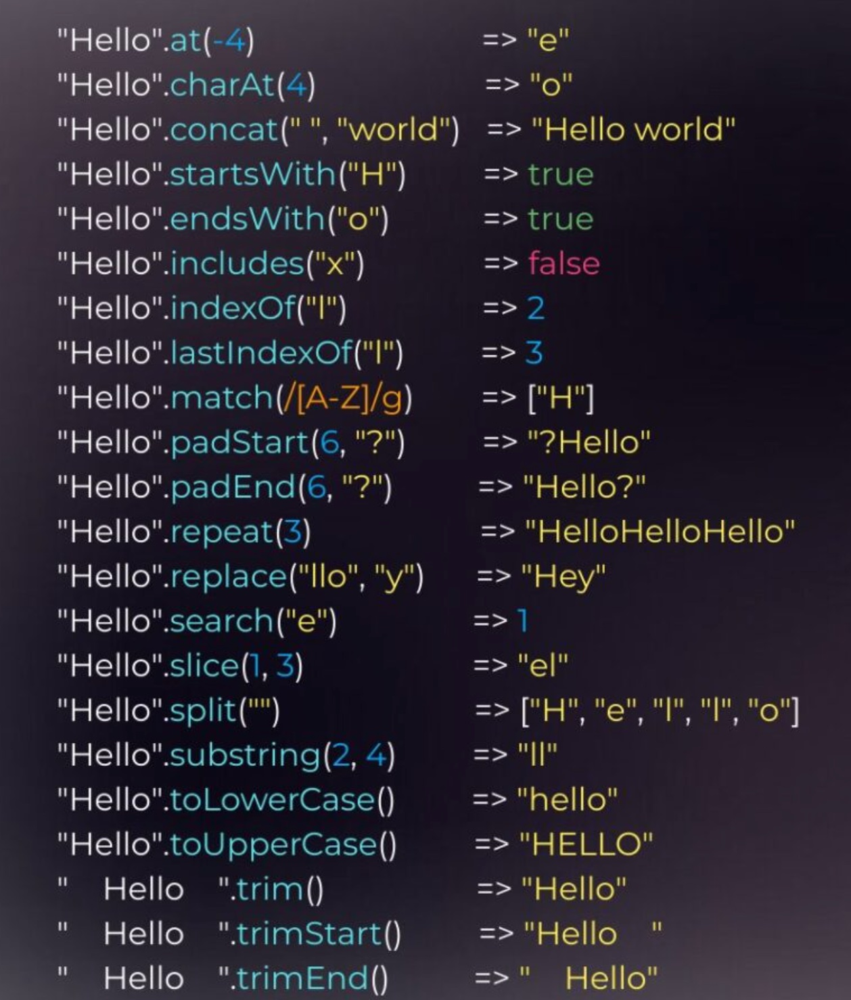

# String


## Syntax

- String có thể được khai báo theo các cách sau:
  ```js
  const myName1 = 'Wanda Maximoff';
  const myName2 = 'Wanda Maximoff';
  const myName3 = `Wanda Maximoff`;
  const myName4 = "I am 'good'. She said";
  ```

## Access characters

```js
const weather = 'rain';

console.log(weather.length); // 4

console.log(weather[0]); // 'r'

console.log(weather.charAt(0)); // 'r'

console.log(weather[weather.length - 1]); // 'n'
```

## Immutable (Tính bất biến)

- Immutable trong string có nghĩa là khi một biến kiểu string được tạo ra thì giá trị của nó không thể thay đổi hoặc chỉnh sửa => Tất cả các tác vụ tính toán để can thiệp hay sửa đổi giá trị của biến sẽ tạo ra một biến mới dựa trên biến sẵn có.
- String là một kiểu dữ liệu đặc biệt, nó bất biến (immutable). Có nghĩa là khi đã được define ra thì không thay đổi giá trị, chỉ có tạo ra biến mới và gán lại giá trị cho nó => Tất cả methods của string đều trả về một string mới đã xử lý và không thay đổi bất cứ gì trên string gốc

  

- Một số case sử dụng immutable của string

  - Tạo một biến string:

    - Khi một biến string được khởi tạo, giá trị của nó là bất biến và sẽ không bị thay đổi hay chỉnh sửa

      ```js
      const myString = 'hello';
      myString[0] = 'H';

      console.log(myString); // hello
      ```

    - Những kí tự và thuộc tính length của nó cũng sẽ không đổi.

      ```js
      const myString = 'hello';
      console.log(myString.length); // 5

      myString.length = 100;
      console.log(myString.length); // 5
      ```

  - Thao tác với string: Khi gọi các hàm thao tác với string như split, concat, slice,... thì những hàm này sẽ không thay đổi biến string gốc mà sao chép một biến string khác, xử lý nó và trả về

    ```js
    const arr1 = [1, 2, 3];
    const arr2 = [4, 5, 6];

    const arrFinal = arr1.concat[arr2];

    console.log(arrFinal); // [1, 2, 3, 4, 5, 6]
    console.log(arr1); // [1, 2, 3]
    ```

  - Gán giá trị:
    Khi gán một giá trị string cho biến, kết quả vẫn trả về string mới nhất. Nhưng bản chất bên dưới vẫn không phải là chỉnh sửa string mà là thay thế string cũ bằng một string mới

    ```js
    let name = 'wong';
    name = 'Wung';

    console.log(name); // Wung
    ```

- Khác nhau giữa primitive string và string object

  ```js
  a = 'foo';
  a.b = 'bar';
  alert('a.b = ' + a.b); //Undefined

  A = new String('foo');
  A.b = 'bar';
  alert('A.b = ' + A.b); // bar
  ```

  - String được khai báo với kiểu bình thường thì nó không thể đính kèm thêm 1 thuộc tính nào nữa nên việc gọi như ở trên sẽ dẫn tới undefined
  - Khi`typeof` nó ra thì giữa 2 cái cũng khác nhau, 1 cái là string, 1 cái là object.

    

## Methods / properties tương tác với string

length



## Thực hành

1. Làm sao để đảo ngược một chuỗi
2. Làm sao để in hoa chữ cái đầu của một string
3. Làm sao để remove khoảng trắng trong string
4. Làm sao để convert một string thành kiểu boolean
5. Làm sao để xoá một substring trong một string
6. Làm sao để kiểm tra một string là empty
7. Làm sao để thêm khoảng trắng (space) vào trước mỗi chữ viết hoa
8. Làm sao để chuyển chuyển đổi một dãy số tài khoản ngân hàng gồm 16 số `2034390021101095` thành dạng `**********101095`
