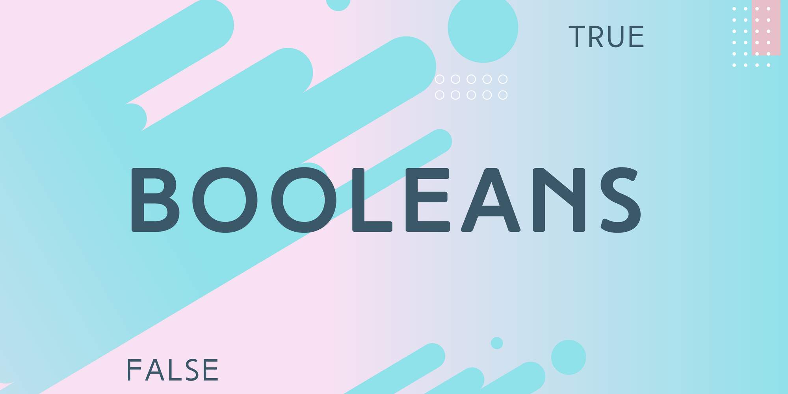

# Boolean (Giá trị luận lý)



- Boolean là kiểu dữ liệu chỉ có 2 giá trị là `true` hoặc `false`
- Thường sử dụng cho các biến chỉ có 2 giá trị luôn đối nghịch nhau:
  - YES / NO
  - ON / OFF
  - TRUE / FALSE

## Falsy & Truthy

- Truthy là những giá trị khi chuyển đổi về kiểu boolean thì nó sẽ có giá trị `true`
- Falsy là những giá trị khi chuyển đổi về boolean thì sẽ được giá trị `false`
- Các hệ thống website, ứng dụng thường sẽ cần chuyển đổi tất cả các kiểu dữ liệu về một kiểu dữ liệu đơn giản nhất để kiểm tra được trạng thái của dữ liệu hay chức năng trong mốt số trường hợp:

  - Kiểm tra data đã được tải về thành công chưa để show hiệu ứng loading
  - Kiểm tra user đã đăng nhập chưa để show form đăng nhập
  - Kiểm tra user lưu thông tin chưa để trở về trang chủ
  - ...

- Các giá trị sẽ được tính là Falsy khi chuyển đổi:
  - false
  - undefined
  - null
  - 0 , -0
  - '', ``, ""
  - NaN
- Các giá trị không nằm trong dnah sách trên thì nó là giá trị Truthy

## Boolean coercion

- Boolean coercion là quy trình chuyển đổi một giá trị không phải là kiểu boolean về kiểu boolean (ép kiểu boolean)

- Giá trị được chuyển đổi về kiểu boolean sẽ được căn cứ theo falsy và truthy

- Có 2 cách chính để chuyển đổi

  - Dùng primitive wrapper object `Boolean()`:

    ```js
    const myValue = '';
    const myValue2 = ' ';

    Boolean(myValue); // false
    Boolean(myValue2); // true;
    ```

  - Sử dụng NOT operator (!): Toán tử này sẽ cố gắng đổi bất kì kiểu dữ liệu nào về boolean và phủ định lại giá trị của nó sau khi chuyển đổi.

    ```js
    const myData = 100;
    const hasData = !100; // false
    ```

    > Giải thích: myData ban đầu có kiểu dữ liệu number. Khi sử dụng toán tử NOT nó sẽ convert number sang boolean, vì myData là giá trị truthy nên khi convert sẽ có giá trị true. Và kết hợp với toán tử !true -> Phủ định lại giá trị true thành false.

  - Sử dụng NOT NOT operator (!!):

    - Toán tử này giống như NOT operator, cũng sẽ cố gắng chuyển đổi bất kì kiểu dữ liệu nào về boolean nhưng không phủ định lại nó

    - Có thể hiểu nó là kiểu viết tắt của Boolean()

    - Lưu ý: Toán tử NOT NOT có thể sẽ không hoạt động chính xác với các kiểu dữ liệu phức tạp như array hay object.

    ```js
    const myEmptyStudent = {};
    const myGoodStudent = {
      name: 'Thien',
      age: 30,
    };

    !!myEmptyStudent; // true
    !!myGoodStudent; // true
    ```

## Naming Convention

- Như đã tìm hiểu ở phần [Clean Code](./../2_coding-convention/2_clean_code.md)
- Để đặt tên cho biến boolean ta sẽ dùng các từ tiếng Anh để phân biệt đúng - sai như `is, can, has, should` (Giống dạng yes - no question)

  ```js
  const isAuthenticated = true;
  const hasError = false;
  const canUpdate = false;
  const shouldLogout = true;
  ```

## Convert everything to Boolean

| Other       | Boolean |
| ----------- | ------- |
| 0           | false   |
| 1           | true    |
| ''          | false   |
| ' '         | true    |
| {}          | true    |
| { age: 30 } | true    |
| []          | true    |
| [1,2,3]     | true    |
| NaN         | false   |
| null        | false   |
| undefined   | false   |

## Bài tập

1. Cho 2 biến `isAuthenticated` và `isLogin` với kiểu dữ liệu boolean mặc định lần lược là true và false. Làm thế nào để hoán đổi giá trị cho 2 biến trên ?

   ```js
   let isAuthenticated = true;
   let isLogin = false;
   ```
