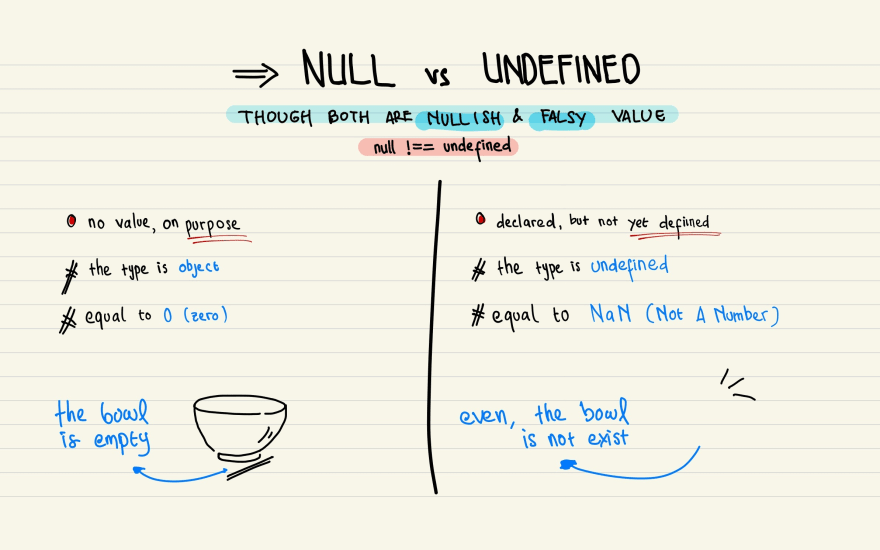

#NOTE: Chuyển bài này ra sau bài object. Hiểu object mới hiểu về cách truy cập prop k tồn tại sẽ trả về undefined

# null & undefined


https://javascript.plainenglish.io/why-does-javascript-have-both-null-and-undefined-6a42fcca9301

## Null là gì ?

- Kiểu dữ liệu null đại diện cho một giá trị không tồn tại một cách có chủ đích và đang không tham chiếu đến object hay array nào cả.

- Ta có thể set null cho một biến nào đó khi muốn tường minh chỉ định biến đó không chưa giá trị hay không muốn nó reference tới object hay array nữa.

- Vì sao null là primitive value mà typeof lại trả về "object" ?

  - Hiện tại nó đang là bug trong suốt quá trình phát triển của JS và nó không thể fix vì sẽ làm hỏng rất nhiều script khác nên quyết định giữ lại và để nó tồn tại song song cùng với sự phát triển của JS.

  - Link tham khảo:
    - https://developer.mozilla.org/en-US/docs/Web/JavaScript/Reference/Operators/typeof#typeof_null
    - https://javascript.plainenglish.io/why-does-javascript-have-both-null-and-undefined-6a42fcca9301

## Undefined là gì ?

- Một biến không có chứa giá trị hay được khai báo mà không gán giá trị.

  ```js
  let userRole;

  console.log(userRole); // undefined
  ```

- Param của một hàm không được truyền

  ```js
  function doSomething(name) {
    console.log(name); // undefined
  }

  doSomething(); // Không truyền gì vào
  ```

- Return của một function: Như cái hộp vậy, sẽ luôn return và k có kqa thi return undefined. Có thể hứng vào một biến và kiểm tra thử

  ```js
  const sayHello = function () {
    console.log('Say Hello');
  };

  const returnValue = sayHello();
  console.log(returnValue); // undefined
  ```

- Truy cập vào một properties không tồn tại trong object

  ```js
  const student = {
    name: 'John Wick',
    address: 'Continental',
  };

  console.log(student.age); // undefined
  console.log(student.age.year); // Uncaught TypeError: Cannot read properties of undefined (reading 'year')
  ```

## Phân biệt null vs undefined

- Giống nhau: Biến có kiểu dữ liệu null hoặc undefined đều có ý nghĩa đại diện cho dữ liệu không tồn tại, không truy cập được hoặc hiện không có sẵn.

  > Nếu vẫn cố gắng truy cập tiếp vào property hay gọi hàm của một biến null hay undefined thì sẽ gây lỗi thậm chí crash hệ thống

  ```js
  console.log(null == undefined); // true
  console.log(null === undefined); // false
  ```

- Khác nhau:

  - `undefined`: Đại diện cho các biến chưa được gán giá trị hay không có giá trị liên kết với biến. undefined sẽ mặc định được gán trong các trường hợp:

    - Biến được khởi tạo nhưng chưa gán giá trị

      ```js
      let x;
      console.log(x); // undefined
      ```

    - Giá trị trả về của một function
      ```js
      function sum(a, b) {
        const sum = a + b;
      }
      console.log(sum(3, 4)); //undefined
      ```
    - Truy cập vào một thuộc tính của object / phần tử của array không tồn tại

      ```js
      const nums = [1, 3, 4];
      console.log(nums[10]); // undefined
      const obj = { name: 'John' };
      console.log(obj.age); // undefined
      ```

  - `null`: Đại diện cho việc giá trị của biến mà nó liên kết không tồn tại

    ```js
    let y = null;
    console.log(y); // null
    ```

  - Check với `typeof`:

    ```js
    console.log(typeof undefined); //undefined
    console.log(typeof null); //object
    ```

  - Giá trị toán học:

    ```js
    console.log(undefined + 1);
    //NaN
    console.log(null + 1);
    //1
    ```

## Kết luận

- Về ý nghĩa sử dụng, cả 2 biến null và undefined đều biểu thị cho một giá trị không tồn tại hay không có sẵn.

  - Null biểu thị không có dữ liệu có chủ đích. Không tham chiếu với kiểu dữ liệu reference
  - Undefined biểu thị chưa được gán dữ liệu, giá trị chưa được xác định

- Tuỳ vào tình huống cũng như convention của dự án mà khi một biến chưa xác định giá trị hay muốn cho nó bị rỗng sẵn từ đầu thì ta sẽ sử dụng `null` hoặc `undefined`. JS sẽ xử lý 2 kiểu này như nhau
