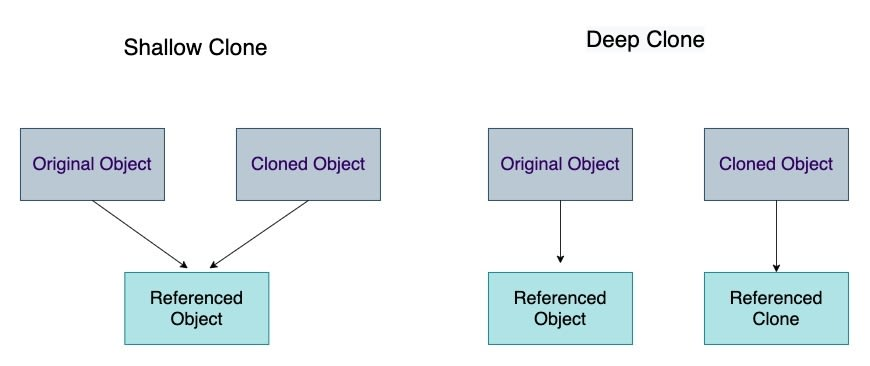

# Object


## Đối tượng là gì ?

### Đối tượng trong đời sống


Mọi người hay mọi thứ xung quanh ta đều có thể là một đối tượng, chúng là những thực thể được định hình bằng các đặc điểm (thuộc tính) và phương thức. Ta có thể dựa trên đặc điểm và phương thức đó để có thể phân biệt được cách mà các đối tượng tồn tại và hoạt động.

### Đối tượng trong lập trình

- Là một cấu trúc dữ liệu dùng để lưu trữ thuộc tính, phương thức của đối tượng được mô phỏng dựa trên chính đối tượng từ thực tế hoặc những đối tượng được định nghĩa dựa theo yêu cầu của một dự án / hệ thống ở bất kì lĩnh vực nào.

- Vd: Một dự án hệ thống bệnh viện sẽ có các đối tượng đời thực như: bệnh nhân, bác sĩ, các loại thuốc, trang thiết bị y tế... đều sẽ được mô phỏng thành đối tượng trong code, ngoài những đặc điểm và phương thức giống với đời thực thì sẽ có thêm các đặc điểm và phương thức thiên hướng kĩ thuật (technical) để có thể tương tác và trao đổi dữ liệu với nhau trong hệ thống.

### Đối tượng trong JS

- Object trong JS cũng như các ngôn ngữ lập trình khác. Sẽ được định nghĩa theo cấu trúc lưu trữ dạng key-value.

  ```js
  const person = {
    hair: 'black',
    eyes: 'black',
    skin: 'fair',
    eat: function () {},
    sleep: function () {},
    walk: function () {},
    play: function () {},
    study: function () {},
  };
  ```

- Các thành phần tạo nên object bao gồm thuộc tính (properties) và phương thức (methods). Một hàm khi được định nghĩa trong một object thì nó sẽ trở thành phương thức của object đó.

## Syntax

```
  const objectName = {
    key: value,
    key: value,
    key: value,
    ...
  }
```

```js
const developer = {
  name: 'John',
  age: 30,
  techStack: ['html', 'css', 'javascript'],
  isOfficialEmployee: true,
  project: {
    name: 'Antivirus',
    createdAt: '10-10-2020',
    members: 100,
  },
};
```

> Một object có thể có rất nhiều properties và một property có thể chứa nhiều kiểu dữ liệu khác nhau, thậm chí là một object khác

- Khi khai báo một object có key trùng nhau thì key được khai báo sau (ở line code dưới cùng) sẽ được áp dụng và ghi đè lại giá trị của key trên
- Khi truy cập không tồn tại trong object. Nó sẽ trả về undefined

  ```js
  const person = {
    name: 'Ple',
    age: 30,
    age: 100,
  };
  ```

  ```js
  console.log(person); // {name: 'Ple', age: 100}
  console.log(person.isRich); // undefined
  ```

- Có thể khai báo một object với shorthand như sau

  ```js
  function makeUser(name, age) {
    return {
      name: name,
      age: age,
    };
  }

  function makeUserShorthand(name, age) {
    return {
      name, // same as name: name
      age, // same as age: age
    };
  }
  ```

- Khai báo method cho object theo 2 cách:
  ```js
  const developer = {
    coding: function () {
      console.log('I am coding!');
    },
  };
  ```
  Tương đương với
  ```js
  const developer = {
    coding() {
      console.log('I am coding!');
    },
  };
  ```

## Access properties

- JS hỗ trợ 3 cách để truy cập được vào thuộc tính của object:

  ```js
  developer.name;
  ```

  ```js
  developer['name'];

  const targetProp = 'name';

  developer[targetProp];

  developer['%'];

  developer['spacing property'];
  ```

  ```js
  const { name } = developer;
  ```

- Thêm một property mới vào object:

  Các ngôn ngữ static typing như C#, Java thì 1 object được khởi tạo dựa trên class, do đó luôn có các trường và hàm cố định

  JS là ngôn ngữ dynamic typing nên có thể thêm xoá các property trong object dễ dàng

  ```js
  const peson = {};

  person.address = 'Da nang';
  console.log(person); // { address: 'Da nang' }
  ```

- Xoá một property trong object: Sử dụng keyword `delete`

  ```js
  delete person.lastName;
  ```

- Kiểm tra một property có tồn tại trong object không: Sử dụng keyword `in`

  ```js
  let user = {
    name: 'John',
    age: 30,
  };

  'age' in user; // true, user.age exists
  'blabla' in user; // false, user.blabla doesn't exist
  ```

## keyword `new`

- JS cũng như các ngôn ngữ lập trình khác, keyword `new` được sử dụng để tạo ra một instance object theo một khuôn mẫu (class) nào đó.
- Hiện nay JS cung cấp sẵn nhiều object built-in giúp làm việc với các kiểu dữ liệu được dễ dàng hơn và không cần thiết phải sử dụng keyword này trừ khi trong dự án có sử dụng OOP Programming.

  ```js
  class Person {
    constructor(name, age) {
      this.name = name;
      this.age = age;
    }

    // Define methods
    sayHello() {
      console.log(
        `Hello, my name is ${this.name} and I am ${this.age} years old.`
      );
    }
  }

  // Create a new instance of the class
  const john = new Person('John', 30);

  // Access instance properties and call methods
  console.log(john.name); // Output: "John"
  console.log(john.age); // Output: 30
  john.sayHello(); // Output: "Hello, my name is John and I am 30 years old."
  ```

## Global object

- Là một object top-level trong global scope. Đối với trình duyệt thì nó là object `window`, đối với môi trường thực thi thì nó là object `global`
- Global object cung cấp các properties và methods có thể truy cập và sử dụng được ở bất cứ đâu
- Đặc điểm

  - Các global object này sẽ ngầm định cung cấp các function built-in mà không cần phải gọi nó ra

    ```js
    const currentDate = Date();
    const globalCurrentDate = window.Date();

    const randomNumber = Math.random();
    const globalRandomNumber = window.Math.random();
    ```

  - Có hiệu lực ở khắp nơi trong hệ thống và trong code, ở đâu cũng có thể gọi ra sử dụng được không cần để tâm đến context.

## this

- Keyword này có tác dụng như một "con trỏ" và trỏ (tham chiếu) đến một object nào đó phụ thuộc vào việc object nào đang gọi nó hay scope mà nó đang tồn tại.

  ```
  I has a computer. Computer is good for me.
  I has a computer. This is good for me.
  ```

- Trường hợp sử dụng:

  - Thường dùng để đại diện cho object ở trong một scope nào đó
  - Có tính tái sử dụng

    ```js
    const person = {
      name: 'John',
      age: 30,
      greet() {
        console.log(
          `Hello, my name is ${this.name} and I'm ${this.age} years old.`
        );
      },
    };

    person.greet();
    ```

### Binding this

- Khi một object hay một function được tạo ra và có sử dụng keyword `this`. Thì con trỏ `this` cũng sẽ được tạo ra và và được bind với object. Việc bind với object nào sẽ phụ thuộc vào một số điều kiện.
- Có 2 kiểu thao túng việc binding this:

  - **Binding ngầm định (implicit)**: This sẽ tự động bind theo object theo context mặc định (ở trong method của object hoặc không scope,...)

  - **Binding tường minh (explicit)**: Dev sẽ chủ động bind this vào một context object nào đó theo chủ đích.

### Implicit binding

- **Global scope**: Mặc định khi không ở trong một object cụ thể nào thì `this` sẽ trỏ đến global object là `window`, chính là môi trường của trình duyệt. Còn trong NodeJS nó là `global` object.

  ```js
  console.log(this); // window

  function showMeThis() {
    console.log(this); // window
  }

  showMeThis();
  ```

  

- **Object's methods scope**:

  - Khi `this` được dùng trong một method thuộc object. Khi method được gọi, `this` sẽ trỏ đến chính object đang gọi method đó.

    ```js
    const person = {
      name: 'Ple',
      weight: 49,
      eat: function () {
        console.log(this.name + ' is eating...');
      },
      showMySelf: function () {
        console.log(this);
      },
    };
    ```

    ```js
    person.eat(); // "Ple is eating..."
    person.showMySelf(); // {name: 'Ple', weight: 49, eat: f...}
    ```

  - Execution context: Mỗi method khi được gọi sẽ tạo ra một execution context của riêng nó. Khi đó `this` cũng sẽ trỏ đến các object khác nhau. Sẽ tìm hiểu trong phần [Function](./../08_function/index.md)

    

    ```js
    const student = {
      name: 'Peter',
      gotoWork: function () {
        console.log('this in gotoWork', this);

        function doSomething() {
          console.log('this in doSomething', this);
        }

        const doSomething2 = () => {
          console.log('this in doSomething', this);
        };

        doSomething();
        doSomething2();
      },
    };
    student.gotoWork();
    ```

### Explicit binding

- Sử dụng một số hàm như `call(), bind(), apply()` để can thiệp và thay đổi context hiện tại của con trỏ `this`

  ```js
  var mouse = {
    name: 'Mickey',
    sayHi: function () {
      console.log(`Hi my name is ${this.name}`);
    },
  };

  var say = mouse.sayHi;
  say(); // Hi my name is undefined

  var say = mouse.sayHi.bind(mouse);
  say(); // Hi my name is Mickey
  ```

  > Ví dụ này sử dụng hàm bind() để gán context cho hàm say và this trong hàm say(). Khi gọi hàm say() thì nó đang có scope là global → window, không có thuộc tính this.name nên sẽ in ra undefined. Bằng cách bind context của object mouse vào cho hàm say(), this sẽ trỏ đúng đến object mouse → Từ đó mới có this.name = 'Mickey'

- Tìm hiểu kĩ hơn hàm `call(), bind(), apply()` ở phần [Function](./../08_function/index.md)

## Deep copy / Shallow copy ([link](https://javascript.plainenglish.io/copies-of-javascript-shallow-and-deep-copy-ac7f8dcd1dd0))



JS hỗ trợ 2 loại copy một object là shallow copy và deep copy. Tránh nhầm lẫn với phép gán object là copy tham chiếu địa chỉ, không phải là copy object.

```js
const car = {
  color: 'red',
  body: {
    slot: 4,
  },
};

const clonedCar = car; // assignment operator

clonedCar.color = 'yellow';
clonedCar.body.slot = 7;

console.log('car', car); // {color: 'yellow', body: { slot: 7 }}
console.log('cloned car', clonedCar); // {color: 'yellow', body: { slot: 7 }}
```

### Shallow copy

- Tạo ra một object mới có các property giống với object ban đầu.

  - Property dạng primitive: Copy giá trị riêng biệt, việc thay đổi giá trị trên object copy sẽ không ảnh hưởng đến object gốc.

  - Property dạng reference: Copy địa chỉ tham chiếu của property đó => Nếu thay đổi các giá trị tham chiếu của object bản sao thì nó cũng sẽ ảnh hưởng đến các giá trị của object gốc.

- Để thực việc shallow copy có thể dùng spread operator (Xem thêm ở phần ES6) hoặc phương thức Object.assign():

  ```js
  const dev = {
    technical: {
      frontend: 'JS',
    },
    exp: 3,
  };

  const otherDev = { ...dev };

  otherDev.technical.frontend = 'HTML, CSS';
  otherDev.exp = 0.5;

  console.log('dev', dev);
  console.log('otherDev', otherDev);
  ```

  ```js
  const dev = {
    technical: {
      frontend: 'JS',
    },
    exp: 3,
  };

  const otherDev = { ...dev };

  const superOtherDev = Object.assign({}, dev);

  superOtherDev.technical.frontend = 'All technologies';
  superOtherDev.exp = 10;

  console.log('dev', dev);
  console.log('superOtherDev', superOtherDev);
  ```

### Deep copy

- Cũng tạo ra một object mới với các property giống object gốc nhưng nó hoàn toàn tách biệt và không liên quan gì với object gốc. Việc thay đổi và chỉnh sửa bất kì thuộc tính nào của object cloned cũng sẽ không gây ảnh hưởng đến object gốc.
- Để tạo ra một deep copy object. Ta sử dụng các method của JSON

  ```js
  let copiedObject = JSON.parse(JSON.stringify(originalObject));
  ```

  ```js
  const obj3 = { a: 0, b: { c: 0 } };
  const obj4 = JSON.parse(JSON.stringify(obj3));

  obj3.a = 4;
  obj3.b.c = 4;
  console.log(obj4); // { a: 0, b: { c: 0 } }
  ```

## So sánh Object

- Khi so sánh object. Kết quả chỉ đúng khi địa chỉ của các object được so sánh có cùng địa chỉ tham chiếu đến cùng một ô nhớ
- Để so sánh trong JS:

  - `==`: Chỉ so sánh về mặt giá trị

  - `===`: Đối với kiểu reference, sẽ so sánh về giá trị và kiểu dữ liệu

  - `Object.is()`: Method của kiểu Object cho phép so sánh 2 giá trị bất kì.

    ```js
    const person1 = {
      name: 'Dev',
    };
    const person2 = {
      name: 'Dev',
    };

    person1 === person2; // => false
    person1 == person2; // => false
    Object.is(person1, person2); // => false

    const otherPerson = person1;

    person1 === otherPerson; // true;
    person1 == otherPerson; // true;
    ```

## Thực hành

- Khởi tạo một object về bản thân trong đó có các thuộc tính (properties) và phương thức (methods) tự chọn. Gọi một vài phương thức của object và kiểm tra kết quả.

- Xác định this trong các đoạn code sau:

  Bài 1:

  ```js
  const person = {
    name: 'John',
    sayName: function () {
      console.log(this.name);
    },
  };

  const greet = person.sayName;
  greet();
  ```

  Bài 2:

  ```js
  const mobile = {
    name: 'iPhoneX',
    color: 'midnight blue',
    weight: 500,

    takePhoto() {
      console.log(this);
    },

    messengerApp: {
      pingUni() {
        console.log(this);
      },
    },
  };

  mobile.takePhoto(); // this = ?
  mobile.messengerApp.pingUni(); // this = ?
  ```

  Bài 3:

  a. Kết quả của 2 câu lệnh console.log() in ra là gì ?

  ```js
  var name = 'Wanda';
  var obj = {
    name: 'Alibaba',
    prop: {
      name: 'Aladin',
      getName: function () {
        return this.name;
      },
    },
  };

  console.log(obj.prop.getName()); // ?

  var result = obj.prop.getName;

  console.log(result()); // ?
  ```

  b. Làm thế nào để `console.log(result());` in ra được kết quả là `Aladin` ?

  Bài 4:

  ```js
  function foo() {
    console.log(this.a);
  }

  const obj1 = {
    a: 42,
    foo: foo,
  };

  const obj2 = {
    a: 99,
    foo: foo,
  };

  const bar = obj1.foo;
  obj1.foo(); // ?
  obj2.foo(); // ?
  bar(); // ?
  ```

  Bài 5:

  ```js
  const obj = {
    value: 42,
    getValue: function () {
      return this.value;
    },
  };

  const getValue = obj.getValue;
  console.log(getValue()); // ?

  const boundGetValue = obj.getValue.bind(obj);
  console.log(boundGetValue()); // ?
  ```

  Bài 6:

  ```js
  const person = {
    name: 'John',
    sayName: function () {
      setTimeout(function () {
        console.log(this.name);
      }, 1000);
    },
  };

  person.sayName(); // ?
  ```

## Tham khảo

- Deep copy và shallow copy của object: https://anonystick.com/blog-developer/phong-van-su-khac-nhau-giua-shallow-copying-va-deep-copying-trong-object-javascript-2019112823755023

- Phương thức Object: https://developer.mozilla.org/en-US/docs/Web/JavaScript/Reference/Global_Objects/Object#static_methods
