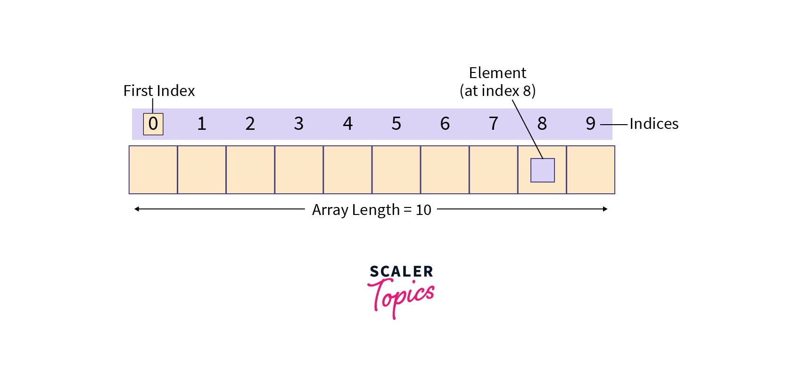
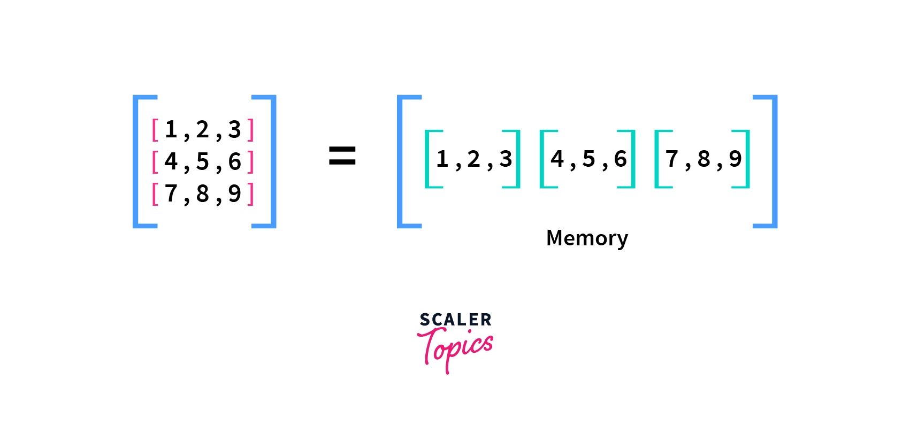
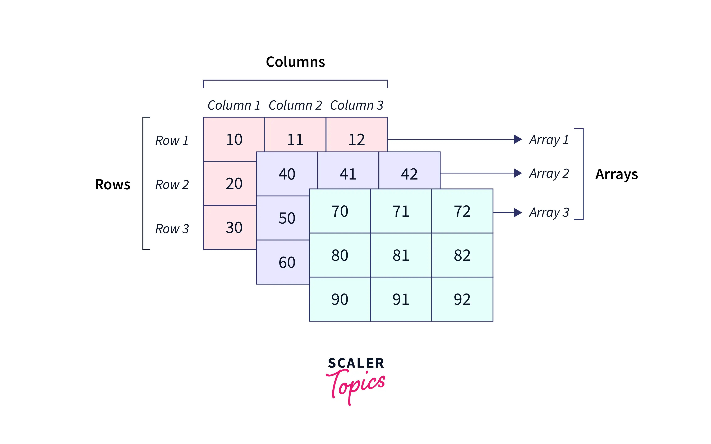

# Array (Mảng)


## Định nghĩa

- Array là một cấu trúc dữ liệu dùng để lưu trữ / gom nhóm một tập (collection) hay một set các giá trị có liên quan với nhau với bất kì kiểu dữ liệu nào.

  ```js
  const favoriteCar = ['Lexus', 'Ford', 'Mercedes'];
  ```

- Khác biệt so với việc khai báo riêng lẻ từng giá trị:
  Những biến này sẽ không liên quan gì với nhau và sẽ khó kiểm soát được nguồn gốc hay phạm vi hoạt động của chúng nếu số lượng ngày một nhiều lên.
  ```js
  let car1 = 'Lexus';
  let car2 = 'Ford';
  let car3 = 'Mercedes';
  ```
  > Chuyện gì sẽ xảy ra khi số xe ngày càng tăng (khoảng 100 xe) được định nghĩa riêng lẻ từng biến và phải xử lý chúng (sắp xếp, tìm kiếm, đổi tên, ...) => **Giải pháp duy nhất là lưu trữ tất cả chúng vào một array**

## Phân loại

- Mảng một chiều (1-D array)

  

- Mảng nhiều chiều (từ 2-D array trở lên)

  

  

Ví dụ mảng 1 chiều:

```js
const arr = [1, 2, 3];
```

Ví dụ mảng 2 chiều:

```js
const grid = [
  [1, 2, 3],
  [4, 5, 6],
  [7, 8, 9],
];

const element = grid[1][2];

console.log(element);
```

Ví dụ mảng 3 chiều:

```js
const grid = [
  [
    [1, 2, 3],
    [4, 5, 6],
    [7, 8, 9],
  ],
  [
    [10, 11, 12],
    [13, 14, 15],
    [16, 17, 18],
  ],
  [
    [19, 20, 21],
    [22, 23, 24],
    [25, 26, 27],
  ],
];

const element = grid[2][1][2];

console.log(element);
```

## Kiểm tra array

Bản chất của array thực ra là một loại của object. Cụ thể là `loại object có key là số nguyên và có thuộc tính length biểu diễn số phần tử chứa trong nó`

```js
typeof []; // "object"
```

- Vậy thì có cách nào để xác định được một biến có phải là array hay không ?

  - Sử dụng hàm có sẵn của Array là `isArray()`:

    ```js
    const myVar1 = [1, 2, 3];
    const myVar2 = 'abc';

    console.log(Array.isArray(myVar1)); // true
    console.log(Array.isArray(myVar2)); // false
    ```

  - Sử dụng keyword `instanceof`. Kiểm tra thử xem nó có phải là một thể hiện của Array hay không

    ```js
    const arr = '';
    const arr2 = [1, 2, 3];

    console.log(arr instanceof Array); // false
    console.log(arr2 instanceof Array); // true
    ```

> Mặc dù là một loại object nhưng array vẫn có các hàm xử lý riêng rất hiệu quả khi làm việc với dữ liệu dạng collection

## Access element in array

- Syntax: `value = array[index]`

  ```js
  const myArr = [1, true, 'hello'];

  const length = myArr.length; // 3;
  const lastElement = myArr[length - 1]; // 'hello'
  const randomValue = myArr[1]; // true
  ```

- Sử dụng hàm `at()`:

  ```js
  const myArr = [1, true, 'hello'];

  console.log(myArr.at(1)); // true
  console.log(myArr.at(-3)); // 1
  ```

## Array methods [(link)](https://developer.mozilla.org/en-US/docs/Web/JavaScript/Reference/Global_Objects/Array)

- Tham khảo: https://igorgonchar.medium.com/javascript-array-methods-cheatsheet-55016e405d14

- Các phương thức dùng để làm việc với mảng rất nhiều, dưới đây là một số method phổ biến:

  

## Một số vấn đề với index

### Phần tử ảo

Là những phần tử bất thường xuất hiện trong mảng có thể gây lỗi và phá vỡ logic xử lý dữ liệu với mảng. Có nhiều cách tạo ra phần tử ảo này.

- Khi tạo mảng với chỉ số cách biệt nhảy vọt, nó vẫn sẽ thêm giá trị đó vào mảng và length sẽ tương ứng từ arr[0] đến array index tại vị trí nhảy vọt đó.

  ```js
  let array = [1, 2, 3, 4];

  array[10] = 5;
  console.log(array); // [ 1, 2, 3, 4, <6 empty items>, 5 ]
  console.log(array.length); // 11
  ```

- Khi thêm một phần tử với index âm thì phần tử đó sẽ tạo thành một property có key là index âm. Length của sẽ không tính phần tử ảo này

  ```js
  let array = [1, 2, 3, 4];

  array[-10] = 6;
  console.log(array); // [ 1, 2, 3, 4, '-10': 6 ]
  console.log(array.length); // 4
  ```

- Đối với mảng rỗng:

  ```js
  const arr = [];
  arr.length = 10;

  console.log(arr); // (10) [empty × 10]
  console.log(arr.length); // 10;
  console.log(arr[3]); // undefined
  ```

- Đối với mảng có phần tử:

  ```js
  const arr = [1, 2, 3];
  arr.length = 10;

  console.log(arr); // (10) [ 1, 2, 3, <7 empty items> ]
  console.log(arr.length); // 10;
  console.log(arr[3]); // undefined
  ```

## Đọc thêm

**Vì sao phần tử đầu tiên trong mảng có index = 0 ?**

Đó là vì cơ chế zero-based indexing. Được sử dụng với lí do cần nhất quán với con trỏ trong số học: Trong lập trinh cấp thấp, các mảng thường được lưu vào các ô nhớ có địa chỉ liền kề. Sử dụng zero-based indexing để đánh index cho các phần tử trong mảng là cách đơn giản và đồng bộ nhất.
