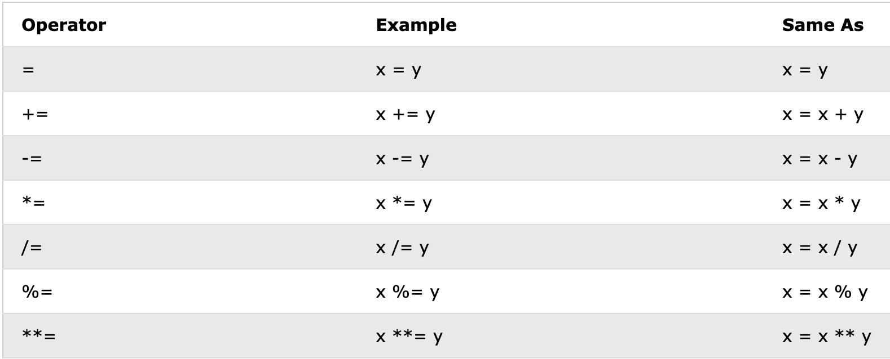

# JS Operators

Là các kí hiệu đại điện cho các phép so sánh và tính toán. Rất hay được sử dụng cùng với các câu lệnh điều kiện và các phép gán giá trị cho biến.


## ARITHMETIC

- Các phép toán cơ bản:

  - `+`: Cộng
    ```js
    const total = 10;
    total++;
    ```
  - `-`: Trừ
    ```js
    const total = 10;
    total++;
    ```
  - `*`: Nhân
  - `**`: Luỹ thừa
  - `/`: Chia lấy phần nguyên

    ```js
    const result = 8 / 4; // 2;
    const result2 = 9 / 4; // 2.25;
    ```

  - `%`: Chia lấy phần dư

    ```js
    const result = 8 % 4; // 0;
    const result2 = 9 % 4; // 1;
    ```

## COMPARISON

### Basic comparison

```js
  !=
  !==
  >
  <
  >=
  <=
```

### Loose equal / Loose Comparison (==)

- Phép so sánh này sẽ so sánh dựa trên **giá trị**.
- Nếu so sánh giữa các kiểu dữ liệu khác nhau, nó sẽ cố gắng convert kiểu dữ liệu ở vế trái thành kiểu dữ liệu ở vế phải rồi mới so sánh. Cơ chế convert dữ liệu xem thêm ở phần [Comparsion & Conversion](/2_Programs/Stage2/3_javascript/).

  ```js
  console.log(0 == false); // true
  ```

### Strict equal / Strict Comparison (===)

- Phép so sánh này sẽ so sánh dựa trên giá trị và kiểu dữ liệu
- Không như (==). Chỉ cần khác kiểu dữ liệu thì return về false, không cần phải convert
- Recommend sử dụng so sánh Strict equal `===` khi làm việc với JS

  ```js
  console.log(0 === false); // false
  ```

## LOGICAL

### And (&&)

https://javascript.info/logical-operators#and

Có 2 trường hợp sử dụng:

**Case 1:**

- Dùng trong if statement để kiểm tra nhiều điều kiện kết hợp với nhau và trả về kêt quả cuối cùng.

- Kết quả của toán tử trả về `true` khi tất cả các điều kiện **bắt buộc** đều true.

- Kết quả toán tử trả về `false` nếu có ít nhất một điều kiện false.

```js
const weather = 'sunny';
const money = 500_000;

if (weather === 'sunny' && money > 0) {
  // Block code này chỉ chạy khi điều kiện weather === 'sunny' và money > 0 đều trả về true
  console.log('go to shopping');
} else {
  // Block code này chạy khi một trong 2, hoặc cả 2 điều kiện ở trên trả về false
  console.log('at home');
}
```

**Case 2:**

- Dùng trong việc xử lý các điều kiện để lấy giá trị trả về và gán cho một biến nào đó

```js
let result = value1 && value2 && value3;
```

> - Biểu thức sẽ được đánh giá từ trái sang phải
> - Return về giá trị falsy đầu tiên được tìm thấy
> - Return về giá trị truthy cuối cùng

```js
console.log(1 && false && {}); // ?
console.log([] && 'true' && 1); // ?
```

### Or (||)

https://javascript.info/logical-operators#or

- Giống như toán tử AND (&&). Dùng để kết hợp nhiều điều kiện với nhau và trả về kết quả cuối cùng.
- Điểm khác biệt là chỉ cần một điều kiện `true` thì kết quả cuối cùng vẫn sẽ trả về true.

  ```js
  const domain = 'frontend';

  if (domain === 'frontend' || domain === 'backend' || domain === 'fullstack') {
    // Block code này chạy khi có ít nhất một trong 3 điều kiện trên, hoặc cả 3 trả về true
    console.log('Developer');
  } else {
    // Block code này chạy khi cả 3 điều kiện trên đều false
    console.log('Normal person');
  }
  ```

### Negative (!)

https://developer.mozilla.org/en-US/docs/Web/JavaScript/Reference/Operators/Logical_NOT

- Toán tử phủ định. Sẽ convert một giá trị về kiểu boolean và đảo ngược lại giá trị của nó sau khi chuyển đổi.

  ```js
  const loggedIn = {};
  const result = !loggedIn;
  console.log(result); // {} -> Boolean({}) -> true -> ! -> false
  ```

  ```js
  const isShowPopup = false;

  function togglePopup() {
    isShowPopup = !isShowPopup;
  }
  ```

### Not-not operator (!!)

- Dùng để convert một giá trị bất kì thành kiểu boolean tương ứng. Tương tự như việc gọi một Primitive Wrapper Object Boolean bọc bên ngoài biến.
- Công dụng giống như negative operator nhưng nó sẽ không đảo ngược lại giá trị.

```js
const mySt = 'hello';
const myNum = 0;

Boolean(myStr); // true
!!myStr; // true

Boolean(myNum); // false
!!myNum; // false
```

### Nullish coalescing (??)

https://javascript.info/nullish-coalescing-operator

- Dùng để kiểm tra xem một biến có giá trị hay null/undefined

  ```js
  const data = dataFromServer ?? defaultData;
  ```

- Giá trị null/undefined ở vế bên nào thì giá trị của bên còn lại sẽ được lấy và gán cho biến

  ```js
  const foo = null ?? 'default string';
  console.log(foo); //"default string"

  const baz = 0 ?? 42;
  console.log(baz); // 0

  var user;
  alert(user ?? 'Anonymous'); // Anonymous (user not defined)
  var user = 'John';
  alert(user ?? 'Anonymous'); // John (user defined)
  ```

### Chaining Operations (?.)

https://javascript.info/optional-chaining

- Mặc định trong JS nếu cố gắng truy cập môt property hay 1 method không tồn tại từ cấp lồng thứ 2 trở đi của object thì sẽ bị lỗi và gây crash hệ thống.

  ```js
  const dev = {
    name: 'ple',
  };

  // Access object property level 1
  console.log(dev.name); // ple
  console.log(dev.domain); // undefined

  // Access object property level 2
  console.log(dev.domain.backend); // Uncaught TypeError: Cannot read properties of undefined (reading 'backend')
  ```

- Toán tử này giúp việc truy cập các thuộc tính của đối tượng theo cấp lồng nhau một cách an toàn.
- Sử dụng trong trường hợp một object nhận về từ server hay chưa được gán giá trị thì mình sẽ không biết được là tại thời điểm mình truy cập thì thuộc tính hay methods mình truy cập có bị null hay undefined không.
- Syntax: `?.`

  ```js
  const cat = {
    name: 'Meow',
    age: 3,
    // foot: {
    //   toe: 3
    // }
  };

  // Using if statement
  if (cat.foot) {
    if (cat.foot.toe) {
      if (cat.foot.toe) {
        console.log(cat.foot.toe);
      }
    }
  }

  // Using optinal chaining operator
  console.log(cat?.foot?.toe);
  ```

#### Trường hợp sử dụng khác

- Optional chaining không chỉ sử dụng được với object mà còn sử dụng được cho mảng, hàm.

  ```
  obj?.prop,
  arr?.[index],
  func?.()
  ```

#### Warning

- Tác dụng của optinal chaining là giúp ta kiểm soát lỗi khi truy cập các thuộc tính null / undefined nhưng việc lạm dụng quá nhiều toán tử này sẽ gây một số ảnh hưởng:

  - Code sẽ trở nên dài hơn và khó đọc hơn. Có khi cần phải tách ra để debug vì không biết được lỗi nằm ở chain nào trong chuỗi

    ```js
    const customer = {
      name: 'John',
      address: {
        street: '123 Main St',
        city: 'Example City',
        state: 'Example State',
        country: {
          name: 'Example Country',
          code: 'EX',
        },
      },
    };

    const countryCode = customer?.address?.country?.code;
    console.log(countryCode);
    ```

  - Có thể gây giảm hiệu năng vì mỗi khi `?.` được sử dụng tương đương với việc sẽ có một biểu thức được sinh ra dùng để đánh giá xem property đó có tồn tại không.

    ```js
    let salary = developer?.department?.salary;
    ```

    Sẽ tương đương với:

    ```js
    let salary;
    if (developer) {
      if (developer.department) {
        if (developer.department.salary) {
          salary = developer.department.salary;
        }
      }
    }
    ```

## TERNARY (? :)

- Tên thường gọi là toán tử 3 ngôi (Vì có 3 vế)
- Syntax: `condition ? statement when true : statement when false;`

  ```js
  const result = isFrontendDev ? 'ReactJS' : 'NodeJS';
  ```

- Multiple ternary: Các toán tử 3 ngôi có thể kết hợp với nhau để xử lý nhiều trường hợp. Vì có độ phức tạp cao cũng như khó đọc và khó debug nên chỉ sử dụng trong một số trường hợp đặc biệt.

  ```js
  let age = prompt('age?', 18);

  let message =
    age < 3
      ? 'Hi, baby!'
      : age < 18
      ? 'Hello!'
      : age < 100
      ? 'Greetings!'
      : 'What an unusual age!';

  console.log(message);
  ```

> - Sử dụng toán tử 3 ngôi khi chỉ có một điều kiện cần xem xét và cần lưu kết quả đó lại vào một biến để tiện xử lý cho các logic khác.
> - Nếu có nhiều điều kiện cần xem xét ta có thể chuyển sang sử dụng các câu lệnh điều kiện khác như if... else, switch... case,...

- Ví dụ ở trên nếu được triển khai sử dụng if... else:

  ```js
  if (age < 3) {
    message = 'Hi, baby!';
  } else if (age < 18) {
    message = 'Hello!';
  } else if (age < 100) {
    message = 'Greetings!';
  } else {
    message = 'What an unusual age!';
  }
  ```

## ASSIGNMENT (=)

- Trong lập trình, đây không phải là dấu bằng "=". Đây gọi là **phép gán**.
- Giá trị của vế bên phải sẽ được gán cho vế bên trái.
- Các phép gán có thể gán liên tục với nhau trên một line code.

  ```js
  let x = 5;
  let y = 10;
  let z = 25;

  x = y; // x is 10
  x = y = z; // x, y and z are all 25
  ```

  ```js
  let z = 10;
  let x, y;

  x = y = z;

  console.log(x); // Output: 10
  console.log(y); // Output: 10
  ```

- Bảng các phép gán tính toán giá trị hay sử dụng:

  

## void

- Làm cho giá trị của biểu thức trả về `undefined`
- Sử dụng trong một số trường hợp không cần nhận giá trị return về từ một biểu thức hay một phép so sánh

  ```js
  console.log(10 + 10); // 20

  console.log(void (10 + 10)); // undefined
  ```

## Tham khảo

- So sánh '==' và '===': https://codeaholicguy.com/2016/06/14/nen-dung-hay-de-so-sanh-trong-javascrip
