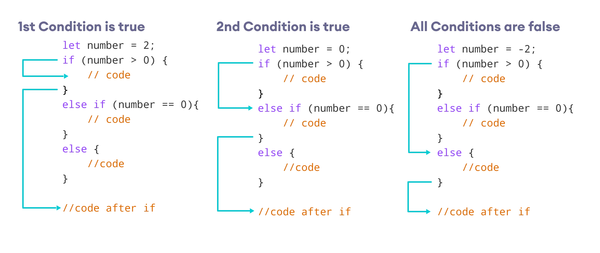
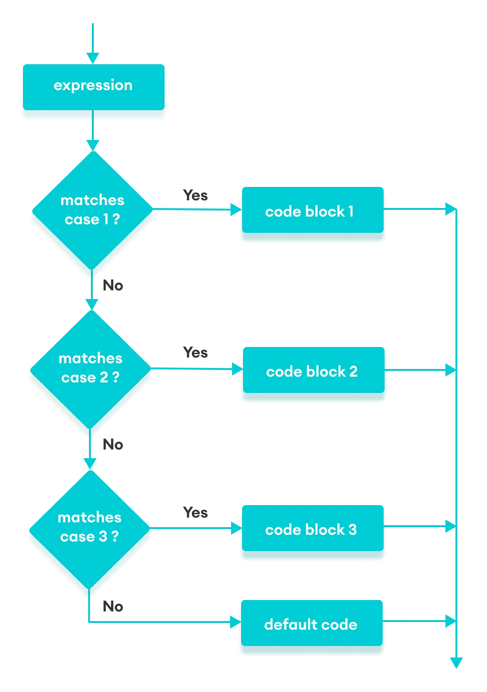

# Conditional Statements


Các câu lệnh điều kiện là một phần không thể thiếu trong quá trình viết code giúp ta kiểm tra các điều kiện trả về là đúng hay sai để thực hiện tiếp tục các tác vụ tương ứng. Từ đó có thể giúp luồng chạy chương trình rẽ nhánh theo các điều kiện khác nhau phù hợp với yêu cầu và mục đích đề ra ban đầu.

```
IF weather = 'RAIN' goSleep ELSE goOut
```

## IF / IF ELSE / IF ELSE-IF

### IF

- Block code trong if statement sẽ được thực thi khi điều kiện truyền vào trả về giá trị true. Ngược lại nếu condition không đúng (trả về false) thì if statement này sẽ bị bỏ qua và không được thực thi

- Syntax:

  ```js
  if (condition) {
    statement;
  }
  ```

  ```js
  if (condition) statment;
  ```

- Flow:
  

### IF ELSE

- Tương tự như if statement ở trên dùng cho trường hợp chỉ có một điều kiện để xét. Nếu cần thêm option để xử lý khi condition false có thể dùng thêm else statement

- Syntax:
  ```js
  if (condition) {
    statement; // when condition is true;
  } else {
    statement; // when condition is false;
  }
  ```
- Flow:
  

### IF ELSE-IF

- Trong trường hợp condition false và block else được thực thi thì ngay tại đây ta có thể mở thêm một `if else statement` ngay trong `block else` nữa để xử lý những điều kiện con.

> Trừ một vài trường hợp đặc biệt để sử dụng. Cách này không khuyến khích thường xuyên sử dụng vì nó làm cho flow code trở nên phức tạp và khó debug lỗi sau này.

- Syntax:

  ```js
      if (this condition is true) {
        doSomething();
      } else if {
        doThisOtherThing();
      } else if {
        doThisAwesomeThing();
      } else {
        doSomethingDifferent();
      }
  ```

  

- Flow:
  

## SWITCH CASE

- Sử dụng khi ta có thể đoán trước được các giá trị sẽ trả về (các phép toán, số tháng trong một năm, số ngày trong một tháng, giới tính, trạng thái bật / tắt...)
- Syntax:
  Sử dụng bộ keyword 'switch-case-default-break'

  ```js
  switch (expression) {
    case value1:
      block1;
      break;
    case value2:
      block2;
      break;
    case value3:
      block3;
      break;
    default:
      defaultBlock;
      break;
  }
  ```

- Example:

  ```js
  let age = 30;
  let generation;
  switch (age) {
    case 10:
      generation = 'kid';
      break;
    case 20:
      generation = 'teen';
      break;
    case 70:
      generation = 'old';
      break;
    default:
      generation = 'adult';
      break;
  }
  console.log(`The generation is ${generation}`);
  ```

  ```js
  let fruit = 'apple';
  switch (fruit) {
    case 'apple':
    case 'mango':
    case 'pineapple':
      console.log(`${fruit} is a fruit.`);
      break;
    default:
      console.log(`${fruit} is not a fruit.`);
      break;
  }
  ```

  ```js
  let fruit = 'mango';
  let isSour = true;
  let favortieFruit = '';
  switch (fruit) {
    case 'mango':
      if (isSour) {
        favortieFruit = 'mango';
      }
      break;
    default:
      console.log(`${fruit} is not a fruit.`);
      break;
  }
  console.log(favortieFruit); // mango
  ```

> - Sau mỗi case luôn luôn dùng keyword `break` để thoát luồng hiện tại ra, nếu không nó sẽ thực thi hết tất cả các case còn lại bên dưới.
> - Ở case default không bắt buộc phải thêm `break` cho nó vì cơ bản nó là case cuối cùng và ngầm định có keyword `break` nên sẽ tự thoát ra khỏi switch-case statement sau khi thực thi.
> - Các case có cùng chung cách xử lý với nhau sẽ viết liền với nhau và dùng 1 block code.

- Flow:
  

## Lưu ý

- Các statment có thể convert linh hoạt với nhau (từ if else convert sang switch case,...). Tuỳ thuộc vào tập điều kiện cần cover và mục đích sử dụng.
- Nested conditions:

  - Các điều kiện xử lý logic khi không được tối ưu hay tính toán kĩ sẽ rất dễ bị lồng vào nhau và vô tình làm cho source code trở nên rất phức tạp và khó debug khi gặp lỗi sau này

    

    

  - Solution: Phân tách các điều kiện nhỏ ra và kiểm soát các trường hợp một cách tối ưu để tránh việc số lượng cases cần cover quá nhiều dẫn đến source bị scale lớn không cần thiết.

- Falsy và Truthy:

  - Các conditions statement có thể nhận vào các giá trị falsy hay truthy và xem đó như là kết quả của condtion từ đó thực thi các block code tương ứng

    - Giá trị falsy: false, '', null, undefined, NaN, 0

    - Giá trị truthy: true, number > 0, string not empty, {}, [], ...

    ```js
    const isTruthyValue = true;
    if (isTruthyValue) {
      // do something...
    } else {
      // execute when conditional is any falsy value
    }
    ```
