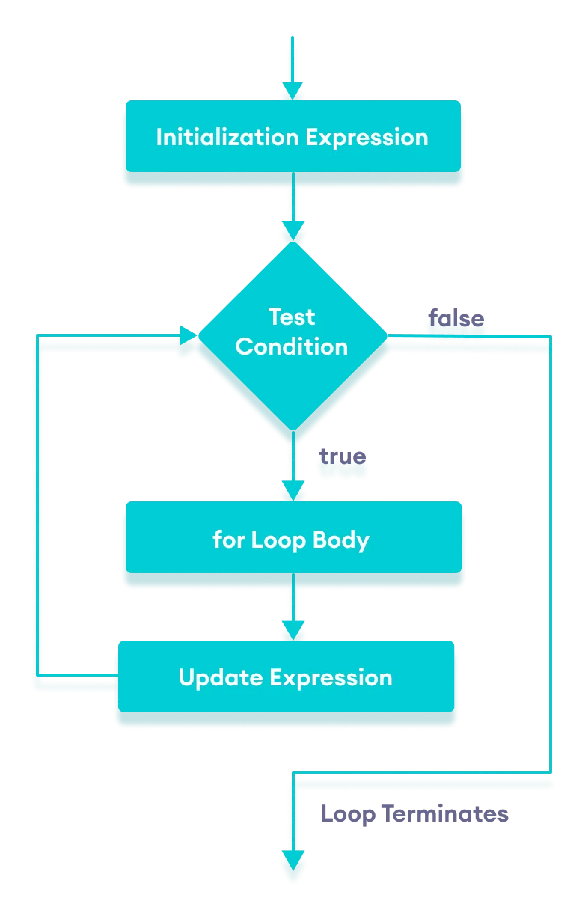
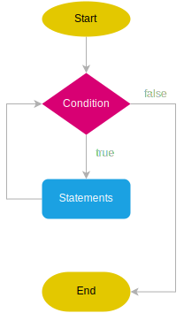
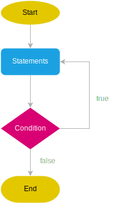

# Loop

https://javascript.info/while-for

For...in: https://www.javascripttutorial.net/javascript-for-in/

For i: https://www.javascripttutorial.net/javascript-for-loop/

While: https://www.javascripttutorial.net/javascript-while-loop/

Do...while: https://www.javascripttutorial.net/javascript-do-while/


## Định nghĩa

Cấu trúc lặp (vòng lặp) là khái niệm phổ biến và rất hay được sử dụng và nó xuất hiện trong mọi ngôn ngữ lập trình.

Công dụng chính của vòng lặp là giúp ta thực thi một hoạt động hay một chuỗi các hoạt động lặp lại n lần mà không phải viết lại code trùng lặp.

Ví dụ:

- Viết code in ra màn hình số từ 1 đến 5

  - Không dùng vòng lặp

    ```js
    console.log(1);
    console.log(2);
    console.log(3);
    console.log(4);
    console.log(5);
    ```

  - Dùng vòng lặp

    ```js
    for (let i = 1; i <= 5; i++) {
      console.log(i);
    }
    ```

- Triển khai chức năng hệ thống có tính lặp lại dựa theo điều kiện nào đó như bắt buộc user phải login đúng password, lặp qua response từ server để hiển thị ra một list dữ liệu trên UI, ...
- Truy cập vào các list user để thực hiện sửa đổi thông tin tại một thuộc tinh nào đó

### Ưu điểm

- Tiết kiệm thời gian viết code, giảm code trùng lặp trong source.
- Có thể tái sử dụng (reuse) - Khi muốn thay đổi logic chỉ cần chỉnh sửa một chỗ.

### Nhược điểm

- Không nắm rõ cơ chế hoạt động của vòng lặp có thể dẫn đến việc viết các vòng lặp lồng nhau hoặc vòng lặp vô hạn gây ảnh hưởng nghiêm trọng đến hiệu năng và có nguy cơ tràn bộ nhớ.

- Không kiểm soát tốt số vòng lặp cần thực hiện hay ước lượng được điều kiện để thoát vòng lặp cũng sẽ dễ dẫn tới khả năng lặp vô hạn.

### Cấu tạo tổng quát của vòng lặp

- Biến đếm (dùng để kiểm tra số lượng vòng lặp được thực hiện);
- Biểu thức điều kiện (Quyết định xem khi nào thì thoát vòng lặp);
- Biểu thức cập nhật biến đếm

### Phân loại vòng lặp

#### for i


Sử dụng khi biết trước được số vòng lặp và điều kiện.


- Syntax:

  ```
  for (expression1; expression2; expression3) {
    // code block to be executed
  }
  ```

  > - expression1: Dùng để khởi tạo biến đếm (i). Chạy một lần trước khi chạy block code.
  > - expression2: Điều kiện để thực thi block code. Đúng thì sẽ thực thi block code -> expression3
  > - expression3: Tăng giá trị biến đếm i. Chạy mỗi lần block code được thực thi xong

- For i với biến i define ở ngoài: Có thể truy cập và sử dụng được biến i sau khi vòng for kết thúc

  ```js
  let i = 0;

  for (i = 0; i < 3; i++) {
    // use an existing variable
    console.log(i); // 0, 1, 2
  }

  console.log(i); // 3, visible, because declared outside of the loop
  ```

- For i với biến i define bên trong: Không thể truy cập được vì biến i sẽ bị giải phóng sau khi vòng for kết thúc.

  ```js
  for (let i = 0; i < 3; i++) {
    console.log(i); // 0, 1, 2
  }
  console.log(i); // ReferenceError: i is not defined
  ```

- For i lặp vô hạn

  ```js
  for (let i = 0; ; i++) {
    // repeats without limits
  }
  ```

  ```js
  for (;;) {
    // repeats without limits
  }
  ```

  For i được cấu tạo từ 3 biểu thức, khi biểu thức điều kiện (condition statement) bị thiếu thì sẽ mặc định như alway true => Vòng lặp sẽ chạy vô hạn. Hãy cẩn thận!

- Khác nhau giữa i++ và ++i trong for i

  ```js
  for (let i = 0; i < 5; i++) {
    console.log(i);
  }
  ```

  ```js
  for (let i = 0; i < 5; ++i) {
    console.log(i);
  }
  ```

  Kêt quả của 2 vòng lặp ở trên là giống nhau, khác biệt ở chỗ khi biểu thức cập nhật biến đếm i được thực thi:

  - i++: Giá trị hiện tại sẽ được gán cho biến i, sau đó i tăng lên 1 đơn vị và lưu vào bộ nhớ
  - ++i: Giá trị hiện tại của i sẽ tăng lên một đơn vị, sau đó gán cho biến i

  **Kết luận**: Việc sử dụng i++ hay ++i trong for i gần như tương đương nhau và không có gì quá khác biệt.

#### for each

- Sử dụng hàm `forEach()` của Array. Nhận vào 1 callback function. Qua mỗi lần lặp sẽ thực thi callback function để thao tác với element đang được lặp lúc đó.
- Calllback function nhận vào 3 tham số là value, index, và chính mảng đang được lặp.

  ```js
  const numbers = [45, 4, 9, 16, 25];
  numbers.forEach(function (value, index, array) {
    console.log(value);
  });
  ```

  ```js
  const arr = [4, 1, 5, 3];

  arr.forEach((...everything) => {
    console.log(everything);
  });
  ```

  ```
  [ 4, 0, [ 4, 1, 5, 3 ] ]
  [ 1, 1, [ 4, 1, 5, 3 ] ]
  [ 5, 2, [ 4, 1, 5, 3 ] ]
  [ 3, 3, [ 4, 1, 5, 3 ] ]
  ```

- So sánh với hàm `map()`

  ```js
  const numbers = [45, 4, 9, 16, 25];
  numbers.map(function (value, index, array) {
    console.log(value);
  });
  ```

- Giống nhau: Đều copy ra một array mới để làm việc mà không thay đổi array cũ (immutable).

- Khác nhau: forEach sẽ không return về giá trị gì (undefined). Còn map nó sẽ loop qua array gốc, add vào mảng mới và return về mảng mới đó, không thay đổi array gốc.

  ```js
  const arr = [1, 2, 3];

  const resultForEach = arr.forEach(function (element) {
    return element * 2;
  });

  const resultMap = arr.map(function (element) {
    return element * 2;
  });

  console.log(resultForEach); // undefined
  console.log(resultMap); // [2, 4, 6];
  ```

#### for...of

- Lặp qua các value của **Iterable Object** như string, array, map, set

  ```js
  const array1 = ['a', 'b', 'c'];

  for (const element of array1) {
    console.log(element);
  }

  // "a"
  // "b"
  // "c"

  //====

  const iterable = 'boo';

  for (const value of iterable) {
    console.log(value);
  }
  // "b"
  // "o"
  // "o"
  ```

- Một object bình thường không phải là một **Iterable Object**. Nếu dùng for...of lặp qua nó sẽ báo lỗi

  ```js
  const student = {
    name: 'Ple',
    age: 18,
    mark: 10,
  };

  for (const value of student) {
    console.log(value);
  }
  ```

  ```
  TypeError: student is not iterable
  ```

#### for...in

- Thường dùng để loop qua các property (key) của một object
- Các property của object là các [enumerable property](https://www.javascripttutorial.net/javascript-enumerable-properties/)

  ```js
  for (key in object) {
    // executes the body
  }
  ```

  ```js
  let user = {
    name: 'John',
    age: 30,
    isAdmin: true,
  };

  for (let key in user) {
    console.log(key); // name, age, isAdmin
    console.log(user[key]); // John, 30, true
  }
  ```

  ```js
  const str = 'Hello';

  for (let char in str) {
    console.log(char);
  }
  ```

  ```js
  const arr = [2, 4, 6];

  for (let idx in arr) {
    console.log(idx); // '0', '1', '2'
  }
  ```

#### So sánh giữa for...in và for...of

```js
let myString = 'hello';

for (const str of myString) {
  console.log(str); // h,e,l,l,o
}

for (const str in myString) {
  console.log(
    str, // 0, 1, 2, 3, 4
    myString[str] // h, e, l, l, o
  );
}
```

```js
let list = [4, 5, 6];

for (let i in list) {
  console.log(i); // "0", "1", "2",
}

for (let i of list) {
  console.log(i); // "4", "5", "6"
}
```

#### while - do...while

- while

  ```js
  while (condition) {
    // executed until condition is false
  }
  ```

  ```js
  while (i < 10) {
    text += 'The number is ' + i;
    i++;
  }
  ```

  

  Lưu ý: Khi sử dụng while mà không có điểm endpoint (kết quả false của condition) thì vòng lặp sẽ lặp vô hạn.

  ```js
  while (true) {
    // infinite loop
  }
  ```

- do...while:

  Là một biến thể của vòng lặp while phía trên. Khác biệt ở chỗ block code trong `do` sẽ luôn được thực thi trước một lần. Từ lần thứ 2 trở đi nó sẽ bắt đầu check điều kiện trong `while`, nếu điều kiện đúng sẽ thực thi code trong `do`. Nếu sai sẽ thoát vòng lặp.

  

  ```js
  let count = 0;
  do {
    console.log(count);
    count++;
  } while (count < 5);
  ```

### ES5 Loop Functions

- Phiên bản ES5 của JS hỗ trợ thêm các hàm có thể lặp qua một array, cho phép can thiệp và xử lý logic từng phần tử trong array đó vd: map(), reduce(), filter(),...

## `break` keyword [(link)](https://www.javascripttutorial.net/javascript-break/)

## `continue` keyword [(link)](https://www.javascripttutorial.net/javascript-continue/)

## Bài tập

1. Viết hàm dùng để đảo ngược một array [1 ,2, 3] mà không được dùng method reverse().

2. Cho một mảng gồm 5 phần tử [10, 20, 30, 40, 50]. Hãy tạo ra một mảng gồm các phần tử của màng cũ nhưng có giá trị gấp đôi bằng cách sử dụng for i, for in. Vd [20, 40, 60, 80, 100];
