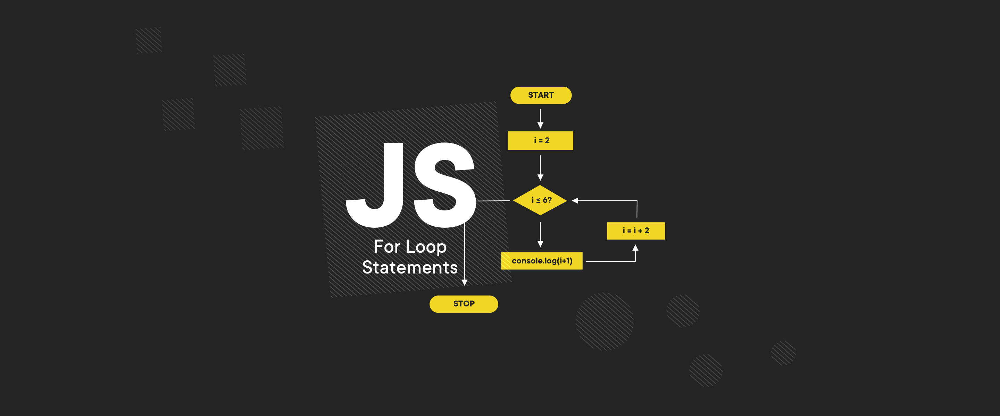

# Loop

Cấu trúc lặp (vòng lặp) là khái niệm phổ biến và rất hay được sử dụng trong lập trình, xuất hiện trong mọi ngôn ngữ lập trình.

## for i

## for...of

## for...in

## while - do...while

## ES5 Loop Functions

- Phiên bản ES5 của JS hỗ trợ thêm các hàm có thể lặp qua một array, cho phép can thiệp và xử lý logic từng phần tử trong array đó vd: map(), reduce(), filter(),...
- Tham khảo thêm các hàm này ở phần [Data Type Array](/2_Programs/Stage2/3_javascript/04_data-types/08_array.md)
