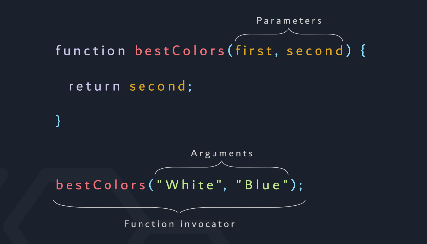
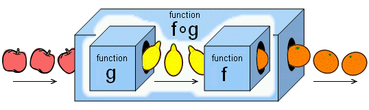
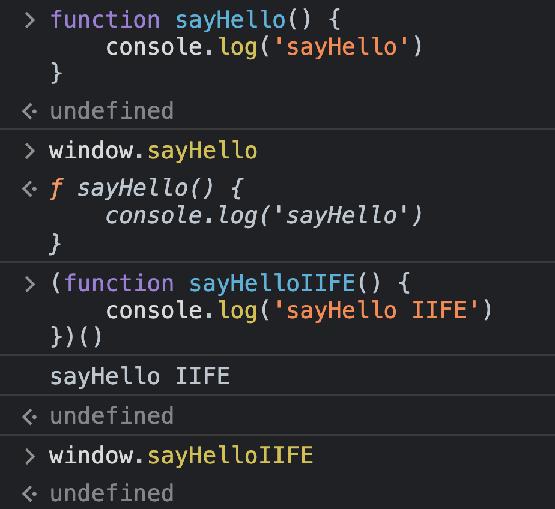
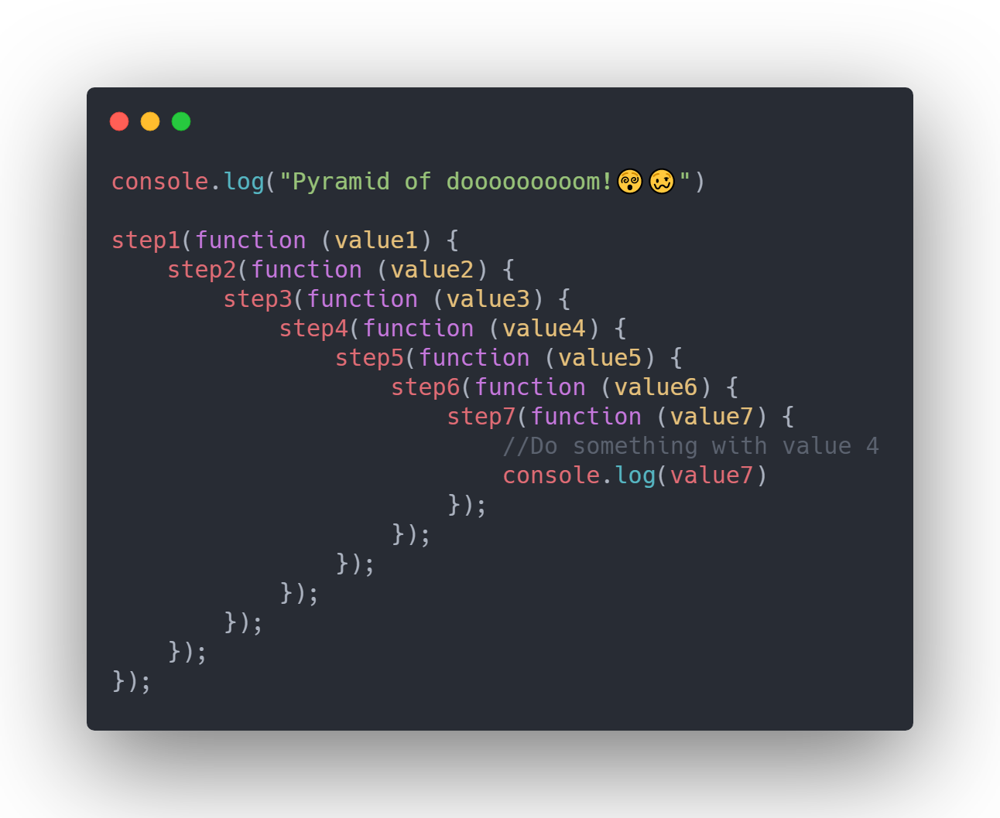
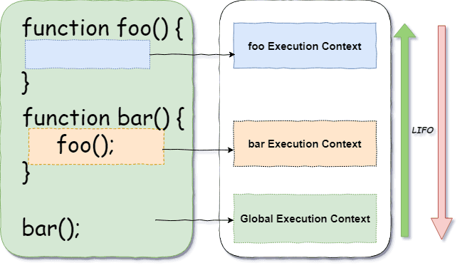
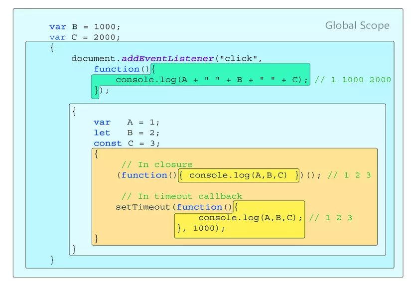
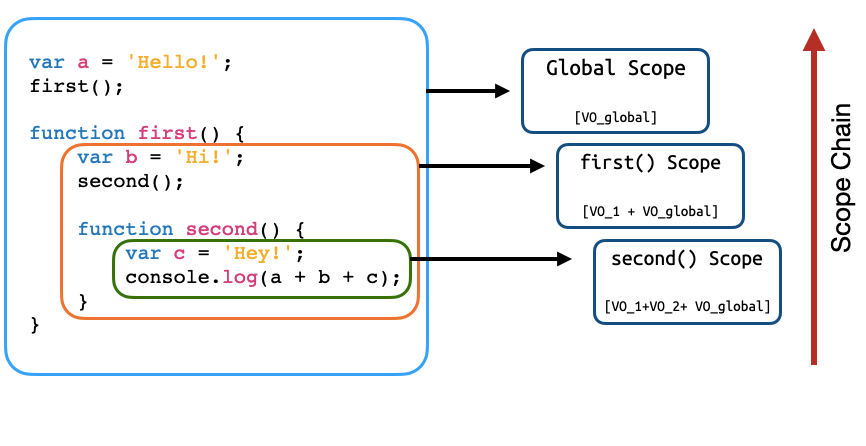

# Function

Để giải quyết một vấn đề phức tạp, ta chia thành nhiều vấn đề nhỏ. Mỗi vấn đề nhỏ muốn giải quyết lại cần nhiều bước để thực hiện. Các bước đó có thể gom thành một hàm.

## Định nghĩa


- "Hàm" trong đời sống: ăn, ngủ, nghỉ,...
- Function (hàm) trong JS bản chất là một block code được đặt tên hoặc không đặt tên (anonymous) - Là một hoặc một chuỗi các statement dùng để thực hiện một tác vụ nào đó hoặc tính toán và trả ra một giá trị

## Tính chất

- Function được chia làm 2 loại

  - Built-in
  - Tự định nghĩa

- Hàm không tự thực thi khi đang được khai báo.

  Chỉ thực thi khi sử dụng lời gọi hàm `()`.

  ```js
  function sayHello() {
    console.log('Hello world!'); // this line will not be execute
  }

  sayHello(); // Excecute! -> 'Hello world!'
  ```

- Có thể nhận vào tham số hoặc không.
- Luôn luôn return về giá trị:

  - Ngầm định (implicit): undefined
  - Tường minh (explicit): Dev tự định nghĩa

- Lợi ích:

  - Định nghĩa các hàm giúp code được tách bạch để dễ quản lý và sửa đổi.

  - Dễ đọc, dễ bảo trì nâng cấp sau này.

  - Nếu không có function. Tất cả logic không liên quan gì đến nhau dồn chung lại một chỗ => Dẫn đến việc không thể mở rộng hệ thống cũng như rất tốn thời gian và công sức nếu như có lỗi phát sinh.

## Định nghĩa một function

### Tham số (parameter) và đối số (argument)



- Tham số: Là một biến được định nghĩa khi khai báo hàm, như là một chỗ trống sẵn để dành cho input truyền vào khi gọi hàm.
- Đối số: Là biến được truyền vào trực tiếp cho hàm để hàm có thể dựa vào đó và xử lý.

  ```js
  function sayHello(name) {
    // name is parameter
    console.log('Hello ' + name);
  }

  const name = 'Ple';
  sayHello(name); // name is argument
  ```

- Một hàm chỉ nên có tối đa 3 tham số.

- Tưởng tượng hàm như một cái box. Ta có thể truyền tham số đầu vào (input) để hàm có thể xử lý dựa trên tham số đó và trả ra kết quả ta mong muốn (output).

- Giá trị trả ra (output) của hàm này có thể là input của hàm khác.



### Function declaration

- Sử dụng keyword `function` và tên của function để định nghĩa.

  ```js
  function nameOfFunction() {
    // function body
  }
  ```

### Function expression

- Khai báo biến và gán một function cho biến đó.

- Function này được gọi là anonymous function. Không cần đặt tên, chỉ cần gọi thông qua biến mà nó được gán vào.

  ```js
  const nameOfFunction = function () {
    // function body
  };
  ```

  > Vì sử dụng `=`nên mới được gọi là expression

- Một biến thể của function expression sẽ là arrow function:

  ```js
  const num = (param) => {
    // statements
  };
  ```

  - Syntax `() => {}` thay thế cho `function() {}`
  - Tìm hiểu kĩ hơn ở bài Arrow Function.

### So sánh function declaration và function expression

|          | Function declaration                                    | Function expression                                                                                                                                  |
| -------- | ------------------------------------------------------- | ---------------------------------------------------------------------------------------------------------------------------------------------------- |
| Syntax   | Sử dụng keyword `function` và đặt tên khai báo độc lập. | Gán function vào biến, function không có tên.                                                                                                        |
| Hoisting | Gọi hàm trước rồi khai báo sau                          | Function chỉ được tạo khi chương trình thực thi đến đoạn code khai báo và chỉ sử dụng trong một thơi điểm nhất định. Phải khai báo rồi mới dùng được |
| Use case | Dùng khi muốn định nghĩa một hàm và gọi mọi lúc mọi nơi | Vì được gán vào biến nên function sử dụng khi muốn định nghĩa trong một scope nào đó giúp global scope sạch hơn                                      |
| Name     | Được đặt tên theo naming convention                     | Function không có tên, chỉ được gọi nhờ vào biến mà function được gán                                                                                |

## Return value

- Vì sao một hàm luôn return ra một giá trị nào đó ?

  - Cần một giá trị để thể tiếp tục tính toán -> Vì chương trình là một hệ thống các function hoạt động cùng nhau (hàm này phải biết dữ liệu trả ra của hàm khác để xử lý tiếp).

  - Sử dụng keyword `return` để trả về giá trị của một hàm.

  - Khi không định nghĩa giá trị return thì mặc định hàm sẽ return ra undefined

  ```js
  function returnNothing() {
    console.log('return nothing!');
  }

  console.log(returnNothing()); // undefined
  ```

  ```js
  function returnSomething() {
    console.log('return something...');
    return {
      product: 'iPhone 12',
      price: '200$',
      brand: 'Apple',
    };
  }

  console.log(returnSomething());
  ```

## Pass by value & pass by reference


- Trong JS, tuỳ vào kiểu dữ liệu là primitive hay reference mà cách lưu giá trị xuống bộ nhớ sẽ khác nhau.

- Truyền tham số hàm cũng vậy, tuỳ vào kiểu dữ liệu của tham số mà hàm cũng sẽ có cách xử lý các giá trị input đó khác nhau.

### Pass by value

- Khi tham số có kiểu dữ liệu **primitive** thì giá trị của tham số sẽ được copy ra. Lúc này tham số truyền vào hàm và tham số tồn tại trong hàm là 2 giá trị khác nhau. Nên việc thay đổi sẽ không gây ảnh hưởng đến nhau.

  ```js
  let age = 28;

  function makeYounger(age) {
    age -= 10;
  }

  makeYounger(age);
  console.log('new age: ' + age);
  ```

### Pass by reference

- Khi tham số có kiểu dữ liệu **reference** thì lúc này thứ được truyền vào hàm chính là tham chiếu địa chỉ của tham số đó. Nên nếu trong hàm có bất cứ thay đổi nào thì sẽ ảnh hưởng đến cả 2, gây ra side effect bên ngoài hàm.

  ```js
  let student = {
    age: 28,
  };

  function makeYounger(student) {
    student.age -= 10;
  }

  makeYounger(student);
  console.log(student);
  ```

## IIFE function [(link)](https://developer.mozilla.org/en-US/docs/Glossary/IIFE)

- IFFE: Immediately Invoked Function Expression - Hàm được gọi ngay lập tức

  ```js
  (function () {
    // …
  })();
  ```

  ```js
  (() => {
    // …
  })();
  ```

### Đặc điểm:

- Phần khai báo hàm sẽ được invoke ngay lập tức.

- Có thể đặt tên cho hàm IIFE hoặc không (optional).

- Hàm IIFE có truyền tham số:

  ```js
  (function (num1, num2) {
    console.log(num1 + num2);
  })(1, 2);
  ```

- Private scope:

  ```js
  const studentHandler = (function () {
    let student = {
      age: 28,
      address: 'Danang',
    };
    return {
      add(prop, value) {
        student[prop] = value;
      },
      get() {
        return student;
      },
      delete(prop) {
        if (student[prop]) {
          delete student[prop];
        }
      },
    };
  })();

  console.log(studentHandler.get());
  studentHandler.add('name', 'ple');
  console.log(studentHandler.get());
  studentHandler.delete('name');
  console.log(studentHandler.get());
  ```

  ```js
  (function sayHello() {
    console.log('Hello!');
  })(); // 'Hello!'

  sayHello(); // ReferenceError: sayHello is not defined
  ```

### Trường hợp sử dụng

- Sử dụng để init nhanh một giá trị nào đó và đóng gói các variable trong một scope kín không thể truy cập

  ```js
  (() => {
    var age = 30;
    console.log(age); // 30
  })();

  console.log(age); // ReferenceError: age is not defined
  ```

- IIFE gần như không thể tái sử dụng lại nên hầu hết các trường hợp nó là anonymous function mà không cần đặt tên (trừ trường hợp muốn sử dụng đệ quy hay đặt tên chỉ để biết công dụng của hàm).

- Dùng để viết thư viện. Vì khi nhúng thư viện (như carousel, slide show) vào src project của mình thì thư viện vẫn chạy tốt và không conflict với code có sẵn của mình vì nó tách bạch hẳn ra giữa src thư viện và src của project.

- Tránh việc làm nhiễu global scope khi khai báo và sử dụng nhiều biến global. Thứ sẽ luôn tồn tại trong suốt quá trình hoạt động của hệ thống ứng dụng.

  

### Đặt dấu `;` phía trước hàm IIFE khi sử dụng:

- Liên quan đến cú pháp của IIFE. Đề phòng trường hợp các statement phía trên nó không có dấu `;` để ngăn cách statement

  ```js
  let name = 'bee'(function (name) {
    console.log(name);
  })(name);
  ```

  > TypeError: "bee" is not a function

- Ở đây JS compiler sẽ hiểu là đang cố gắng gọi một thứ không phải là hàm (biến name) nên sẽ gây ra lỗi. Tuỳ theo style coding để đặt dấu `;` tách riêng các statment.

  ```js
  let name = 'bee';

  (function (name) {
    console.log(name);
  })(name);
  ```

  ```js
  let name = 'bee';

  (function (name) {
    console.log(name);
  })(name);
  ```

### Khác nhau giữa "call function" và "invoke function"

- Call function: Cần một block code khai báo hàm và cần có một statement cho việc gọi hàm.

- Invoke function: Hàm tự động được gọi ngay sau khi block code khai báo hàm được thực thi.

## Callback function (Hàm gọi lại)

### Định nghĩa

- Một hàm được truyền vào dưới dạng tham số của một hàm khác và được gọi lại trong context của hàm khác thì đó là **hàm callback**.

- Callback có thể áp dụng để viết code đồng bộ (sync) và bất đồng bộ (async).

```js
function getTodoList() {
  // ...
}

function doSomething(callback) {
  // ...
  console.log(typeof callback); // 'function'
}

doSomething(getTodoList);
```

- Callback in sync

  - Ví dụ: Viết một chương trình dùng để tính tổng 2 số và in ra kết quả

  Không dùng callback:

  ```js
  function sum(num1, num2, callback) {
    return num1 + num2;
  }

  console.log(sum(1, 2));
  ```

  Sử dụng callback:

  ```js
  function showData(result) {
    console.log(result);
  }

  function sumAndMore(num1, num2, callback) {
    callback(num1 + num2);
  }

  sumAndMore(1, 2, showData);
  ```

- Callback in async

  - Ví dụ: Get dữ liệu của một student từ server và in ra thông tin. Mô phỏng việc lấy dữ liệu bằng setTimeout()

    ```js
    let student = {};

    function showStudent(data) {
      console.log(data);
    }

    function getStudentFromServer(callback) {
      setTimeout(function () {
        const response = {
          name: 'Ple',
          age: 28,
        };

        student = { ...response };
        callback(student);
      }, 3000);
    }

    // without callback
    showStudent(student);

    // use callback
    getStudentFromServer(showStudent);
    ```

### Trường hợp sử dụng

- Xử lý tác vụ bất đồng bộ: Đối với những tác vụ cần tốn thời gian để hoàn thành, sau khoản thời gian đó ta sẽ cần callback để thực thi các action tiếp theo.

- Đóng vai trò là event listener : Đối với các sự kiện như click chuột, nhấn nút, thì callback có tác dụng lắng nghe và thực thi logic ngay khi sự kiện kích hoạt để phản hồi lại.

### Callback hell / Pyramid of dom

Đối với những tác vụ (đa số là bất đồng bộ) cần nhiều step mà vẫn phải sử dụng nhiều callback lồng nhau sẽ tạo ra `callback hell`.

Sau này để khắc phục người ta tạo ra Promise và async await.


## Execution Context

Mỗi một function hay method khi được gọi sẽ tạo ra một execution context và this trong những trường hợp này sẽ khác nhau.

Ví dụ 1:



Ví dụ 2:



Ví dụ 3:



## Thực hành

1. Viết một hàm dùng để xác nhận một số có phải là số chẵn hay không?

   <details>
     <summary>Answer</summary>
    <br />
    
    Cách 1:

   ```js
   const checkEvenNumber = (input) => {
     if (input % 2 === 0) {
       console.log(`${input} is even number`);
     } else {
       console.log(`${input} is not even number`);
     }
   };

   checkEvenNumber(10);
   checkEvenNumber(11);
   ```

   Cách 2:

   ```js
   const checkEvenNumber = (input) => input % 2 === 0;
   checkEvenNumber(10);
   checkEvenNumber(11);
   ```

   </details>

2. Viết một hàm yêu cầu người dùng nhập tên và in ra "Hello + tên người dùng đó" sử dụng prompt và alert. (test trên browser)
   <details>
     <summary>Answer</summary>

   ```js
   const userInput = prompt('Input your name:');

   alert(`Hello ${userInput}`);
   ```

   </details>

3. Viết một hàm dùng để lọc ra các phần tử chẵn của một mảng

   <details>
     <summary>Answer</summary>
     <br />

   Cách 1:

   ```js
   const arr = [13, 4, 80, 3, 25, 15, 20];
   const result = [];

   const filterEvenElement = (inputArr) => {
     for (let i = 0; i < inputArr.length; i++) {
       if (inputArr[i] % 2 === 0) {
         result.push(inputArr[i]);
       }
     }
     return result;
   };

   filterEvenElement(arr);
   ```

   Cách 2:

   ```js
   const arr = [13, 4, 80, 3, 25, 15, 20];

   const filterEvenElement = (inputArr) =>
     inputArr.filter((el) => el % 2 === 0);

   console.log(filterEvenElement(arr));
   ```

   </details>

4. Viết một hàm trả về giá trị nhỏ thứ 2 trong một mảng

   <details>
     <summary>Answer</summary>

   ```js
   const getSecondMinValue = (arr) =>
     arr.sort((prev, next) => next - prev)[arr.length - 2];

   getSecondMinValue([10, 40, 5, 15, 50, 2]);
   ```

   </details>

5. Viết một hàm tạo ra mã số nhân viên có tiền tố "PLE-XXXXXX" trong đó XXXXXX được sinh ra ngẫu nhiên

   <details>
     <summary>Answer</summary>

   ```js
   const generateEmployeeID = () => `PLE-${Math.ceil(Math.random() * 1000000)}`;

   console.log(generateEmployeeID());
   ```

   </details>

6. Tìm hiểu và thuyết trình + code demo khái niệm higher order function và first class function.
