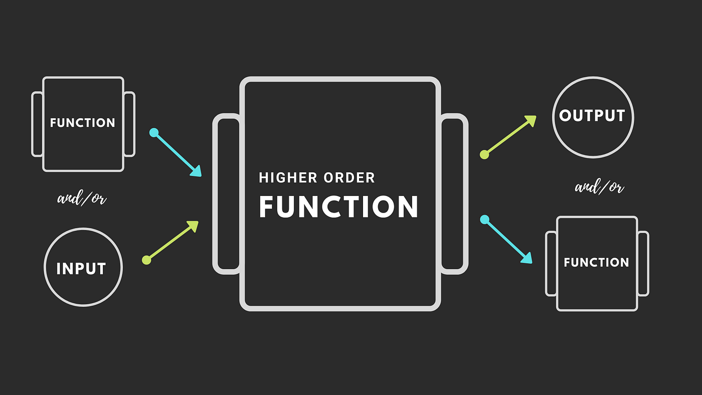

# Function

## Định nghĩa
- Function (hàm) bản chất là một block code được đặt tên - Là một hoặc một chuỗi các statement dùng để thực hiện một tác vụ nào đó hoặc tính toán và trả ra một giá trị

## Gọi một function

## Pass by value & pass by reference

## Function declaration & Function Expression
- Function declaration
- Function expression

## Pure function

## HOF (Higher order function)

- 
## First class function

## Callback function (Hàm gọi lại)

When a function is called, a new stack frame is created and added to the top of the stack, containing the function's execution context. This frame is popped off the stack when the function completes.
