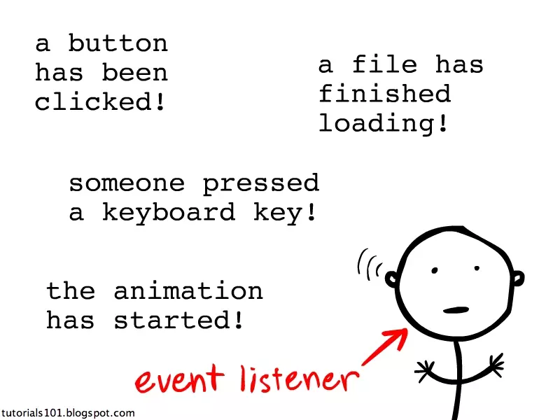
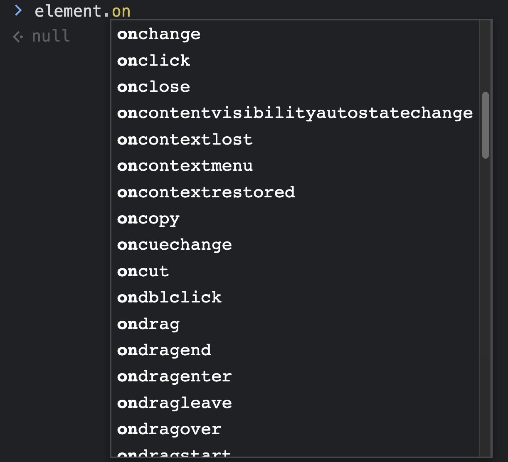
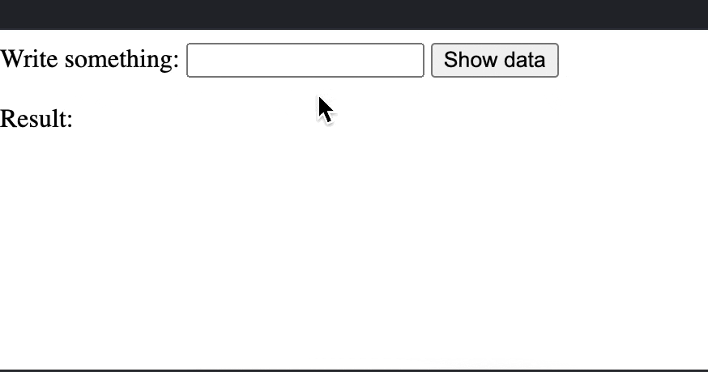
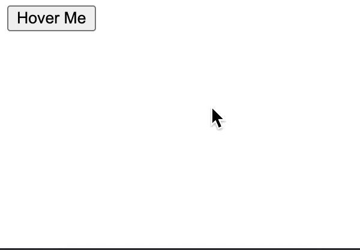

# Events (Sự kiện)



## Định nghĩa

- Sự kiện là những hành động tác động lên bất cứ thành phần nào của trang web (component, DOM, data, ...). Từ đó trang web sẽ lắng nghe có những phản hồi ngược lại tương ứng.

  => Điều này khiến trang web trở nên "sống động" hơn và làm cho user đang thực sự giao tiếp với trang web chứ không chỉ đơn thuần chỉ là web để đọc thông tin.

- Các sự kiện built-in trên web bao gồm sự kiện phím, chuột, state của các web element...
- Vd:

  - user click vào button Login => Hệ thống sẽ gửi request xác thực account.
  - Page loading xong dữ liệu.
  - Use hover chuột vào một card.
  - User nhấn một nút bất kì trên bàn phím.
  - v.v...

## Event handlers

- Các event handlers đã được built-in sẵn trong element theo dạng properties. Thường có tiền tố "on" trước tên các sự kiện:

  

- Các hàm handler được định nghĩa và assign trực tiếp cho property của element và sẽ được thực thi khi sự kiện kích hoạt.

- Chỉ có **một event handler duy nhất** được assign cho element. Nếu define thêm thì event handler sau sẽ override event handler trước.

  - Sử dụng event handler

    ```js
    const button = document.querySelector('.btn');
    button.onclick = () => {
      console.log('Hello!');
    };
    button.onclick = () => {
      console.log('How are you?');
    };

    // When click button
    // "How are you?"
    ```

  - Sử dụng event listener

    ```js
    const button = document.querySelector('.btn');
    button.addEventListener('click', (event) => {
      console.log('Hello!');
    });
    button.addEventListener('click', (event) => {
      console.log('How are you?');
    });

    // This will log to the console
    // "Hello!"
    // "How are you?"
    ```

  - Ngoài ra còn có event attribute. Assign các handler cho các sự kiện trực tiếp trên code html của element đó.

    ```html
    <button onclick="showHello()">Click me</button>

    <script>
      function showHello() {
        alert('Hello');
      }
    </script>
    ```

    ```html
    <button onclick="alert('Hello')">Click me</button>
    ```

## Event listeners

- Là những hàm được gán vào một sự kiện nào đó thông qua hàm `addEventListener` nhận vào tên của event và một callback function với vai trò là listener để lắng nghe khi sự kiện được kích hoạt thì nó sẽ thực thi:

  ```js
  element.addEventListener('click', function () {
    alert('Hello World!');
  });
  ```

  ```js
  element.addEventListener('click', callback);

  function callback() {
    alert('Hello World!');
  }
  ```

- Có thể add được nhiều listener cho một element nào đó và tất cả chúng sẽ được thực thi khi sự kiện được kích hoạt.

- Sử dụng trong trường hợp muốn xử lý linh hoạt các loại sự kiện khác nhau trên cùng một html element.

  ```html
  <button id="my-button">Click me</button>
  <h1 id="status">Do nothing!</h1>
  ```

  ```js
  const myBtn = document.getElementById('my-button');
  const status = document.getElementById('status');

  myBtn.addEventListener('click', function () {
    status.innerHTML = 'You are clicking!';
  });

  myBtn.addEventListener('mouseover', function () {
    status.innerHTML = 'You are hover!';
  });

  myBtn.addEventListener('mouseout', function () {
    status.innerHTML = 'Do nothing!';
  });
  ```

> Copy đoạn code này vào [jsfiddle](https://jsfiddle.net) để kiểm tra kết quả.

## Thực hành

- Dùng [jsfiddle](https://jsfiddle.net) tạo một element input. Sau khi điền dữ liệu xong và nhấn nút thì sẽ hiển thị kết quả vừa nhập trong input.

  

- Tạo một button mà khi hover vào thì nó sẽ đổi màu bất kì. Khi không hover thì button sẽ phóng to ra.

  

## Link tham khảo

- https://javascript.info/introduction-browser-events
- https://www.javatpoint.com/javascript-events
