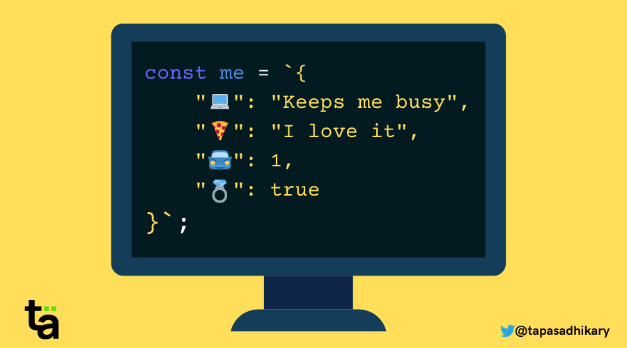
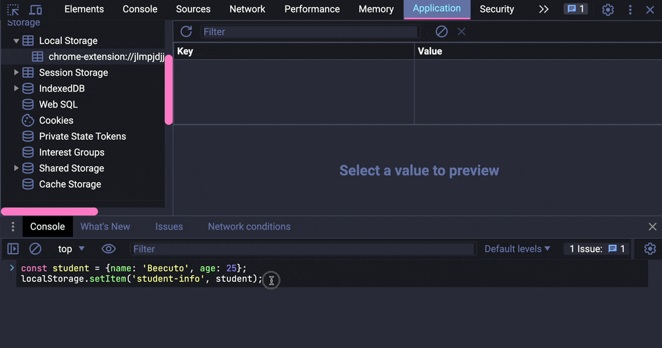
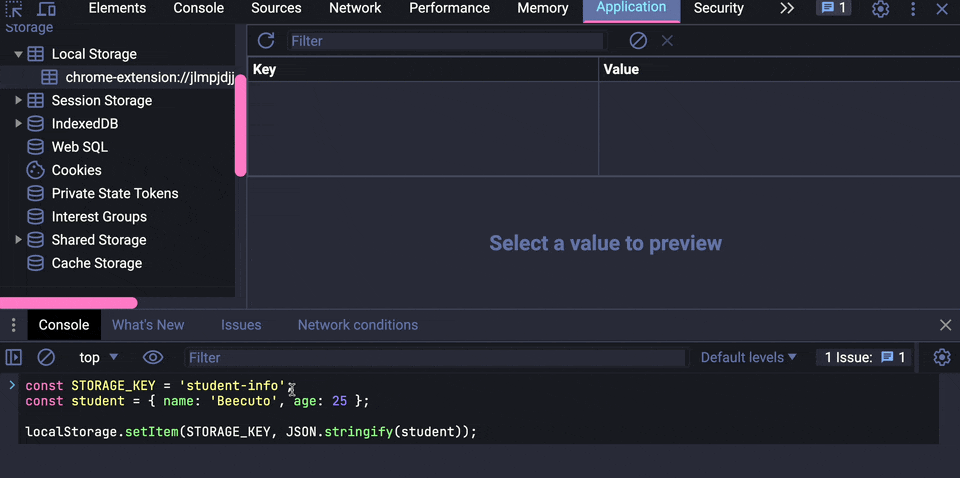

# JSON (JavaScript Object Notation)



## JSON là gì ?

- Là một kiểu object phổ biến dùng để biểu diễn và trao đổi dữ liệu giữa frontend - backend, giữa các hệ thống với nhau
- Sử dụng extension [JSON Viewer](https://chrome.google.com/webstore/detail/json-viewer/gbmdgpbipfallnflgajpaliibnhdgobh) để xem format json ở api trên được dễ dàng hơn
- JSON được thiết kế để có thể dễ đọc và viết
- Vd về API trả về json: https://jsonplaceholder.typicode.com/todos

- Data dạng JSON sẽ có dạng như sau:

  ```json
  {
    "browsers": {
      "firefox": {
        "name": "Firefox",
        "pref_url": "about:config",
        "releases": {
          "detail": {
            "release_date": "2004-11-09",
            "status": "retired",
            "engine": "Gecko",
            "engine_version": "1.7"
          }
        }
      }
    }
  }
  ```

## JSON Object

- Object JSON sẽ cung cấp cho ta 2 methods chính để chuyển đổi JSON theo kiểu serialize và deserialize để dễ dàng gửi qua request từ client đến server và ngược lại.

### [JSON.parse()](https://developer.mozilla.org/en-US/docs/Web/JavaScript/Reference/Global_Objects/JSON/parse)

- Convert json từ string -> object:

  ```js
  const json = '{"result":true, "count":42}';
  const obj = JSON.parse(json); // { result: true, count: 42 }
  ```

- Một số ví dụ khác:

  ```js
  JSON.stringify({}); // '{}'

  JSON.stringify(true); // 'true'

  JSON.stringify('foo'); // '"foo"'

  JSON.stringify([1, 'false', false]); // '[1,"false",false]'

  JSON.stringify([NaN, null, Infinity]); // '[null,null,null]'

  JSON.stringify({ x: 5 }); // '{"x":5}'
  ```

### [JSON.stringify()](https://developer.mozilla.org/en-US/docs/Web/JavaScript/Reference/Global_Objects/JSON/stringify)

- Convert json từ object -> string

- Một số ví dụ khác:

  ```js
  JSON.parse('{}'); // {}

  JSON.parse('true'); // true

  JSON.parse('"foo"'); // "foo"

  JSON.parse('[1, 5, "false"]'); // [1, 5, "false"]

  JSON.parse('null'); // null
  ```

## JSON với localStorage
Ta không thể lưu cả một object nguyên bản vào localStorage của browser mà không xử lí chúng. Vì cơ chế của localStorage trên trình duyệt chỉ cho phép lưu data dưới dạng string, không hỗ trợ lưu các cấu trúc dữ liệu phức tạp (array, object,...) nên cần phải convert chúng trước khi lưu.



Sử dụng JSON.stringify() để convert data thành string sau đó lưu vào localStorage rồi khi cần sử dụng thì sẽ parse nó lại bằng JSON.parse():



```js
const STORAGE_KEY = 'student-info';
const student = { name: 'Beecuto', age: 25 };

localStorage.setItem(STORAGE_KEY, JSON.stringify(student));

const getStudentFromLocalStorage = () => {
  return JSON.parse(localStorage.getItem(STORAGE_KEY));
};

console.log(getStudentFromLocalStorage()); // {name: 'Beecuto', age: 25}
```

## Thực hành

1. Viết chương trình call API: https://jsonplaceholder.typicode.com/users để lấy data và lưu hết vào localStorage với key `USERS_DATA_STORAGE`

   <details>
     <summary>Answer</summary>
     <br/>

   ```js
   const API_URL = 'https://jsonplaceholder.typicode.com/users';
   const storageKey = 'USERS_DATA_STORAGE';
   fetch(API_URL)
     .then((response) => response.json())
     .then((data) => localStorage.setItem(storageKey, JSON.stringify(data)));
   ```

   </details>

2. Lấy ra thông tin của user cuối cùng từ data vừa lưu và log ra màn hình console.

     <details>
     <summary>Answer</summary>
     <br/>

   ```js
   const storageKey = 'USERS_DATA_STORAGE';
   const usersData = JSON.parse(localStorage.getItem(storageKey)) || [];

   if (usersData.length !== 0) {
     const lastIndex = usersData.length - 1;
     const lastUser = usersData[lastIndex];
     console.log(lastUser);
   } else {
     console.log('Data not found');
   }
   ```

   </details>

## Tham khảo

- https://developer.mozilla.org/en-US/docs/Web/JavaScript/Reference/Global_Objects/JSON

- https://javascript.info/json

- https://www.w3schools.com/js/js_json.asp
