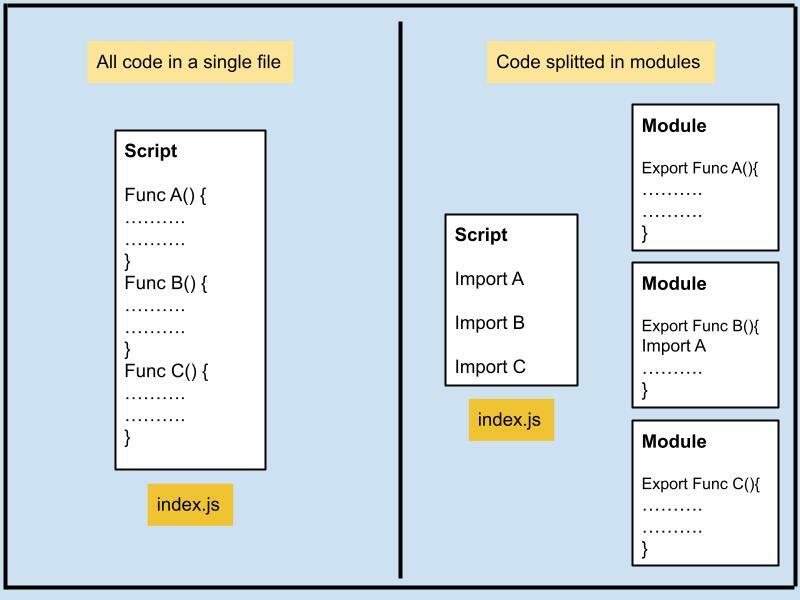
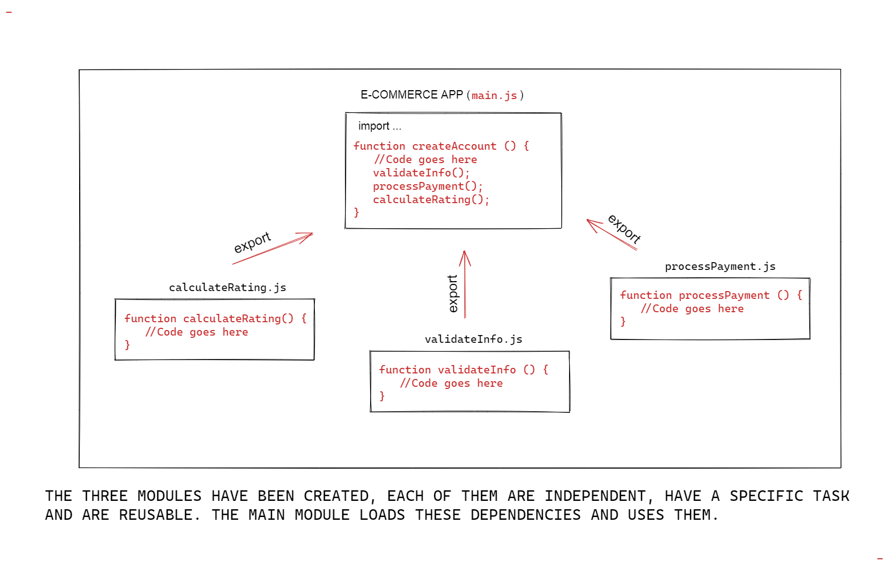

# JS Modules

Trong source code của các dự án, mỗi khi có update feature mới hay cần optimize thì sẽ thêm một số lượng lớn các file code và số lượng dòng code.

Việc để tất cả code chung một file hay một thư mục sẽ dẫn đến việc khó debug khi phát sinh lỗi hay không thể expand một cách dễ dàng để thêm các tính năng mới trong tương lai.

Giải pháp hiệu quả sẽ là phân tách các chức năng của hệ thống ra thành các modules gồm các thư mục và các file code khác nhau để dễ dàng kiểm soát code và bảo trì sau này.



## introduction

## Import - Export

- Để phân tách source code thành các modules, JS hỗ trợ keyword `import` và `export` để làm được việc đó.

  

- Import là nhập các resource hợp lệ từ bên ngoài vào file code hiện tại và sử dụng. Có thể import một phần toàn bộ những gì được export ra từ một file khác.

- Export là xuất các resource cần thiết ra ngoài để những file khác trong project có thể import và sử dụng được. Export có 2 loại:

  - Export

  - Export default

  ```js
  // 📁 sayHi.js
  export function sayHi(user) {
    alert(`Hello, ${user}!`);
  }
  ```

  ```js
  // 📁 main.js
  import { sayHi } from './sayHi.js';

  alert(sayHi); // function...
  sayHi('John'); // Hello, John!
  ```

### CommonJS & ES modules

CommonJS và ES module là 2 hệ thống module khác nhau dùng để tổ chức và chia sẻ code JavaScript giữa các file với nhau trong cùng project

#### Syntax:

- **CommonJS**: Sử dụng `require()` để import module từ file khác vào và `module.export` để export code ở file hiện tại ra ngoài.

- **ES Modules**: Sử dụng `import` và `export` để thục hiện công việc cùng tên.

#### Browser or Server:

- **CommonJS**: Ban đầu được thiết kế để sử dụng cho phát triển backend với NodeJS. Cũng có thể sử dụng phía trình duyệt với các tool như Browserify hoặc webpack.

- **ES Modules**: Tính năng được giới thiệu trong ES6. Được hỗ trợ ở server sử dụng NodeJS và trên trình duyệt mà không cần thêm bất cứ thư viện hỗ trợ nào.

#### Behaviors

- **CommonJS**: Thực thi các module đồng bộ, block các luồng thực thi khác cho đến khi module được tải xong

- **ES Modules**: Thực thi module bất đồng bộ. Cho phép tải song song nhiều module cùng một lúc và cải thiện performance

## Link tham khảo

- https://medium0.com/@etherealm/named-export-vs-default-export-in-es6-affb483a0910

- https://sebhastian.com/javascript-import-export

- https://javascript.info/modules-intro

- https://www.digitalocean.com/community/tutorials/understanding-modules-and-import-and-export-statements-in-javascript

- https://javascript.info/import-export

- https://javascript.info/modules-dynamic-imports
