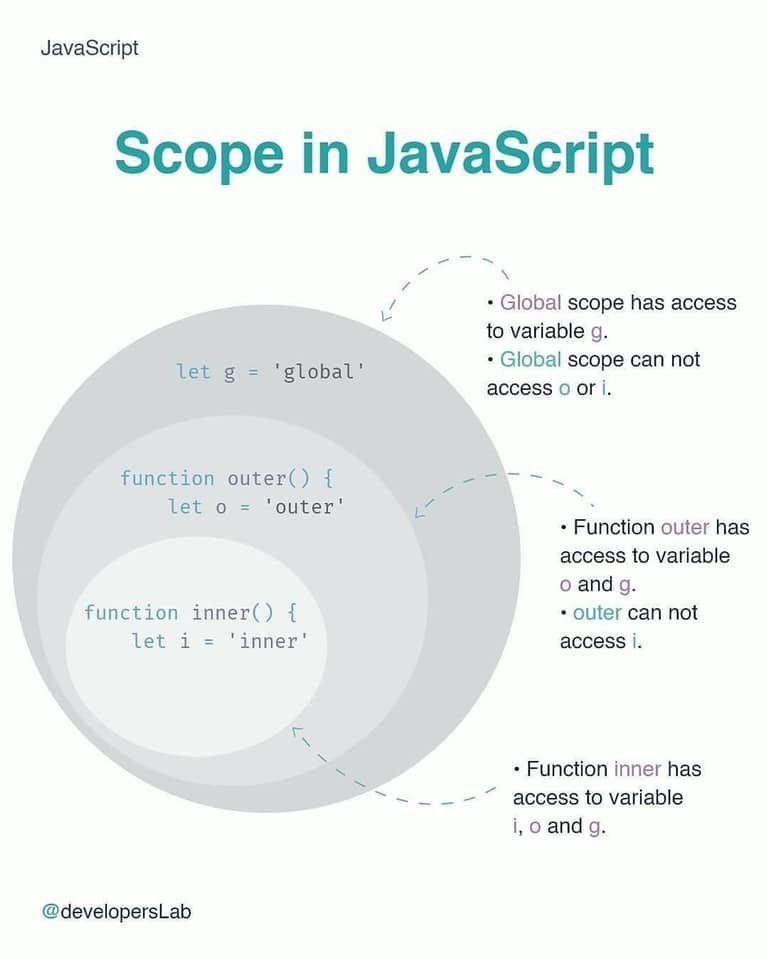
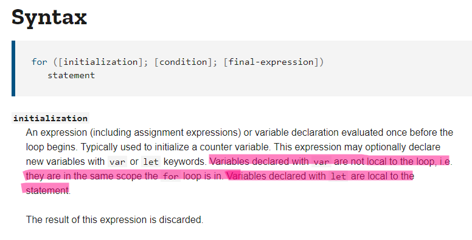

# var - let - const - Scope

## Scope



Scope là phạm vi truy cập được của một biến. Tức là một biến khi được khai báo ra có thể sử dụng được ở một giới hạn nào đó. Ra khỏi phạm vi thì biến không còn tồn tại và không sử dụng được nữa.

Hiểu rõ về scope sẽ kiểm soát tốt được dòng code mình viết ra, biết được các biến hay hàm của mình khai báo ở đâu thì sử dụng được, ở đâu không sử dụng được. Hiểu rõ được tầm ảnh hưởng dòng code của mình đến sự ổn định chung của hệ thống.

Các loại scope:

- Global scope

- Block scope (ES6)

- Function Scope (Local Scope)

### Global scope

- Hay còn gọi là global execution context.

- Là scope đầu tiên được tạo ra khi code JS bắt đầu được thực thi.

- Những biến hay hàm được định nghĩa không thuộc scope của object hay function nào khác sẽ được assign cho object window và có phạm vi global. Có thể sử dụng được ở mọi nơi.

- Nên hạn chế sử dụng biến hay hàm ở global scope vì mọi thứ đều có thể được gọi và thay đổi giá trị ở bất cứ nơi nào trong hệ thống. Sẽ gây rủi ro khi chương trình ngày càng lớn, số lượng code nhiều dẫn đến số lượng biến và hàm tăng nhiều rất dễ đụng độ nhau.

```js
const age = 10; // global scope
let me = 'Anonymous'; // global scope
var address = 'Danang'; // global scope

function globalFunction() {
  console.log('I am running from global scope!');
}

function doSomething() {
  console.log(age, me, address); // 10 'Anonymous' 'Danang'
  globalFunction(); // 'I am running from global scope!'
}

doSomething();
```

### Block scope

Block - Một khối code, là phạm vi được tạo ra giữa dấu `{` và `}`

```js
{
} // this is a block scope
```

Mọi biến được khai báo trong `{}` sẽ chỉ hoạt động được trong phạm vi block scope này và không tồn tại ở bên ngoài.

> Cú pháp `if statement` cũng sẽ ngầm định được hiểu là tạo ra một block code. Chỉ là shorthand của if, không có tác dụng bỏ qua việc tạo block code.

```js
let x = 1;
{
  let x = 2;
}

function doSomething() {
  let x = 5;
}

doSomething();

for (let i = 0; i <= 1; i++) {
  let x = 10;
}

if (true) {
  let x = 100;
}

console.log(x);
```

> Các biến hay hàm được khai báo bằng `const, let` sẽ có phạm vi block scope.

### Function scope

- Local scope được tạo ra bởi body của function gồm dấu `{}`. Các biến được khai báo trong function scope sẽ không truy cập được từ bên ngoài.

- Trong scope của một function, có thể truy cập được biến được định nghĩa trong function cha, nhưng không truy cập được biến được định nghĩa trong function con.

```js
function parentFunction() {
  let a = 10;

  function childFunction() {
    console.log(a); // 10
    let b = 500;
  }
  childFunction();
  console.log(b); // ReferenceError: b is not defined
}

parentFunction();
```

## var - let- const

### var

- Trước ES6, `var` là từ khoá được dùng để khai báo biến duy nhất, nhưng sau này có 1 số vấn đề về scope.

- `var` có 2 scope:

  - **Global scope**: Khi nó được sử dụng ở ngoài hàm. Ở đâu cũng có thể truy cập được.

  - **Function scope**: Khi nó được sử dụng ở bên trong hàm. Chỉ trong hàm sử dụng được, ra ngoài hàm không sử dụng được

- Biến có thể khai báo lại được, cùng 1 tên biến có thể khai báo bằng `var` nhiều lần dễ dẫn đến có bug trong code

### let

- Block scope

- Biến `let` không cho phép khai báo lại. Nhưng cùng 1 biến mà khai báo ở 2 scope khác nhau thì vẫn được cho phép.

  ```js
  let greeting = 'say Hi';
  if (true) {
    let greeting = 'say Hello instead';
    console.log(greeting); // "say Hello instead"
  }
  console.log(greeting); // "say Hi"
  ```

### const

- Block scope

- `const` bắt buộc phải gán giá trị lúc khai báo biến. Không cho phép thay đổi các biến nguyên thuỷ. Biến tham chiếu thì có thể thay đổi được.

- Lưu ý khi dùng const với object. Thì chỉ có object là không được chỉnh sửa thôi nhưng các thuộc tính bên trong nó thì vẫn có thể thay đổi được.

- Khi dùng biến `let` và `const` trong body của một hàm thì biến đó cũng sẽ có phạm vi là scope của hàm, chỉ truy cập được trong hàm đó.

## For loop with `var`

Biến được khai báo bằng var khi hoạt động trong loop sẽ không nằm trong scope của loop.



## Kết luận

- var có global scope hoặc function scope trong khi let và const là block scope.

- var có thể khai báo lại và gán lại trong scope của nó, let có thể gán lại nhưng không thể khai báo lại, const thì không thể gán cũng không thể khai báo lại.

- var và let có thể khai báo tên biến thôi, thì const cần phải vừa khai báo tên biến vừa khai báo giá trị đồng thời.

## Link tham khảo

- https://www.w3schools.com/js/js_scope.asp
