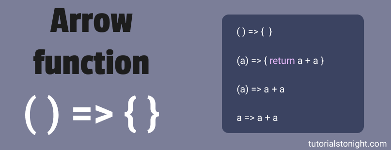
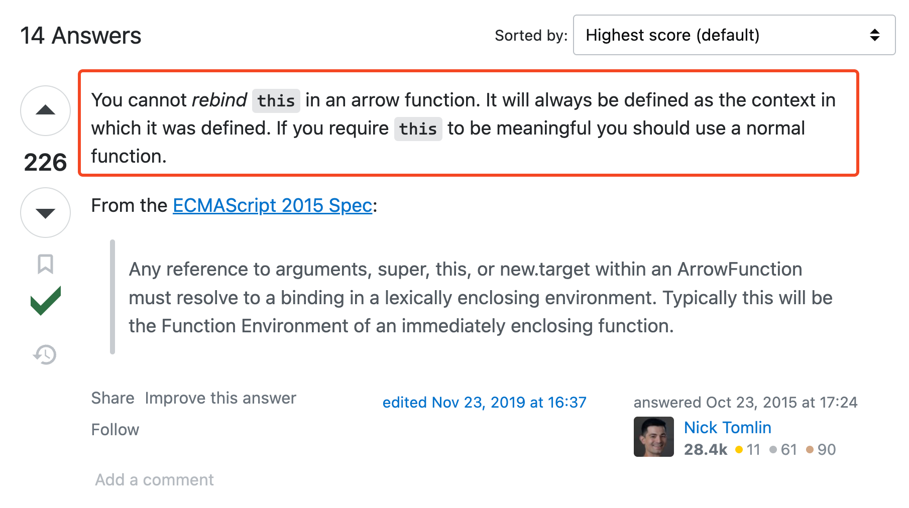

# Arrow function



- Là một biến thể của function expression

  ```js
  const sayHello = function () {
    console.log('hello');
  };
  ```

  Arrow function có syntax ngắn gọn hơn:

  ```js
  const sayHello = () => {
    console.log('hello');
  };
  ```

### Arrow function with params / no param / return value

- Arrow function không nhận tham số

  ```js
  const logger = () => {
    console.log(`Logger is running...`);
  };
  ```

- Arrow function có nhận tham số

  Trường hợp chỉ có một tham số thì có để bỏ `()` ở tham số:

  ```js
  const sayHello = (name) => {
    console.log(`Hello ${name}!`);
  };
  ```

  ```js
  const sayHello = (name) => {
    console.log(`Hello ${name}!`);
  };
  ```

  Trường hợp có nhiều tham số truyền vào thì ta bắt buộc phải dùng `()` để gom các tham số lại và có syntax chuẩn hơn:

  ```js
  // SyntaxError: Missing initializer in const declaration
  const sum3number = num1, num2, num3 => {
    console.log('Sum:' + num1 + num2 + num3);
  };
  ```

  ```js
  const sum3number = (num1, num2, num3) => {
    console.log('Sum:' + num1 + num2 + num3);
  };
  ```

### Return value

- Arrow function có syntax return giống function expression:

  ```js
  const sum = (num1, num2) => {
    return num1 + num2;
  };
  ```

- Hoặc syntax ngắn gọn hơn khi arrow function chí có 1 statement và đó cũng là statement return:

  ```js
  const sum = (num1, num2) => num1 + num2;
  ```

  ```js
  const doubleElement = (input) => input * 2;
  ```

- Return một object:

  - Function expression:

    ```js
    const generateStudent = () => {
      return {
        name: 'student',
        age: 30,
      };
    };
    ```

  - Arrow function:

    ```js
    const generateStudent = () => ({
      name: 'student',
      age: 30,
    });
    ```

### this



Vì arrow function không bind this nên nó sẽ không thể sử dụng như một methods của object nếu cần tham chiếu về chính object đó (chi tiết xem tại [đây](https://stackoverflow.com/questions/33308121/can-you-bind-this-in-an-arrow-function))

```js
const student = {
  name: 'Peter',
  eat: function () {
    console.log(`${this.name} is eating...`);
  },

  study() {
    console.log(`${this.name} is studying...`);
  },

  gotoSchool: () => {
    console.log(`${this.name} is going to school...`);
  },
};

student.eat(); // 'Peter is eating...'
student.study(); // 'Peter is studying...'
student.gotoSchool(); // ' is going to school...'

student.gotoSchool.bind(student)(); // ' is going to school...'
```

## Link tham khảo

- https://developer.mozilla.org/en-US/docs/Web/JavaScript/Reference/Functions/Arrow_functions

- https://javascript.info/arrow-functions

- https://javascript.info/arrow-functions-basics
