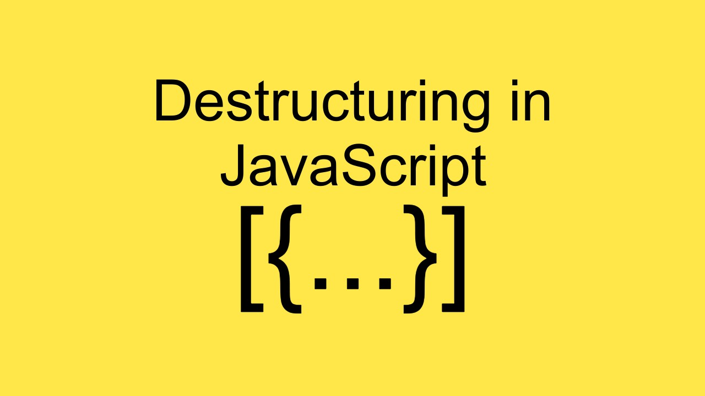

# Destructuring



- Là một cú pháp của ES6 cho phép bóc tách:

  - Các thuộc tính của một object.

  - Các phần tử của một array.

- Việc sử dụng destructuring sẽ giúp ta giảm thiểu code dư thừa và reuse lại các biến một cách dễ dàng.

## Object destructuring

- Syntax:

  ```js
  const { prop1, prop2, prop3 } = obj;
  ```

  ```js
  const {
    prop1: { subProp },
  } = obj;
  ```

  ```js
  const { prop1: aliasName } = obj;
  ```

- Show tất cả thuộc tính của một object

  ```js
  const student = {
    name: 'Bee',
    age: 29,
    major: 'IT',
  };
  ```

  Theo cách thông thường:

  ```js
  console.log(student.name);
  console.log(student.age);
  console.log(student.major);
  ```

  Sử dụng object destructuring:

  ```js
  const { name, age, major } = student;
  console.log(name, age, major); // 'Bee', 29, 'IT'
  ```

  Có thể kết hợp sử dụng với default value khi destructuring phải một property không tồn tại của object:

  ```js
  const { mark = 0 } = student;

  console.log(mark); // 0
  ```

  Nested destructuring: Sử dụng khi muốn truy cập thuộc tính của object lồng nhiều cấp:

  ```js
  const dev = {
    name: 'Ple',
    domain: {
      frontend: 'ReactJS',
    },
  };

  const {
    domain: { frontend },
  } = dev;

  console.log(frontend); // 'ReactJS'
  ```

## Array destructuring

- Tương tự như object, ta cũng có thể destructuring các element trong một array:

```js
const arr = [1, 2, 3];

const [el1, el2] = arr;

console.log(el1, el2); // 1 2
```

## So sánh array destructuring và object destructuring

**Object destructuring**

- Tên biến dùng để destructuring phải đúng với property name trong object.

- Không quan trọng thứ tự destructuring.

- Khi destructuring một property không có trong object thì biến đó sẽ trả về undefined.

  ```js
  const student = {
    name: 'Bee',
    age: 29,
    major: 'IT',
  };

  const { name, age, major, mark, address } = student;
  console.log(name, age, major, mark, address);

  // 'Bee' 29 'IT' undefined undefined
  ```

**Array destructuring**

- Đặt tên biến tự do theo convention.

- Thứ tự destructuring sẽ tương ứng với thứ tự phần từ trong mảng.

- Khi destructuring một phần từ không hợp lệ (có chỉ số index > length) thì biến đó sẽ trả về undefined.

  ```js
  const arr = [1, 2, 3];

  const [el1, el2, el3, el4, el5] = arr;

  console.log(el1, el2, el3, el4, el5);

  // 1 2 3 undefined undefined
  ```

## Argument destructuring in function

Destructuring có thể dùng được trong function, dùng để bóc tách property hoặc phần tử nếu tham số truyền vào là một object hoặc một array để thuận tiện cho việc xử lý các đối số truyền vào hàm.

```js
const studentData = {
  name: 'Max',
  age: 20,
};
```

Cách thông thường:

```js
const handleSomething = (data) => {
  console.log(data.age); // if you want to get age
  console.log(data.name); // if you want to get name

  // and what will we do if data variable is changed ?
};

handleSomething(studentData);
```

Sử dụng destructuring, chỉ get property nào cần sử dụng thay vì truyền toàn bộ object vào một hàm:

```js
const handleSomething = ({ name, age }) => {
  console.log(name, age);
};

handleSomething(studentData); // 'Max' 20
```

## Thực hành

Desctructuring thuộc tính của object developer để có thể lấy được chuỗi **'JavaScript'** và log ra màn hình:

```js
const developer = {
  name: 'Max',
  age: 30,
  domain: {
    frontend: {
      languages: ['JS', 'C++', 'Java'],
      frameworks: [
        {
          id: 1,
          name: 'ReactJS',
        },
        {
          id: 2,
          name: 'NodeJS',
        },
        {
          id: 3,
          name: 'JavaScript',
        },
      ],
    },
  },
};
```

## Link tham khảo

- https://anonystick.com/blog-developer/destructuring-javascript-la-gi-buong-gi-buong-chu-dung-bo-qua-phan-nay-cua-es6-2019122141422037

- https://developer.mozilla.org/en-US/docs/Web/JavaScript/Reference/Operators/Destructuring_assignment
