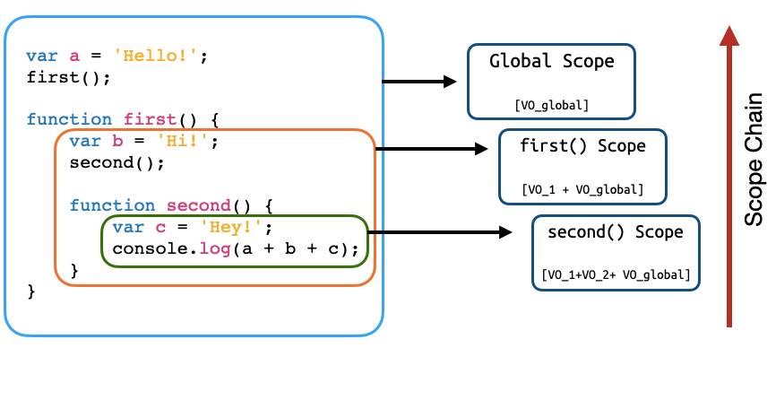

# Asynchronous


JS là ngôn ngữ đơn luồng và chạy đồng bộ (synchronous), điều đó đồng nghĩa với việc luồng thực thi chỉ có thể thực hiện một tác vụ tại một thời điểm, tác vụ sau sẽ bị block bởi tác vụ trước => Dẫn đến treo hoặc đứng trình duyệt.


Khái niệm bất đồng bộ ra đời nhờ vào môi trường NodeJS hay các Web APIs được cung cấp bởi browser, cho phép luồng thực thi code JS có thể thực hiện được nhiều tác vụ cùng lúc mà không phải tuân theo trình tự và không phải chờ nhau (blocking). Khắc phục được bản chất hạn chế của JS và làm nó trở nên đa dụng mạnh mẽ hơn.

```js
console.log(1);
console.log(2);
console.log(3);

// 1 2 3
```

```js
console.log(1);
setTimeout(() => {
  console.log(2);
}, 0);
console.log(3);

// 1 3 2
```

Để làm việc với bất đồng bộ trong JS:

- **ES5**: Callback function.

- **ES6**: Promise (sinh ra để giải quyết callback hell).

- **ES7**: Async await (sinh ra để giải quyết promise hell khi vẫn phải sử dụng Promise kết hợp cùng callback).

## Code JS được thực thi như thế nào ?

Trước khi tìm hiểu code bất đồng bộ JS ta cần tìm hiểu code đồng bộ của JS hoạt động như thế nào (execution context, call stack, event loop, web APIs, ... )

### Execution context



Mỗi khi ứng dụng JS được khởi chạy. Nó sẽ tạo ra một execution context đầu tiên là global context là context để khởi chạy cả ứng dụng và nằm trong call stack. Nếu trong code có định nghĩa các function và mỗi function khi được gọi sẽ tạo ra một execution context riêng (this sẽ được bind khác nhau theo mỗi context).

### Call stack

[Call stack visualize](http://latentflip.com/loupe/?code=JC5vbignYnV0dG9uJywgJ2NsaWNrJywgZnVuY3Rpb24gb25DbGljaygpIHsKICAgIHNldFRpbWVvdXQoZnVuY3Rpb24gdGltZXIoKSB7CiAgICAgICAgY29uc29sZS5sb2coJ1lvdSBjbGlja2VkIHRoZSBidXR0b24hJyk7ICAgIAogICAgfSwgMjAwMCk7Cn0pOwoKY29uc29sZS5sb2coIkhpISIpOwoKc2V0VGltZW91dChmdW5jdGlvbiB0aW1lb3V0KCkgewogICAgY29uc29sZS5sb2coIkNsaWNrIHRoZSBidXR0b24hIik7Cn0sIDUwMDApOwoKY29uc29sZS5sb2coIldlbGNvbWUgdG8gbG91cGUuIik7!!!PGJ1dHRvbj5DbGljayBtZSE8L2J1dHRvbj4%3D)

Như tên gọi nó là một ngăn xếp hoạt động theo cơ chế LIFO (Last In First Out). Được sử dụng để lưu trữ tất cả các execution context trong quá trình code JS được thực thi.

### Web APIs / Browser APIs

Đây là nhân tố chính giúp cho JS có thể chạy đa luồng được trên trình duyệt bằng cách tận dụng sức mạnh của các CPU xử lý đa nhân đa luồng hiện nay, tất cả các tác vụ bất đồng bộ cần tốn thời gian để xử lý (fetch, setTimeout, promise, ...). Sẽ được đưa vào đây để thực thi riêng. Không gây block luồng thực thi chính.

VD: Trong lúc đợi data của một component nào đó load thì ta vẫn có thể thực hiện các action khác như nhập form, scroll page,... Nếu không có async thì mọi hoạt động tương tác trên browser sẽ bị block (treo) đến khi nào data tải xong ta mới có thể thực hiện được các việc trên.

### Callback Queue

Khác với call stack, cơ chế của queue là FIFO (First In First Out). Có nhiệm vụ bảo đảm những tác vụ bất đồng bộ được trả về từ web API sắp xếp đúng thứ tự thực thi (callback).

### Event Loop

Là một thành phần trong JS Runtime (V8 Engine trong Chrome) có nhiệm vụ kiểm tra call stack và callback queue. Nếu call stack đã clear thì event loop mới đẩy tác vụ từ callback queue lên call stack và thực thi. Việc này sẽ lặp đi lặp lại vô hạn (loop) cho đến khi nào không còn task nào trong callback queue.

## Workflow


## Callback hell (pyramid of doom)


Khi làm việc với các tác vụ bất đồng bộ nhưng phải chờ nhau (tác vụ sau cần dữ liệu của tác vụ trước hoặc bắt buộc phải thực hiện thứ tự để tuân theo logic). Việc sử dụng callback quá nhiều sẽ làm chúng bị lồng vào nhau dẫn đến code rất khó để đọc và debug. (Sau này Promise ra đời để giải quyết callback hell).

```js
function morningWorks() {
  setTimeout(() => {
    console.log('wake up');
  }, 1000);
  setTimeout(() => {
    console.log('breakfast');
  }, 3000);
  setTimeout(() => {
    console.log('go to office');
  }, 2000);
}
```

```js
function morningWorks2() {
  setTimeout(() => {
    console.log('wake up');
    setTimeout(() => {
      console.log('breakfast');
      setTimeout(() => {
        console.log('go to office');
      }, 2000);
    }, 3000);
  }, 1000);
}
```

- [Demo callback hell](https://jsfiddle.net/thienphamIT1907/15g2qt40/12/)

## Tham khảo

- https://felixgerschau.com/javascript-event-loop-call-stack

- https://viblo.asia/p/cuoi-cung-thi-event-loop-la-gi-LzD5dX705jY

- https://developer.mozilla.org/en-US/docs/Glossary/Call_stack

- https://thaunguyen.com/2018/06/23/javascript-event-loop-va-call-stack-la-gi
