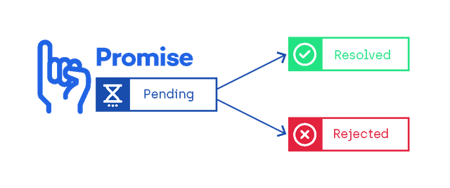
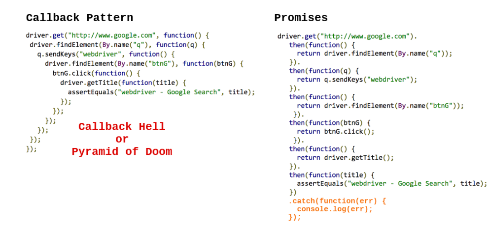
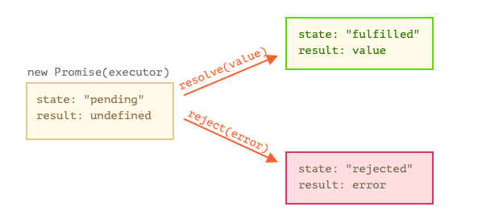
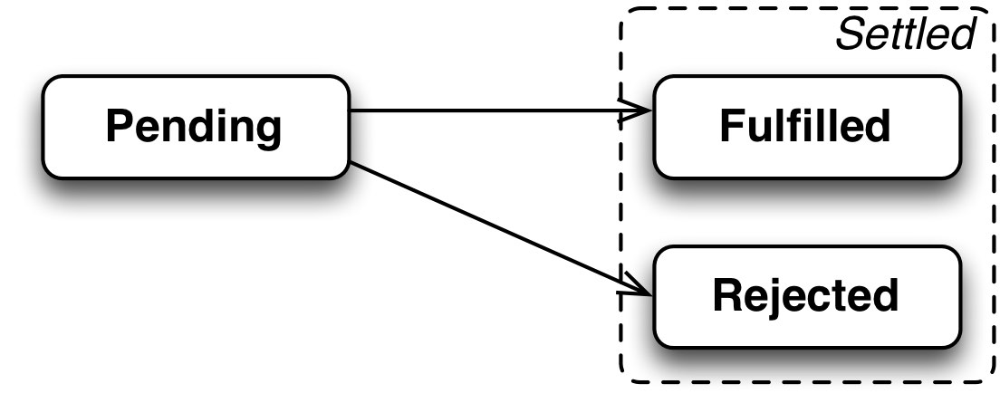
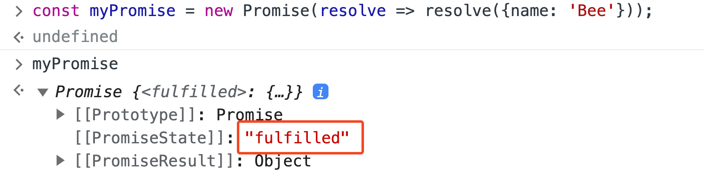
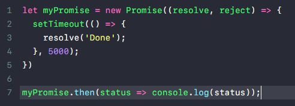

# Promise

> Hứa thật nhiều thất hứa thì cũng thật nhiều.



## Định nghĩa

- Promise là một object built-in trong JS kể từ phiên bản ES6 giúp làm việc với các tác vụ bất đồng bộ và hỗ trợ xử lý logic trong trường hợp tác vụ đó thành công hay thất bại.

- Trước đây khi chưa có Promise ta sử dụng callback và dễ xảy ra callback hell. Promise ra đời để giải quyết vấn đề này.

  

  > Sau này việc sử dụng nhiều Promise sẽ dẫn đến promise hell nên lại tiếp tục có thêm `async await` ra đời để giải quyết.

## Promise states



Promise có 3 trạng thái để mô tả kết quả của một tác vụ bất đồng bộ:

- **Pending**: Promise đã được khởi tạo và tác vụ bất đồng bộ đang trong trạng thái chờ xử lí.

- **Fulfilled**: Tác vụ bất đồng bộ đã được thực thi thành công. Response trả về là data từ server

- **Rejected**: Tác vụ bất đồng bộ thực thi không thành công. Response trả về là mã lỗi kèm theo message để mô tả chi tiết lỗi

Trạng thái fulfilled hay rejected sẽ được sẽ được tính là trạng thái **settled** (có ý nghĩa một Promise đã có kết quả dù có thành công hay thất bại)



## Khởi tạo một promise

- Sử dụng keyword `new` hay được sử dụng trong OOP để khởi tạo một instance object Promise.

- Promise nhận vào một callback function (`executor`) được thực thi ngay lập tức sau khi khởi tạo `new Promise()` chứ không phải lúc gọi `.then()`.

  Executor function có 2 tham số:

  - `resolve`: function xử lí logic khi Promise thành công.

  - `reject` function xử lí logic khi Promise thất bại.

  ```js
  const myPromise = new Promise((resolve, reject) => {
    resolve('Request success!');
    reject('Request failed!');
  });
  ```

  ```js
  const executor = (resolve, reject) => {
    resolve('Request success!');
    reject('Request failed!');
  };

  const myPromise = new Promise(executor);
  ```

> - resolve function và reject function không bắt buộc khi nào cũng phải khai báo cùng nhau. Tuỳ theo logic mình cần xử lí case nào thì define function cho case đó.
> - resolve, reject là callback function trong Promise, có thể define bằng bất cứ tên gì khác theo naming convention. Vd: handleSuccess, handleFailed,...

- Khi Promise thực thi xong ta chỉ có thể xem được trạng thái của nó:

  

- Để truy cập được kết quả của một promise, ta sử dụng:

  - `then()`: Nhận vào một callback function. Callback này có tham số là những gì return ra từ hàm resolve (thường là data được trả về từ server)

    ```js
    const myPromise = new Promise((resolve) => {
      resolve({ name: 'Bee' });
    });

    myPromise.then((response) => console.log(response));
    ```

  - `catch()`: Nhận vào một callback function. Callback này có tham số là những gì return ra từ hàm reject (thường là mã lỗi và message nguyên nhân gây lỗi)

    ```js
    const myPromise = new Promise((reject) => {
      reject({ code: 404, msg: 'Bee not found' });
    });

    myPromise.catch((error) => console.log(error));
    ```

  - `finally()`: Callback này vẫn sẽ được thực thi sẽ xử lí bất kể kết quả của Promise có thành công (fulfilled) hay thất bại (rejected).

    ```js
    promiseAction()
      .then((data) => {
        console.log(data);
      })
      .catch((err) => {
        console.error(err);
      })
      .finally(() => {
        console.log('Clear something...'); // Always execute
      });
    ```

## Promise chaining

Các trạng thái của Promise thay vì định nghĩa riêng lẻ giờ đây có thể nối (chain) lại với nhau để việc xử lí kết quả được liên tục và dễ dàng hơn vì hàm then() của promise return về một Promise mới, nhận data thông qua hàm resolve của Promise trước. Cho nên ta có thể liên tục gọi `.then()` để xử lý.


## setTimeout in Promise

Promise mà có setTimeout() ở trong thì hoạt động như thế nào ?



Trả lời:

Khi vào scope của Promise nó sẽ đợi thời gian timeout rồi mới thực thi hàm callback của setTimeout.

## Promise hell

Cũng giống như callback, một số logic khi được triển khai cũng sẽ dẫn đến tình trạng promise hell.

`then()` của promise nhận vào một callback function. Callback function đó có chứa data cần thiết cho một tác vụ khác. Và tác vụ đó có nhiệm vụ return ra data cho một tác vụ khác nữa sử dụng, etc..

```js
const getUsername = new Promise((resolve) => {
  console.log(`Getting username...`);
  setTimeout(() => {
    resolve({
      username: 'beecuto',
    });
  }, 1000);
});

const generateIdByUsername = (username) => {
  console.log(`Generating id by username [${username}]...`);
  return new Promise((resolve) => {
    setTimeout(() => {
      resolve(`CHIBEE_ID_${username}`);
    }, 3000);
  });
};

const validateUserId = (userId) => {
  console.log(`Validating user id [${userId}]...`);
  return new Promise((resolve) => {
    setTimeout(() => resolve(`User [${userId}] is valid!`), 2000);
  });
};
```

Sử dụng Promise chaining cho logic sẽ dẫn đến Promise hell:

```js
getUsername.then((data) => {
  generateIdByUsername(data.username).then((id) => {
    validateUserId(id).then((result) => {
      console.log(result);
    });
  });
});
```

Để khắc phực tình trạng Promise hell. Sau này ES6 cung cấp thêm khái niệm `async await` để làm việc với bất đồng bộ JS tốt hơn nữa (dễ bảo trì và sửa lỗi).

```js
const handleUsername = async () => {
  const data = await getUsername;
  const userId = await generateIdByUsername(data.username);
  const result = await validateUserId(userId);

  console.log(result);
};

handleUsername();
```

## Một số method khác của Promise

- [Promise.any()](https://developer.mozilla.org/en-US/docs/Web/JavaScript/Reference/Global_Objects/Promise/any)

  ```js
  const makeMilktea = new Promise((resolve) => {
    setTimeout(() => {
      resolve('=> Milktea');
    }, 3000);
  });

  const makeOrangeJuice = new Promise((resolve) => {
    setTimeout(() => {
      resolve('=> Orange Juice');
    }, 1000);
  });

  const makeAppleJuice = new Promise((resolve) => {
    setTimeout(() => {
      resolve('=> Apple Juice');
    }, 2000);
  });

  const randomActions = [makeMilktea, makeOrangeJuice, makeAppleJuice];

  Promise.any(randomActions).then((result) => console.log(result)); // => Orange Juice
  ```

- [Promise.race()](https://developer.mozilla.org/en-US/docs/Web/JavaScript/Reference/Global_Objects/Promise/race)

  ```js
  const promise1 = new Promise((resolve, reject) => {
    setTimeout(resolve, 500, 'one');
  });

  const promise2 = new Promise((resolve, reject) => {
    setTimeout(resolve, 100, 'two');
  });

  Promise.race([promise1, promise2]).then((value) => {
    console.log(value);
    ('two');
  });
  ```

- [Promise.all()](https://developer.mozilla.org/en-US/docs/Web/JavaScript/Reference/Global_Objects/Promise/all)

  ```js
  const p1 = Promise.resolve(3);
  const p2 = 1337;
  const p3 = new Promise((resolve, reject) => {
    setTimeout(() => {
      resolve('foo');
    }, 100);
  });

  Promise.all([p1, p2, p3]).then((values) => {
    console.log(values); // [3, 1337, "foo"]
  });
  ```

- [Promise.allSettled()](https://developer.mozilla.org/en-US/docs/Web/JavaScript/Reference/Global_Objects/Promise/allSettled)

  ```js
  Promise.allSettled([
    Promise.resolve(33),
    new Promise((resolve) => setTimeout(() => resolve(66), 0)),
    99,
    Promise.reject(new Error('an error')),
  ]).then((values) => console.log(values));

  // [
  //   { status: 'fulfilled', value: 33 },
  //   { status: 'fulfilled', value: 66 },
  //   { status: 'fulfilled', value: 99 },
  //   { status: 'rejected', reason: Error: an error }
  // ]
  ```

- [Promise.resolve()](https://developer.mozilla.org/en-US/docs/Web/JavaScript/Reference/Global_Objects/Promise/resolve)

  ```js
  const promise1 = Promise.resolve(123);

  promise1.then((value) => {
    console.log(value); //123
  });
  ```

- [Promise.reject()](https://developer.mozilla.org/en-US/docs/Web/JavaScript/Reference/Global_Objects/Promise/reject)

  ```js
  function resolved(result) {
    console.log('Resolved');
  }

  function rejected(result) {
    console.error(result);
  }

  Promise.reject(new Error('fail')).then(resolved, rejected); //Error: fail
  ```

## Thực hành

> Hãy cố gắng làm trước khi xem đáp án nhé ^^

1. Dự đoán kết quả log của đoạn code sau: (không chạy trước code)

   ```js
   const myPromise = new Promise((resolve) => {
     resolve();
   });

   myPromise
     .then(() => {
       console.log('Start');
     })
     .then(() => {
       setTimeout(() => {
         console.log('Handle something in 3s');
       }, 3000);
     })
     .then(() => {
       console.log('Do other thing');
     })
     .then(() => {
       console.log('Finish');
     });
   ```

   <details>
    <summary>Answer</summary>
    <br/>

   ```
   Start
   Do other thing
   Finish
   Handle something in 3s
   ```

   </details>

2. Viết lại đoạn code trên để các tác vụ được thực thi đúng theo thứ tự được định nghĩa trong code.

   <details>
     <summary>Answer</summary>
     <br/>

   ```js
   const myPromise = new Promise((resolve) => {
     resolve();
   });

   myPromise
     .then(() => {
       console.log('Start');
     })
     .then(() => {
       return new Promise((resolve) => {
         setTimeout(() => {
           resolve('Do something in 3s');
         }, 3000);
       });
     })
     .then((res) => console.log(res))
     .then(() => {
       console.log('Do other thing');
     })
     .then(() => {
       console.log('Finish');
     });
   ```

   </details>

## Tham khảo

- https://www.w3schools.com/js/js_promise.asp

- https://viblo.asia/p/gioi-thieu-ve-promise-trong-javascript-mrDGMJVPezL

- https://viblo.asia/p/javascript-promise-hua-that-nhieu-that-hua-cung-that-nhieu-ByEZk0eYlQ0
