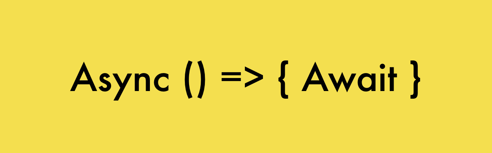
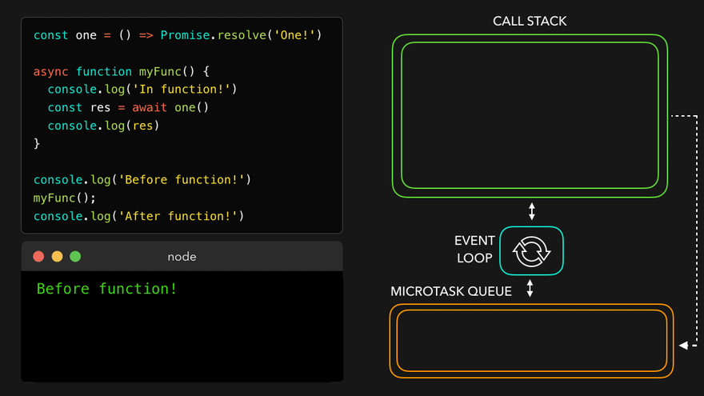

# async await



- Là syntax mới được hỗ trợ JS ES6 để làm việc với bất đồng bộ.
- Khắc phục những hạn chế của Promise bằng syntax mới tránh việc nested và promise hell.
- Bản chất async await vẫn là Promise chạy ở bên dưới.
- Giúp viết code bất đồng bộ mà nhìn như là code đồng bộ.

## Syntax

### async

Sử dụng keyword `async` khi define một function sẽ làm cho function bình thường đó return về một Promise dù có return implicit hay return explicit. Thay cho việc khởi tạo một object `new Promise`.

```js
function fetchData() {}

async function fetchDataFromServer() {}

console.log(fetchData()); // undefined

console.log(fetchDataFromServer()); // Promise {<fulfilled>: undefined}
```

Sử dụng `async` với arrow function:

```js
const fetchDataAsync = async () => {};
```

Giá trị return ra từ async function nếu không phải là Promise thì sẽ được wrap lại bởi một Promise với giá trị truyền vào resolve() của Promise đó.


```js
const sayHelloAsync = async () => {
  return 'hello from async function...';
};

console.log(sayHelloAsync()); // Promise {<fulfilled>: 'hello from async function...'}
```

Vì async function return Promise nên hoàn toàn có thể dùng `.then()` để truy xuất giá trị resolve của Promise:

```js
sayHelloAsync().then((data) => console.log(data)); // 'hello from async function...'
```

Mặc dù có thể sử dụng `.then()` nhưng `async` chỉ thực sự hiệu quả khi sử dụng kèm với `await`. Tác dụng của `await` có thể tạm thời "suspend" để đợi Promise trả về kết quả. tương đương với hàm `.then()`.

### await

```js
await expression;
```

`await` chỉ hoạt động trong async function. Có tác dụng chờ Promise settled (fulfilled hoặc rejected). Giá trị trả về của Promise cũng là giá trị của await expression.

Các statement phía sau `await expression` tương đương với logic nằm trong hàm `.then()` của Promise - Là code bất đồng bộ và sẽ được lấy ra khỏi main stack trong lúc thực thi và sẽ được callback sau.

```js
async function greet() {
  return 'Hello from an async function';
}

async function execute() {
  const message = await greet();
  console.log(message);
}
```

Trong async function nếu không có `await` thì ngoài việc return promise, function đó vẫn sẽ được thực thi đồng bộ như function bình thường

```js
async function myFunc() {
  console.log('In function!');
}

console.log('Before function!');

myFunc();

console.log('After function!');
```

```
'Before function!'

Promise { undefined }

'After function!'
```

## Async await flow

Bản chất `await` ở đây không có nghĩa là chờ promise ở thread chính mà là chờ promise ở web APIs cho đến khi promise settled. `await` ở đây giúp logic đọc code được dễ dàng hơn vì trông nó giống như code đồng bộ.

Phân tích luồng chạy của chương trình trước khi tìm hiểu chi tiết ở phần dưới:

```js
const one = () => Promise.resolve('One!');

async function myFunc() {
  console.log('In function!');
  const res = await one();
  console.log(res);
}

console.log('Before function!');

myFunc();

console.log('After function!');
```


---

### Flow

1. Chương trình khi chạy sẽ thực thi hàm console.log() và in ra "Before function!" vì đây là tác vụ đồng bộ (sync).


2. Khi function myFunc() được call và thực thi. Nó sẽ tạo ra một execution context và thực thi `console.log('In function!')` in ra "In function!".



3. Khi luồng thực thi gặp hàm `one()`. Đây là hàm return về Promise cho nên tất cả những đoạn code phía sau (ở đây là `console.log(res)`) sẽ được tính như code bất đồng bộ và được remove ra khỏi luồng thực thi chính. Gặp keyword `await` nên cả hàm sẽ phải chờ Promise ở một luồng thực thi khác.


4. Luồng thực thi lúc này tiếp tục thực hiện dòng `console.log('After function!')` và in ra "After function!".

   Vì Promise.resolve() là trạng thái settled. Nên promise được chuyển thẳng về callback queue (microtask queue).

   Event loop lúc này thấy call stack đã trống nên đẩy callback của promise lên call stack và thực thi dòng `console.log(res)` với res là giá trị resolve của Promise là "One!".


## So sánh callback - promise - async await

### Callback


### Promise


### Async await


## Thực hành

Convert đoạn code sau từ async await thành promise:

1. Đoạn code 1:

   ```js
   const makeSmoothie = () => {
     const orders = [];
     return Promise.resolve('apple').then((res) => {
       orders.push(res);
       return Promise.resolve('strawberry')
         .then((res) => {
           orders.push(res);
           return Promise.resolve(orders);
         })
         .then((res) => res);
     });
   };
   console.log(makeSmoothie().then((res) => console.log(`shipping ${res}...`)));
   ```

   <details>
     <summary>Answer</summary>

   ```js
   const makeAppleFruit = () => Promise.resolve('apple');

   const makeStrawberryFruit = () => Promise.resolve('strawberry');

   const makeSmoothieAsync = async () => {
     const appleDrinkPromise = makeAppleFruit();
     const strawberryFruitPromise = makeStrawberryFruit();

     const appleDrink = await appleDrinkPromise;
     const strawberryDrink = await strawberryFruitPromise;

     return [appleDrink, strawberryDrink];
   };

   (async () => {
     console.log(`shipping ${await makeSmoothieAsync()}...`);
   })();
   ```

   </details>

2. Đoạn code 2:

   ```js
    const API = 'https://jsonplaceholder.typicode.com/users/2';
    const RATE = 100000;

    const generateIdByUsername = (username) =>
      Promise.resolve(
       `${Math.ceil(Math.random() * RATE)}_${username.toUpperCase()}`
     );

    const getNotification = (id) => Promise.resolve(`Generate ID: ${id}`);

    fetch(API)
      .then((response) => {
        response.json()
          .then(data => {
            generateIdByUsername(data?.username)
              .then(id => {
                getNotification(id)
                  .then(notif => {
                    console.log(notif);
                  })
              })
          })
      });
   ```

   <details>
     <summary>Answer</summary>

   ```js
   const API = 'https://jsonplaceholder.typicode.com/users/2';
   const RATE = 100000;

   const generateIdByUsername = async (username) =>
     `${Math.ceil(Math.random() * RATE)}_${username.toUpperCase()}`;

   const getNotification = async (id) => `Generate ID: ${id}`;

   const handleUsername = async () => {
     const response = await fetch(API);
     const { username = 'anonymous' } = await response.json();
     const userId = await generateIdByUsername(username);
     const notif = await getNotification(userId);
     return notif;
   };

   (async () => console.log(await handleUsername()))();
   ```

   </details>

## Tham khảo

- https://www.javascripttutorial.net/es-next/javascript-async-await/

- https://developer.mozilla.org/en-US/docs/Web/JavaScript/Reference/Statements/async_function

- https://developer.mozilla.org/en-US/docs/Web/JavaScript/Reference/Operators/await
