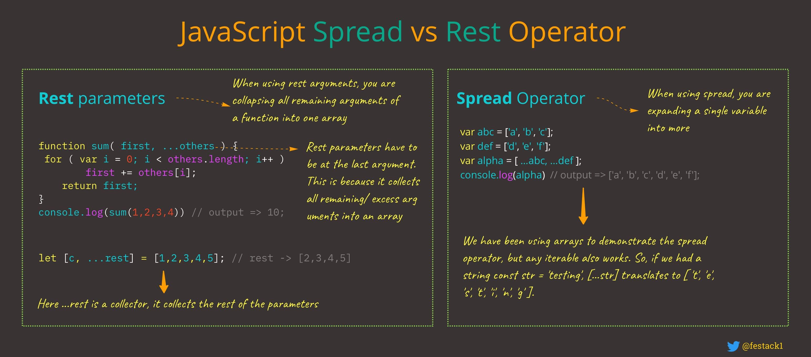

# Spread Operator - Rest Operator



## Syntax: `...`

## Spread Operator

Array:

- Combine / concat arrays:

  ```js
  const arr1 = [1, 3, 5];
  const arr2 = [2, 4, 6];

  const sumArr = [...arr1, ...arr2];
  console.log(sumArr); // [1, 3, 5, 2, 4, 6];
  ```

- Copy array:

  ```js
  const arr = [10, '30', { isLoggedIn: true }];
  const clonedArr = [...arr];
  console.log(clonedArr); // [ 10, '30', { isLoggedIn: true } ]
  ```

Object

- Shallow copy object

  ```js
  const student = {
    name: 'Peter',
    age: 30,
    job: 'developer',
  };

  const clonedStudent = { ...student };
  ```

- Update object property:

  ```js
  const systemInformation = {
    projectName: 'Kindi',
    createdDate: 2021,
    language: 'C++',
    resources: 30,
  };

  const updatedSystemInformation = {
    ...systemInformation,
    language: 'JavaScript',
    resources: 10,
  };

  console.log(updatedSystemInformation);
  ```

- Combine kết hợp nhiều object lại với nhau:

  ```js
  let data1 = {
    name: 'Thien',
    age: 30,
  };

  let data2 = {
    address: 'Da nang',
    device: 'Macbook Pro',
  };

  let data3 = {
    ...data1,
    ...data2,
  };

  console.log(data3); // { name: 'Thien', age: 30, address: 'Da nang', device: 'Macbook Pro' }
  ```

## Rest

### Rest Operator

Array:

```js
const arr = [10, 50, 30, 'hello', true];

const [el1, el2, ...rest] = arr;

console.log(el1, el2, rest); // 10 50 [ 30, 'hello', true ]
console.log(rest); // [ 30, 'hello', true ]
```

Object

```js
 const learningPlan = {
    basic: ['html', 'css', 'js'],
    advanced: ['git', 'reactjs']
  },

  const { basic, ...todo } = learningPlan;

  console.log(basic); // [ 'html', 'css', 'js' ]
  console.log(todo); // { advanced: [ 'git', 'reactjs' ] }

```

Function: Rest Parameter

- Selfdefined function

  ```js
  const makeHamburgerLayer = (...layers) => {
    console.log(layers); // [ 'cake', 'salad', 'beef', 'cheese', '...', 'cake' ]
  };

  makeHamburgerLayer('cake', 'salad', 'beef', 'cheese', '...', 'cake');
  ```

- Built-in function

  ```js
  console.log('hello', true, {}, [], 0); // Thêm bao nhiêu đối số cũng được
  ```

## So sánh Rest và Spread

- Giống nhau về syntax: `...`

- Rest thường dùng chung với destucturing để gom nhóm các phần tử của mảng hay các property của object lại thành một mảng / object duy nhất. Dùng để gom tham số truyền vào hàm.

- Spread dùng để extract / giải phóng / trải rộng:

  - Các phần tử của mảng.

  - Các property của object.

  Trả về mảng mới hoặc object mới chứa các phần tử / property được giải phóng đó.

## Tham khảo

- https://developer.mozilla.org/en-US/docs/Web/JavaScript/Reference/Operators/Spread_syntax

- https://developer.mozilla.org/en-US/docs/Web/JavaScript/Reference/Functions/rest_parameters

- https://www.freecodecamp.org/news/javascript-rest-vs-spread-operators/
