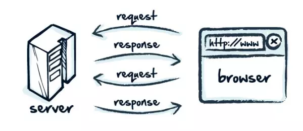
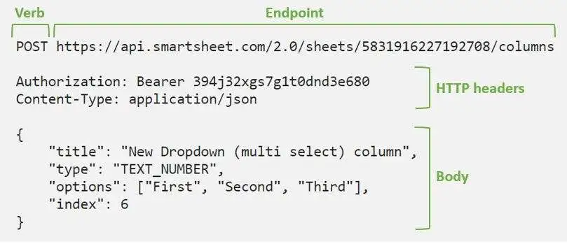
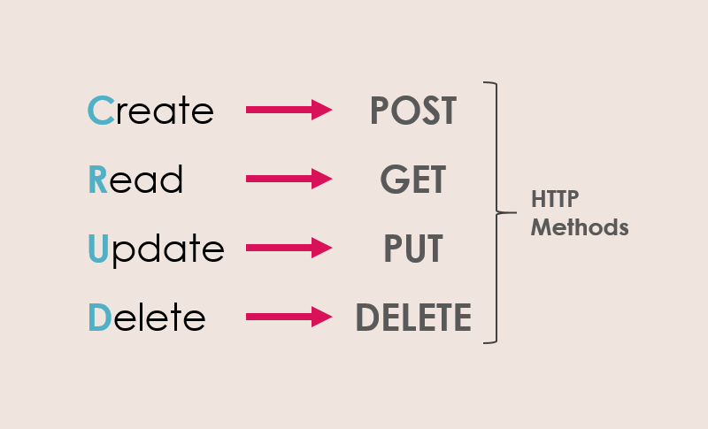

# HTTP - HTTPS

### Mô hình client - server



Trong mô hình client server đơn giản, client sẽ gửi một request đến server để lấy dữ liệu về. Vậy thì cái gọi là request đó thật sự là gì và nó có cấu tạo như thế nào?

### HTTP (Hyper Text Transfer Protocol)

- Là một giao thức (protocol) chung dùng để truyền tải dữ liệu siêu văn bản. Nó được tạo ra với những quy tắc (rules), những thống nhất chung để các hệ thống có thể hiểu và giao tiếp truyền nhận dữ liệu với nhau.

- Client sẽ gửi một **resquest** sử dụng HTTP lên server. Server sau đó xử lí và trả về lại một  **response** cũng bằng cách sử dụng HTTP.

### HTTP Request



- Được tạo ra bởi client. Gửi đến server để yêu cầu được trả về một dữ liệu gì đó tuỳ theo methods.

- Thành phần của HTTP Request

  - Header

  - Methods

  - Body

### HTTP Header

- Là một loại meta được client gửi đi. Cung cấp các thông tin của request cũng như thông tin của trình duyệt.

  - https://www.geeksforgeeks.org/http-headers

  - https://developer.mozilla.org/en-US/docs/Web/HTTP/Headers

### HTTP Methods [(link)](https://developer.mozilla.org/en-US/docs/Web/HTTP/Methods)



- **GET**: Yêu cầu truy vấn data từ server (Lấy list user, thông tin của một resource,...)

  - **Cached**: Request có thể được trình duyệt cached lại.

  - **Bookmarked**: Request có thể được bookmarked.

  - **Max length**: Khi gửi kèm data bằng GET request thì data sẽ được thêm lên URL. Và độ dài tối đa nội dung URL có thể chứa được là 2048 kí tự. [(link)](https://www.baeldung.com/cs/max-url-length)

  - **Visibility**: Data có thể hiện thị lên trên thanh địa chỉ của trình duyệt. Có nguy cơ lộ thông tin.

  - Chỉ hỗ trợ data kiểu string.

  - Các parameters sẽ được lưu lại trong lịch sử của trình duyệt.

  - Thường thường request dạng GET không nên có Request Body, bất cứ loại data nào gửi qua request GET đều sẽ được thêm vào url dưới dạng query parameter

    ```
      https://www.system.com/test/demo_form?name1=value1&name2=value2
    ```

- **POST**: Submit data lên server để lưu trữ hoặc xử lý (Submit form, đăng kí,...)

  - **Cached**: Request sẽ không được trình duyệt cached.

  - **Bookmarked**: Request không thể được bookmarked/

  - **Max length**: Data sẽ được gắn trong body của request, không phải trên thanh url nên không giới hạn kí tự.

  - **Visibility**: Data không hiển thị lên thanh địa chỉ của trình duyệt mà sẽ chứa trong body của request

  - Không lưu lại trong lịch sử trình duyệt.

  - Các parameters sẽ không được lưu lại trong lịch sử của trình duyệt.

  - Không được bookmarked.

  - Không giới hạn về độ dài dữ liệu.

- **PUT / PATCH**:

  - PUT: Cập nhật toàn bộ data (override) có sẵn và tạo mới data nếu nó chưa tồn tại trên server.

  - PATCH: Cập nhật một phần data trên server.

- **DELETE**: Xoá data trên server.

### HTTP Body

- Là phần sẽ chứa dữ liệu để gửi lên server

### Send HTTP Request

- Để xử lý tác vụ bất đồng bộ như gửi request lên server để lấy dữ liệu, JS Engine và trình duyệt hỗ trợ một vài cách:

#### AJAX (Asynchronous JavaScript and XML)

- Là kĩ thuật cho phép tạo các tương tác và thay đổi nội dung động (dynamic) trên trang web bằng cách tạo ra những tác vụ bất đồng bộ request đến server lấy dữ liệu và cập nhật những phần nào có thay đổi, không tải lại toàn bộ trang web

- Cơ chế của AJAX chủ yếu dựa vào sự hỗ trợ của JS để xử lý tác vụ bất đồng bộ và response. Sử dụng object`XMLHttpRequest` (Sau này là dùng hàm fetch()) để gửi và nhận data mà không cần reload lại trang.

- Trước đây dữ liệu trả về dưới dạng XML, sau này nhờ sự phát triển và phổ biến của JSON mà nó được sử dụng phổ biến hơn. AJAX đều có thể xử lý được 2 dạng format data này.

- Tính chất của AJAX thường được dùng để triển khai một vài tính năng:

  - Infinite scroll: Load thêm data khi user scroll page xuống dưới.

  - Submit form mà không làm page bị reload lại.

  - Hiển thị auto suggestion trên thanh search khi gõ keyword.

  - Fetching and hiển thị data từ các nguồn API bên ngoài

- Sau này có các frameworks ra đời như React, Vue, Angular hỗ trợ thêm các cách tối ưu hơn để thực hiện việc truyền nhận hiển thị dữ liệu.

### HTTP vs HTTPS

- Giao thức HTTP hiện tại là một giao thức thiếu bảo mật vì dữ liệu được chuyển giao là dữ liệu thô và không được mã hoá nên rất dễ bị đánh cắp trong quá trình client giao tiếp với server bằng HTTP.

- HTTPS ra đời để khắc phục những điểm yếu chết người của HTTP bằng cách mã hoá tất cả những gì mà client gửi đi bằng giao thức TLS (Transport Layer Security) / SSL ( Secure Sockets Layer).

## Tham khảo

- https://developer.mozilla.org/en-US/docs/Web/HTTP/Basics_of_HTTP
