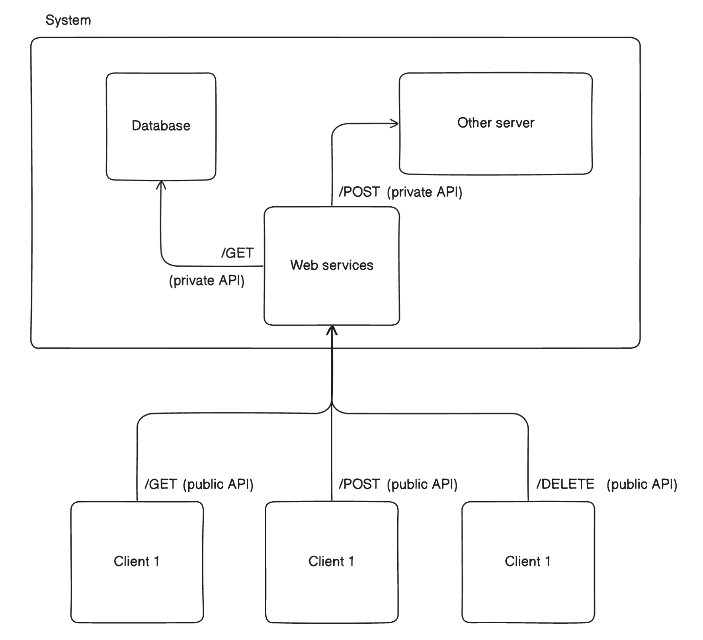
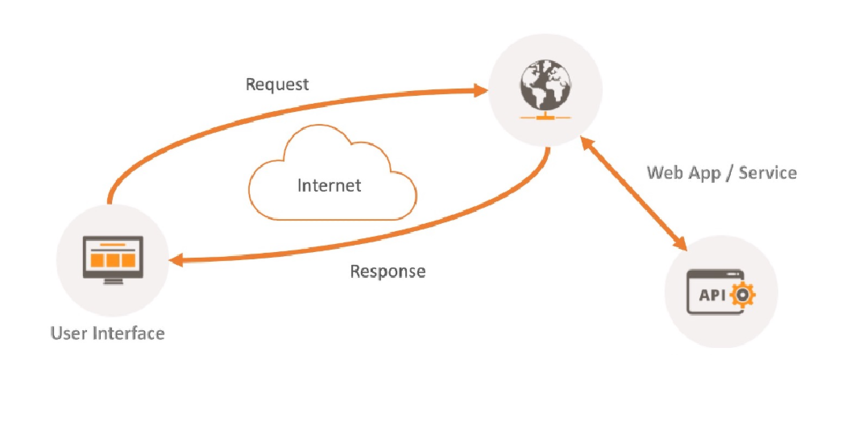
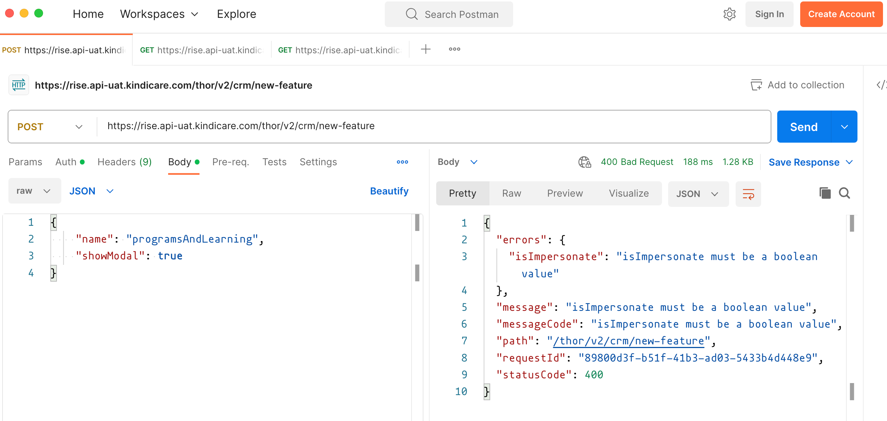

# API - Postman


## API (Application Programming Interface)

Là một "giao diện" tuân thủ một số ràng buộc và quy ước. để 2 hoặc nhiều máy tính có thể giao tiếp với nhau để truyền nhận dữ liệu một cách nhanh chóng và thuận tiện hơn.

> API có hình dạng như một URL cùng với rất nhiều options do backend cung cấp, tuỳ vào request method gì và option như thế nào mà fronted sẽ gửi request lên URL đó để nhận về dữ liệu cần thiết.

Có 2 loại API phổ biến là Private APIs và Public APIs:



## API Architecture

Là một kiến trúc và tập hợp các ràng buộc để thiết kế và triển khai các hệ thống sử dụng API để giao tiếp. Triển khai hệ thống theo kiến trúc này sẽ giúp hệ thống có khả năng mở rộng (scalable), đáng tin cậy (reliable), và dễ bảo trì (maintainable).

### SOAP (Simple Object Access Protocol)

Là giao thức truy cập đối tượng đơn giản được sử dụng để xây dựng API. SOAP do W3C định nghĩa và sử dụng XML để mã hoá thông tin.

### REST (Representational State Transfer)

REST là một trong những kiến trúc giúp xây dựng API phổ biến nhất hiện nay. Các dự án hiện tại xây dựng API đa phần đều dựa trên REST.

Thiết kế API theo chuẩn REST cần tuân thủ các ràng buộc sau:

- Client - Server Seperation:

  Kiến trúc REST cần phải bảo đảm bảo thiết bị đóng vai trò client để gửi request và thiết bị đóng vai trò server để nhận xử lý request và gửi trả response

- Uniform Interface (Chuẩn hoá interface)

  Các request và response phải sử dụng HTTP làm giao thức liên lạc và bảo đảm khả năng tương thích giữa client server.

  Response từ server sẽ được định dạng bằng JSON.

- Stateless (Phi trạng thái)

  Client và server sẽ không lưu trạng thái của nhau. Server sẽ không lưu giữ thông tin gì qua các lần tương tác. Điều này giúp hệ thống dễ phát triển và mở rộng.

- Layered System (Hệ thống phân lớp)

  Các Request và response phải luôn được format cùng rules để bảo đảm tính nhất quán ngay cả khi chúng được gửi đến các server trung gian khác nhau nằm giữa client và API.

- Cacheable

  Response của server phải cung cấp thông tin về việc response có được cache ở client hay không và cache trong bao lâu.

API thiết kế tự do không theo convention:

```
POST /create_post
GET /list_posts
POST /feature_posts
POST /edit_post/:post_id
```

API thiết kế theo convention:

```
POST /v1/posts
GET /v1/posts
GET /v1/posts/:post_id
PUT /v1/posts/:post_id
DELETE /posts/:post_id
```

## Postman

Là một API tool giúp hỗ trợ làm việc với API bằng cách cho phép tạo ra các request. Thay vì tương tác với UI trên browser để có thể gửi được các request với server thì Postman hỗ trợ bỏ qua flow UI mà vẫn tạo được request để tương tác với server / web service.



Installation: https://www.postman.com

  

### Tham khảo

- https://jsonplaceholder.typicode.com

- https://200lab.io/blog/api-la-gi/