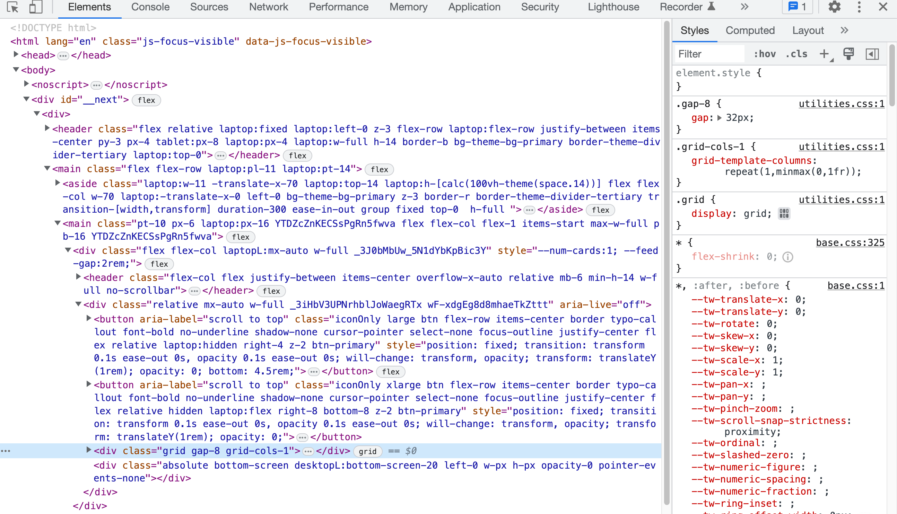
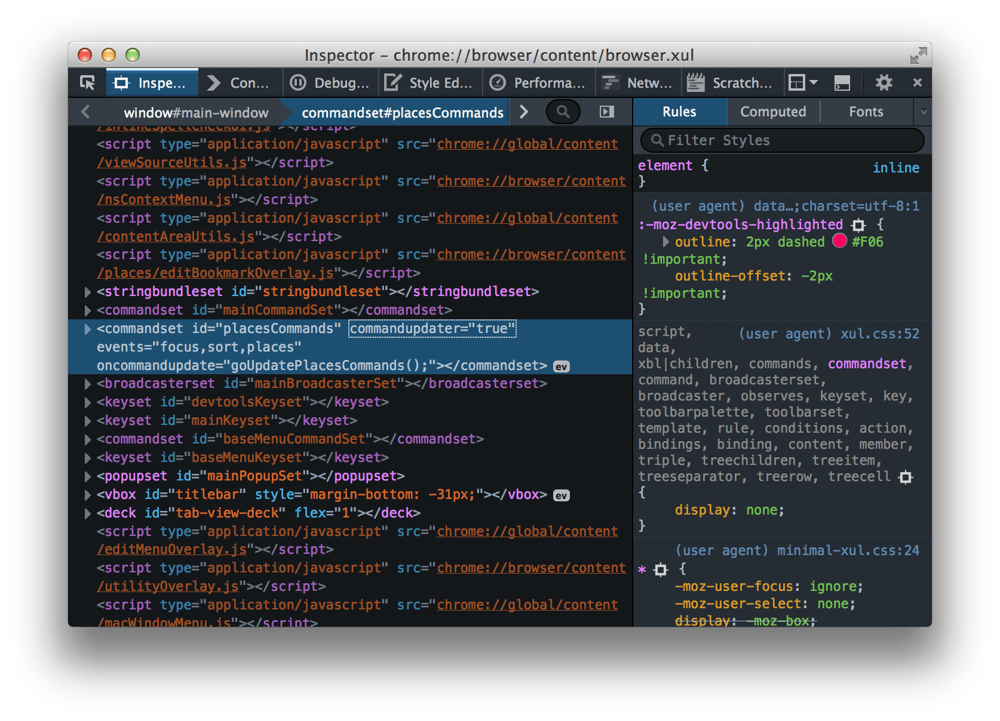
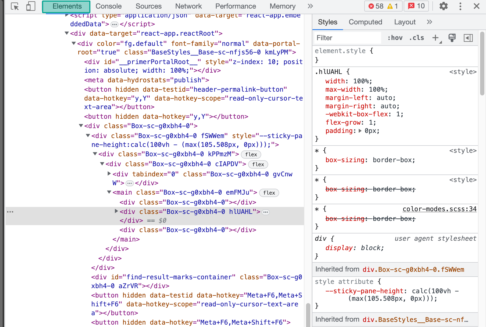
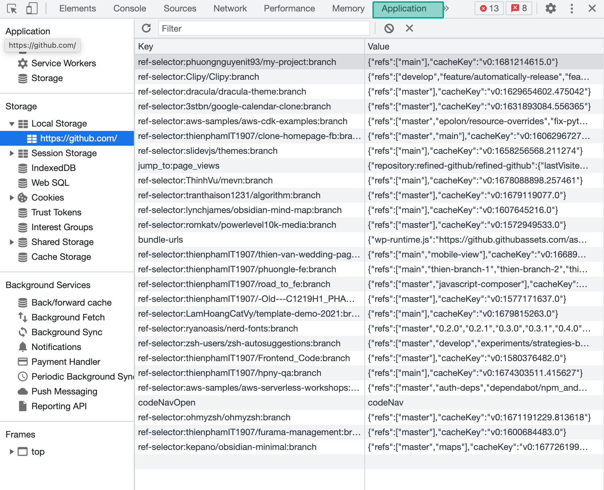
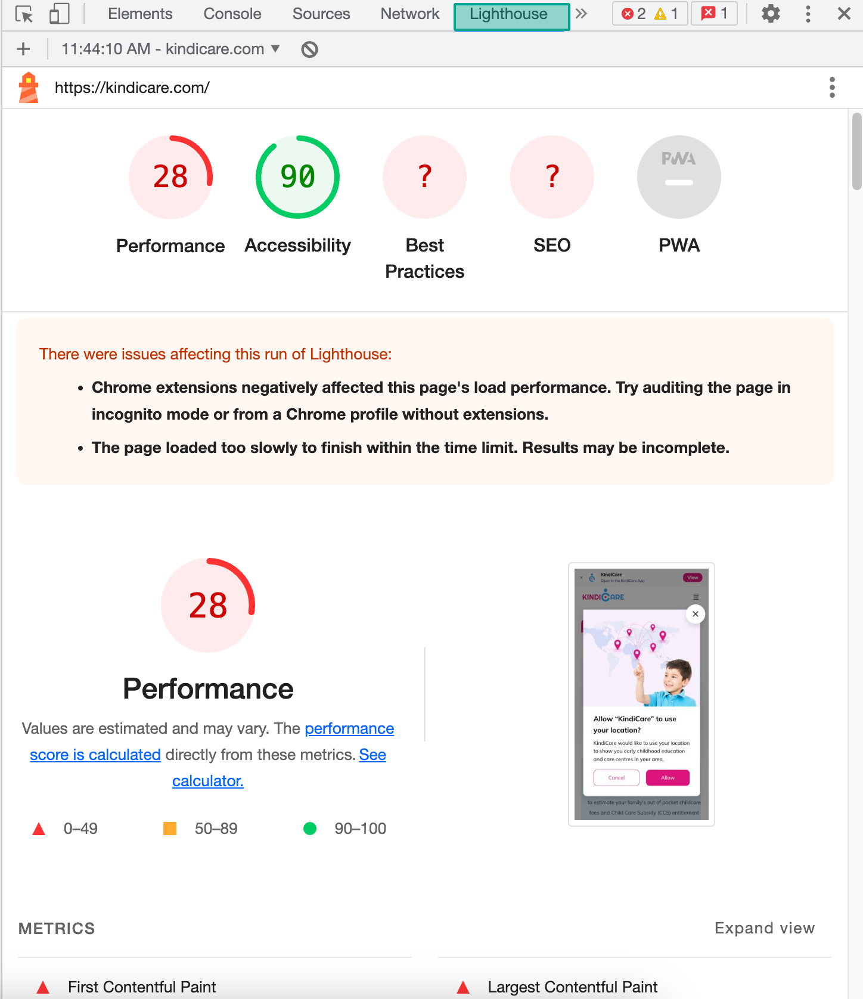
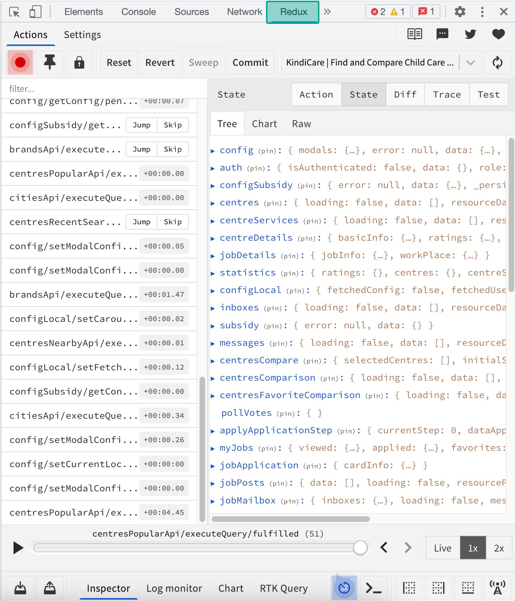
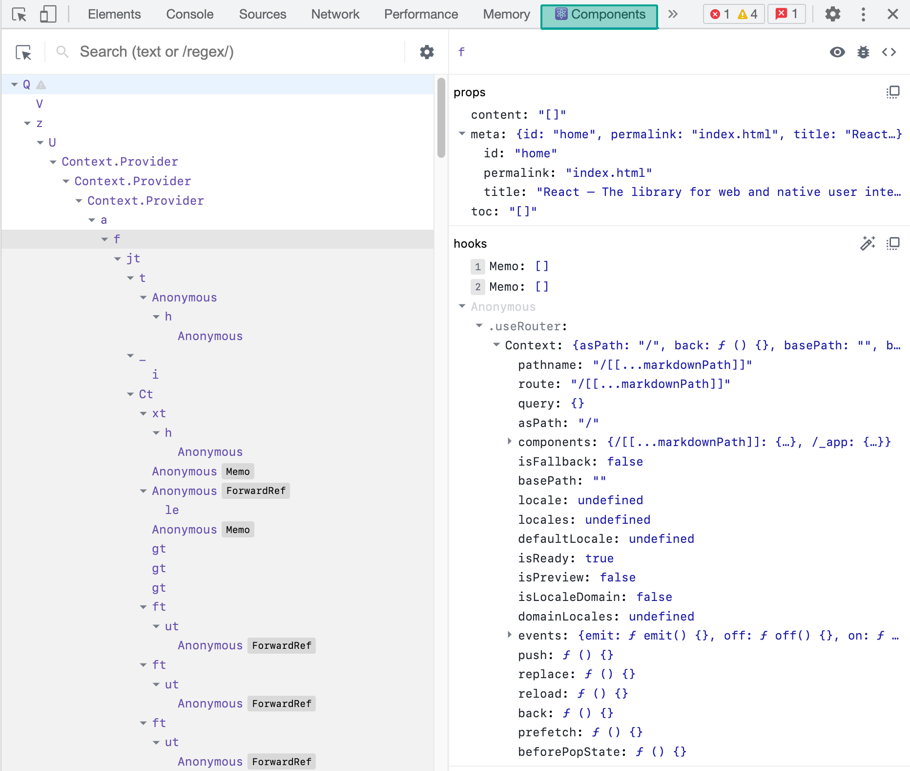

# Developer tool

- Developer tool là công cụ hữu ích trong việc phát triển web cũng như phát hiện lỗi. Vd: Một trang web vào một ngày đẹp trời không vào được nữa, trên giao diện không báo gì nhưng khi có dev tool, ta sẽ tìm được nguyên nhân
- Được tích hợp trong tất cả các trình duyệt

## Dev tool in chrome

## Dev tool in firefox

## Thành phần cơ bản

### Elements

- Hiển thị element html và style dùng để render ra trang web
- Có thể edit trực tiếp để tác động lên layout và style của trang web

### Console

- Hiển thị thông tin, message lỗi, trạng thái của web để ta có thể dễ dàng theo dõi
- Cho phép ta viết code JS để tương tác với trình duyệt như gán event, trích xuất HTML element, xử lý tính toán và log giá trị
- Sử dụng rất hiệu quả cho việc debug chương trình
- Các hàm show popup hay dùng như `prompt()`, `console.log()`, `alert()`

### Network

- Giúp kiểm tra được chi tiết các request, response
- Kiểm tra các API call và data trả về
- Kiểm tra tốc độ mạng, mô phỏng các tình huống mạng yếu / mạnh trong quá trình dev

### Application

- Lưu trữ các thông tin trên trình duyệt dùng cho trang web
- Cache data

### Lighthouse

- Một tool được tích hợp sẵn trong trình duyệt dùng để đánh giá, phân tích hiệu suất cũng như nội dung trên web để phục vụ SEO

### More options

- Một số tab khác thông qua việc cài đặt các extension chuyên dụng cho lập trình web cũng sẽ xuất hiện trên devtool, phổ biến như [Redux DevTools](https://chrome.google.com/webstore/detail/redux-devtools/lmhkpmbekcpmknklioeibfkpmmfibljd) và [React Developer Tools](https://chrome.google.com/webstore/detail/react-developer-tools/fmkadmapgofadopljbjfkapdkoienihi)

