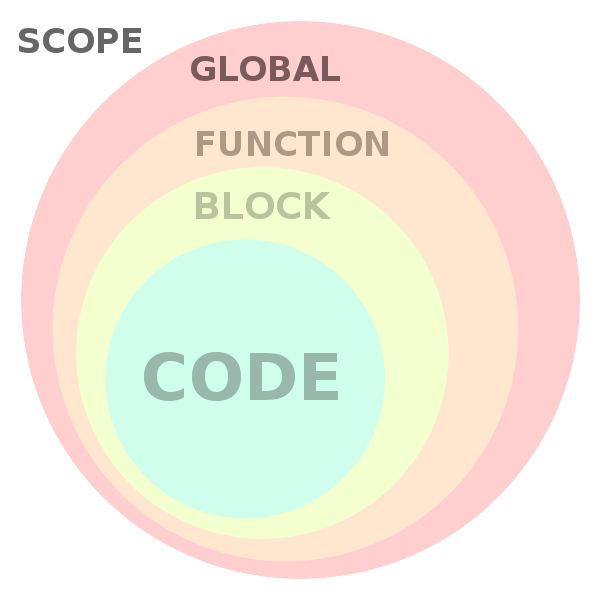

# var - let - const

## Scope

- Các loại scope:
  - Global scope
  - Block scope
  - Local scope

## var - let- const
### var

### let
- Các biến được khai báo bằng `let` sẽ 

### const

## For loop with `var`