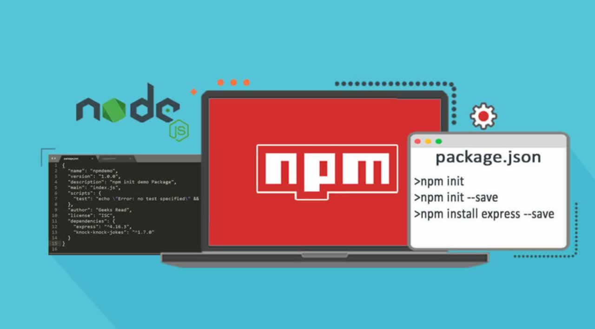
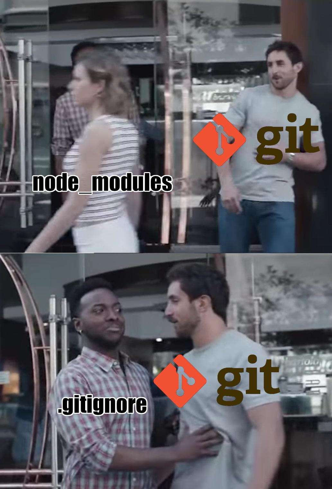
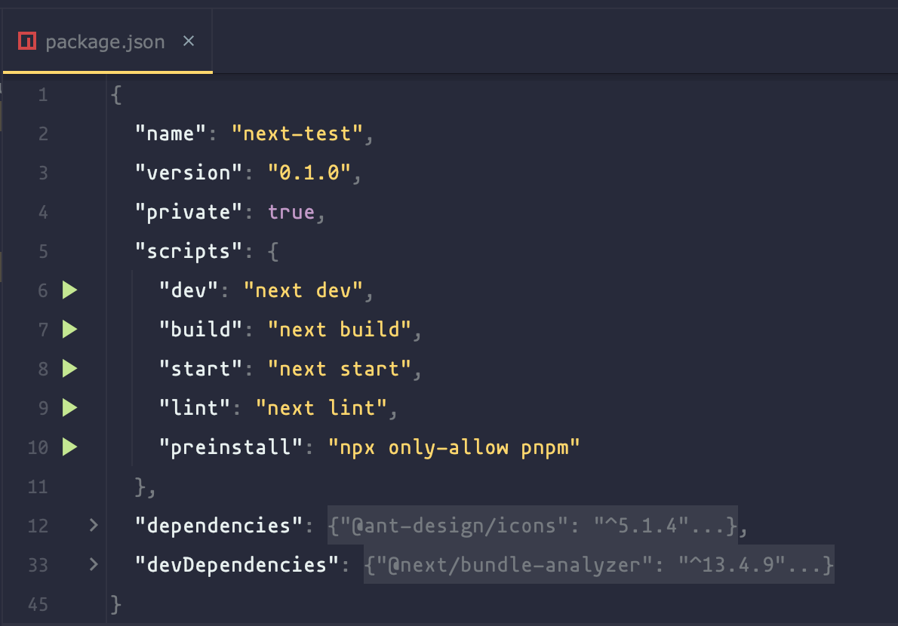
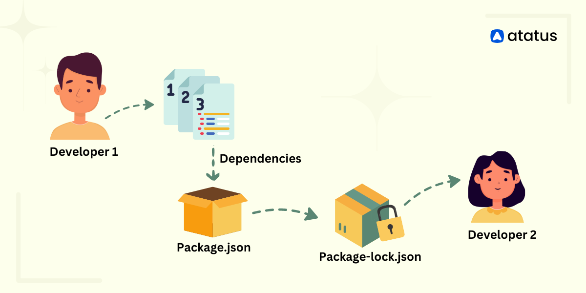
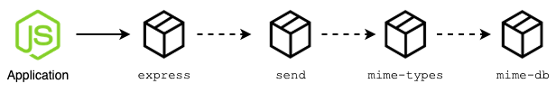
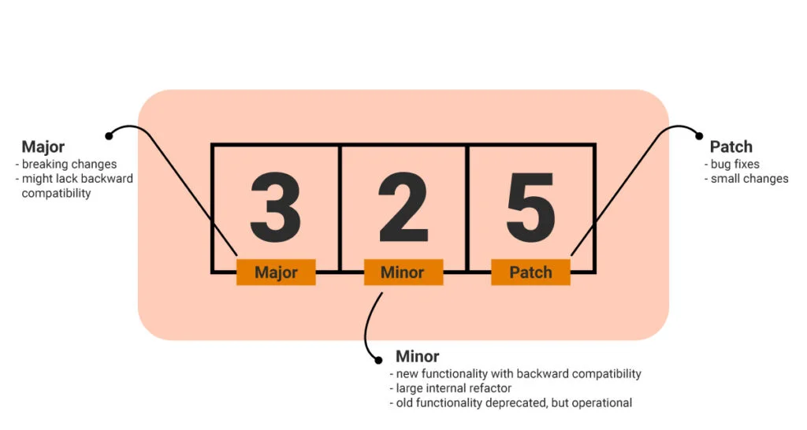
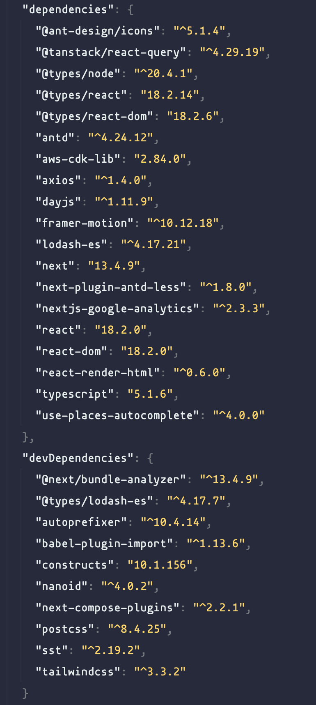
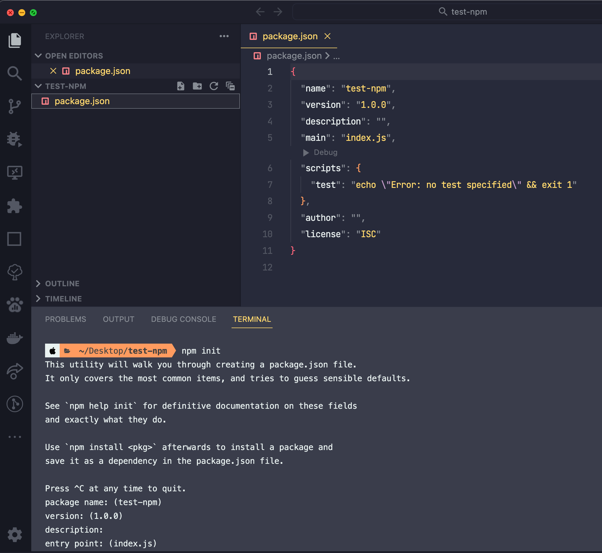
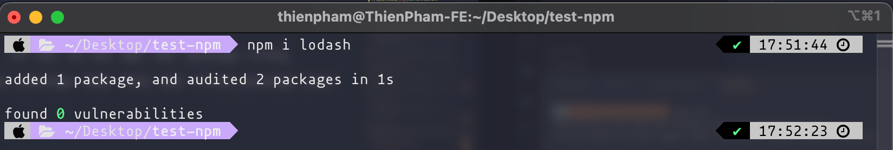
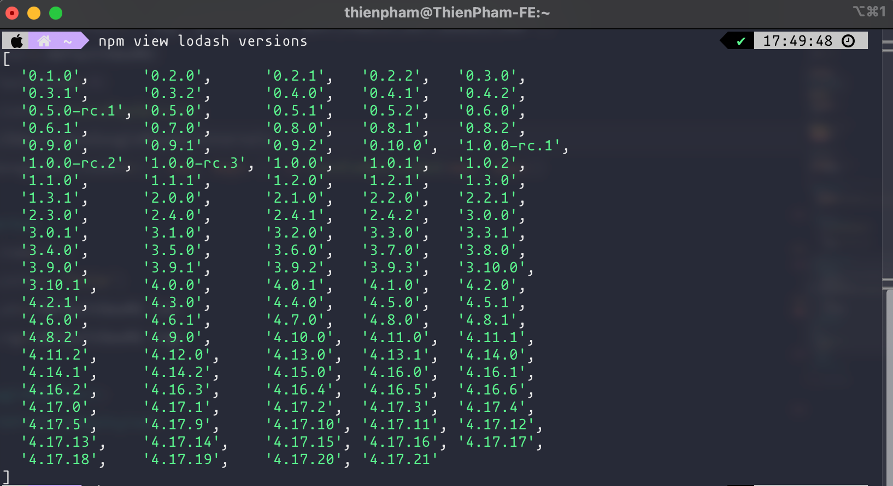

# Node Package Manager (NPM)



Trang chủ: https://www.npmjs.com

NPM Là một kho lưu trữ các gói (package) / thư viện (libraries) / tiện ích (utilities) dùng cho các dự án có sử dụng NodeJS.

Có khoảng 800.000 packages trên kho lưu trữ npm và hoàn toàn miễn phí (open-source). Hiện nay có rất nhiều dự án phần mềm sử dụng package của npm để phát triển thương mại.

Developer có thể tải về và sử dụng cho dự án cá nhân thông qua npm CLI cũng như có thể upload package của mình lên để chia sẻ cho các developer khác sử dụng.

Một vài kho quản lý lưu trữ khác phục vụ cho các nền tảng và các loại ngôn ngữ lập trình khác nhau:

- Nuget dành cho .NET
- Composer dành cho PHP
- Maven dành cho Java
- PiP dành cho Python

## node_modules

Chứa các gói / thư viện / tiện ích cần thiết cho dự án.
Trong quá trình phát triển dự án phần mềm sẽ tải và sử dụng các package từ NPM. Các gói đó sẽ được chứa trong node_modules.

Khi tải một package về node_modules. Thì nó không đơn giản chỉ là tải package đó mà còn tải theo nhiều package thành phần khác có liên quan hay là package trung gian để giúp package chính hoạt động. **Đó là lí do mà node_modules sẽ trở nên rất nặng.**

Vì node_modules là một folder có dung lượng lớn nên khi đẩy source code dự án lên các kho lưu trữ code như github, gitlab,... sẽ rất mất thời gian. Thay vào đó ta sẽ bỏ qua thư mục node_modules. Ở các máy của developer khác khi clone project về chỉ cần chạy lệnh `npm install` để build lại node_modules trên chính local của máy đó với thời gian nhanh hơn là đợi download node_modules về.



Cũng vì node_modules khá nặng nên trong một số trường hợp cần xoá đi và install lại thì cũng không thể dùng cách xoá thông thường mà sẽ sử dụng command: `rm -rf node_modules`


## package.json



File `package.json` dùng để config dự án sử dụng NodeJS. Chứa các thông tin dự án, các package cần thiết cho dự án và các đoạn script dùng để chạy dự án.

`package.json` giúp quá trình làm việc nhóm giữa các developer được thuận tiện hơn khi có thể share với nhau thông tin về cấu hình dự án, version của package và tự cài đặt trên máy cá nhân của mình.



### package-lock.json

- Khi cài đặt một package thì npm sẽ cài đặt luôn tất cả các package cần thiết liên quan. Ví dụ khi cài đặt package Express:

  - Nó sẽ cần dùng thư viện `send`.

  - Thư viện `send` lại cần package `mime-types` để hoạt động.

  - `mime-types` lại cần `mime-db` để hoạt động.

  

  Việc download này giống nhau một chuỗi dây chuyền lặp đi lặp lại. NPM sẽ tải thư viện mình cần, và đồng thời tải luônthư viện thành phần cần thiết cho thư viện chính có thể hoạt động được. **Đó là lí do node_modules rất nặng.**

- File này sẽ lưu trữ lại chính xác version của các package được cài đặt trong hệ thống. Khi install node_modules thì NPM sẽ dựa trên thông tin của file này để tải về các package với version đã lưu trước khi check version trong package.json kể cả đã có version mới => Giúp hệ thống được bảo mật hơn.

- Tương tự khi sử dụng yarn sẽ có yarn.lock, pnpm sẽ có pnpm-lock.yaml.

- node_modules thì có thể ignore khi push lên git nhưng package-lock.json thì nên commit lên remote repository để đảm bảo tính tương thích của các dependencies và giữa các máy local của developer với nhau.

### Semantic Versioning [(link)](https://dev.to/typescripttv/understanding-npm-versioning-3hn4)



Phiên bản của các package NPM thường có 3 phần:

- **Major**: Phiên bản có các cập nhật lớn và quan trọng (tái cấu trúc, implement, cách vận hành...). Những phiên bản này có khả năng không còn tương thích với dự án hay các package khác phiên bản cũ hơn.

- **Minor**: Phiên bản có các update thêm các tính năng mới mà không làm thay đổi cấu trúc core hay cách vận hành của package. Không ảnh hưởng đến project và các package khác.

- **Patch**: Các bản vá để fix các lỗi, thay đổi nhỏ không đáng kể. Không ảnh hưởng đến sự ổn định project và các package khác.

Các package được list trong `package.json` sẽ được khai báo version kèm theo một số kí hiệu đặc biệt:



Những kí hiệu này cho phép NPM tải về những package với version không cần chính xác.

- `^x.x.x`: Cho phép update version của package này lên `latest version của minor và patch` Nhưng vẫn giữ cố định `major version hiện tại`. Vd ^5.0.1 -> ^5.0.2 hoặc ^5.1.0 chứ không lên ^6.0.0.

- `~x.x.x`: Cho phép update version của package này lên `latest patch version`. Chỉ cập nhật những bug fixes hay hotfixes của các bản vá. `Major và minor version` sẽ được giữ nguyên.

  > Cách dùng khác: `N.N.x`: với 'x' cũng sẽ có tác dụng tương tự như `~`

- `x.x.x`: NPM sẽ lấy chính xác version đã được khai báo.

Kiểm tra semver tại: https://semver.npmjs.com

### dependencies & devDependencies

```json
"dependencies": {
  "fill-keys": "^1.0.2",
  "module-not-found-error": "^1.0.0",
  "resolve": "~1.1.7"
},
"devDependencies": {
  "mocha": "~3.1",
  "native-hello-world": "^1.0.0",
  "should": "~3.3",
  "sinon": "~1.9"
}
```

#### dependencies:

- Chứa các package cần thiết để dự án có thể chạy được ở môi trường production.

- Các package này sẽ được cài đặt và build trên môi trường production.

#### devDependencies

- Chứa các package hỗ trợ phục vụ developer trong việc phát triển như code formatter, lint, test, transpiler...

- Các package này sẽ không được cài đặt và build trên môi trường production.

## NPM basic commands

```bash
npm init
```

Dùng để khởi tạo các thông tin ban đầu cho dự án.

Sinh ra file package.json để list các package mình muốn sử dụng và các script để khởi chạy dự án.



---

### Install package

Đối với dự án clone: `npm install` sẽ tải và cài đặt các package trong node_modules dựa theo config và các package được khai báo trong package.json

```bash
npm --version # node package manager version

npm i # Shorthand for npm install

npm i -y # Shorthand for npm install --yes: Init project quickly without fill the question

npm install # install node_modules by package.json

npm install <package-name> # Save package into dependencies

npm install -g <package-name> # Install package global

npm install <package-name> --save-dev # Save package into devDependencies

npm uninstall <package-name> # Remove package from node_modules

npm view <package-name> versions # Kiểm tra toàn bộ các phiên bản của package
```





## Other

- yarn (https://classic.yarnpkg.com/en)
- pnpm (https://pnpm.io)

## Kết luận

> Tưởng tượng một dự án phần mềm NodeJS như các mảnh ghép, mỗi package tải về như một mảnh ghép trong dự án đó. Nhờ có package.json và node_modules ta có thể tiếp cận kho thư viện mã nguồn mở khổng lồ của npm và tận dụng sức mạnh ấy để phát triển dự án phần mềm và cũng dễ dàng quản lý toàn bộ các package trong dự án.

## Tham khảo

- https://nodejs.dev/en/learn/an-introduction-to-the-npm-package-manager

- https://www.w3schools.com/whatis/whatis_npm.asp

- https://tienvm.com/tim-hieu-ve-semantic-versioning
