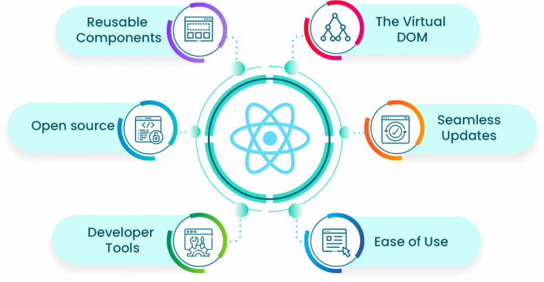
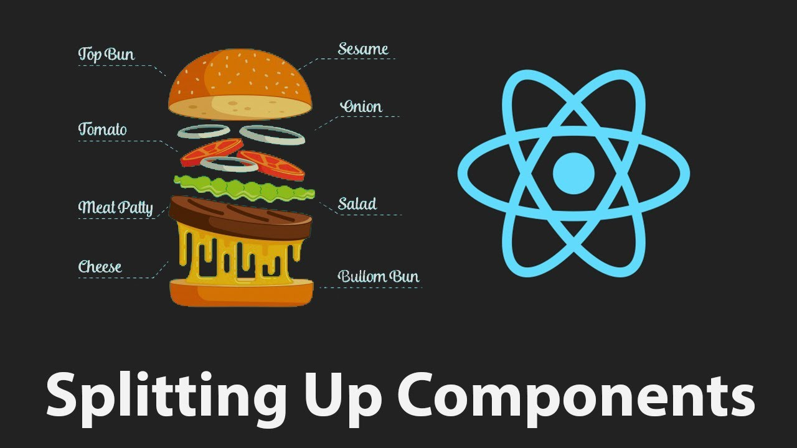
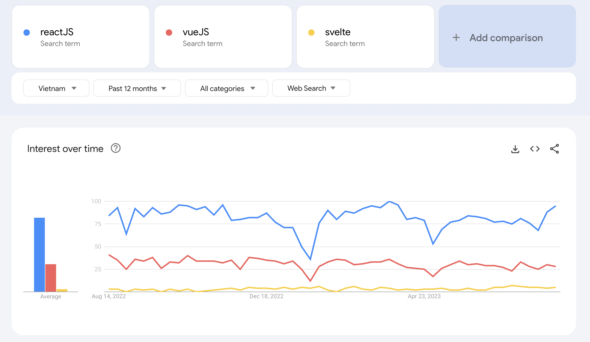

# Introduction ReactJS



##

ReactJS là thư viện JS (ngày nay cũng có thể coi nó như framework) do Facebook tạo ra dùng để xây dựng UI (frontend) theo `component concept`. Hoạt động dựa trên DOM ảo trong bộ nhớ. Thay vì thao tác trực tiếp với DOM thật. React sẽ tạo ra một DOM ảo ở trong bộ nhớ. Nó sẽ thực hiện các xử lý ở đây trước khi thay đổi DOM thật trên trình duyệt thông qua DOM API

Trang tài liệu chính thức: https://react.dev.

## [Installation](https://react.dev/learn/installation)

Để sử dụng được ReactJS có 2 cách

- Embed trực tiếp React vào file html đơn giản

    <details>
      <summary>Click to open</summary>

  ```html
  <!DOCTYPE html>
  <html>
    <head>
      <meta charset="UTF-8" />
      <title>Hello World</title>
      <script src="https://unpkg.com/react@18/umd/react.development.js"></script>
      <script src="https://unpkg.com/react-dom@18/umd/react-dom.development.js"></script>

      <!-- Don't use this in production: -->
      <script src="https://unpkg.com/@babel/standalone/babel.min.js"></script>
    </head>
    <body>
      <div id="root"></div>
      <script type="text/babel">
        function MyApp() {
          return <h1>Hello, world!</h1>;
        }

        const container = document.getElementById('root');
        const root = ReactDOM.createRoot(container);
        root.render(<MyApp />);
      </script>
    </body>
  </html>
  ```

    </details>

- Khởi tạo dự án thông qua [ViteJS](https://vitejs.dev/guide/):

  ```bash
  # npm 6.x
  npm create vite@latest my-react-app --template react

  # npm 7+, extra double-dash is needed:
  npm create vite@latest my-react-app -- --template react

  # yarn
  yarn create vite my-react-app --template react

  # pnpm
  pnpm create vite my-react-app --template react
  ```

## Thinking in React

React sử dụng concept component. Tất cả mọi thứ trong hệ thống đều là component. Vì thế ta cần chia một cấu trúc / layout phức tạp thành các component nhỏ.



Việc chia tách các component sẽ tăng tối đa khả năng tái sử dụng và mở rộng hệ thống. Bên cạnh đó dễ dàng quản lý cách hoạt động của component và dễ debug khi có lỗi xảy ra.


## React Developer Tool

Exension hỗ trợ làm việc với React: [Link install](https://chrome.google.com/webstore/detail/react-developer-tools/fmkadmapgofadopljbjfkapdkoienihi?hl=en)

## Lợi ích



- Một trong những thư viện được sử dụng phổ biến nhất. [(trending)](https://trends.google.com/trends/explore?geo=VN&q=reactJS,vueJS,svelte&hl=en)

- Cộng đồng hỗ trợ lớn.

- Tốc độ phát triển sản phẩm nhanh.

- Tối ưu hiệu suất (Virtual DOM).

- Khả năng tái sử dụng và mở rộng.
