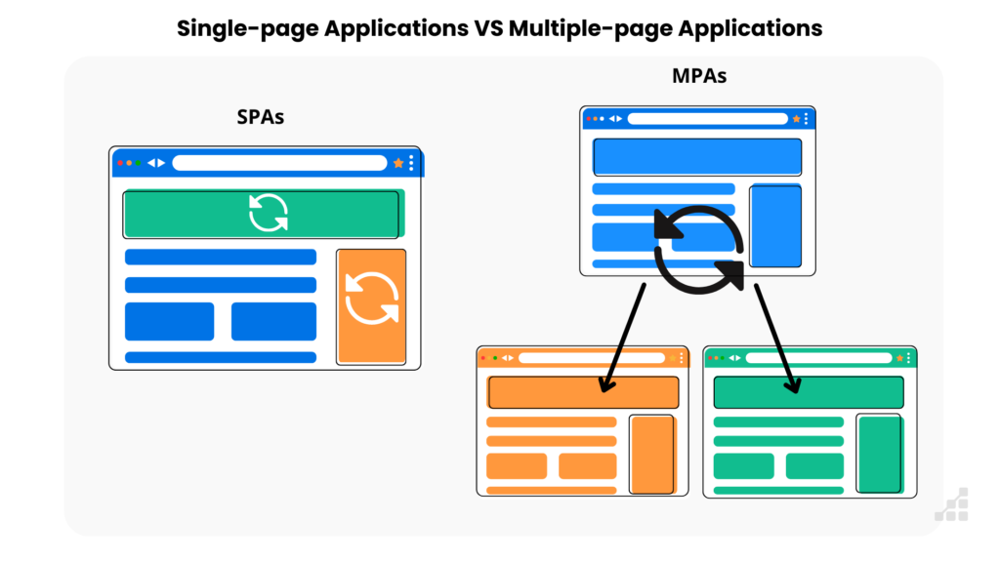
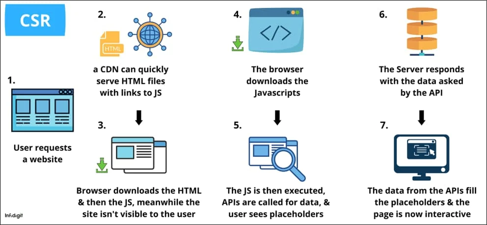
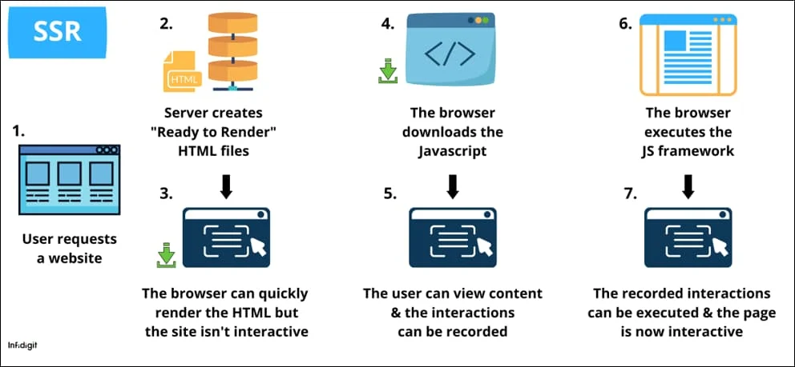

## SPA - MPA - CSR - SSR

## Single Page Application (Ứng dụng một trang)

- Tất cả tương tác và chức năng của ứng dụng chỉ nằm trên một trang duy nhất.

- Page sẽ chỉ cập nhật hoặc reload những phần nội dung có sự thay đổi. Không reload lại toàn bộ page.

- Các tương tác làm thay đổi đường dẫn URL cũng sẽ không làm reload toàn bộ page.

- Ưu điểm:

  - Các tương tác từ user với page phản hồi nhanh và mượt. 

  - Giúp tách riêng phần backend và frontend. Giảm thời gian phát triển, tiết kiệm chi phí. Dễ dàng responsive và nâng cao thẩm mỹ UI/UX

  - Không reload lại toàn bộ page mỗi lần user chuyển hướng trang (redirect) mà chỉ load lại những phần nội dung thay đổi -> Giảm tải cho server

- Nhược điểm:

  - Không hỗ trợ tốt SEO. Vì code html được build ra từ JS nên sẽ không có content để phục vụ SEO.

## Multiple Page Application (Ứng dụng nhiều trang)

- Page sẽ bị reload lại mỗi khi điều hướng URL, toàn bộ trang sẽ được load lại vô tình gây ra UX không tốt.

- Ưu điểm:

  - Hỗ trợ SEO tốt, vì code html đã được render sẵn từ server nên content đã có sẵn để có thể phục vụ SEO.

- Nhược điểm:

  - Việc luôn luôn phải reload lại toàn bộ page sẽ cho UX không được tốt đôi lúc gây khó chịu.

  - Thời gian tải trang lâu vì browser phải load lại luôn cả những phần nội dung không thay đổi. 

  - Phần lớn logic được xử lý ở phía server nên sẽ gây nặng server khi có quá nhiều request cùng một lúc.

## Client Side Rendering (Render phía máy khách)

CSR là cơ chế render webpage ở phía client (browser).

- Khi client gửi request đến đến server.

- Server sẽ phản hồi về một file JS.

- Browser sẽ thực thi file JS và build ra cây DOM, hiển thị tất các các component UI lên viewport.

- CSR thường áp dụng cho các Single Page Application

## Server Side Rendering (Render phía máy chủ)

SSR là cơ chế render webpage ở phía server

- Khi client gửi request đến đến server.

- Server sẽ render page HTML và trả về cho browser.

- Browser nhận file HTML đã render sẵn và hiển thị lên UI.

## Kết luận

Tuỳ vào đặc thù của dự án và các chiến lược kinh doanh (SEO, ...) mà ta sẽ lựa chọn concept xây dựng hệ thống cho phù hợp.

- **SPA**: Dùng cho các dự án tập trung vào trải nghiệm tương tác của người dùng, các chức năng hoạt động mượt mà và ổn định, hiệu suất tốt.

- **MPA**: Dùng cho các dự án marketing, landing page, hiển thị thông tin, cần SEO..

## Tham khảo

- https://developer.mozilla.org/en-US/docs/Glossary/SPA

- https://toidicodedao.com/2018/09/11/su-khac-biet-giua-server-side-rendering-va-client-side-rendering
