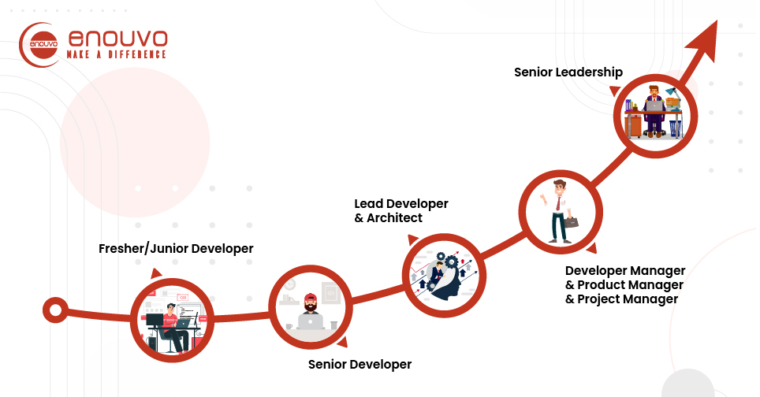

# Introduction

## Level up!

Nội dung phần này sẽ tập trung vào việc tự học và tự bản thân nghiên cứu, tìm hiểu trên tài liệu chính thức của ngôn ngữ mà mình đang sử dụng. (ReactJS)

Tự học cũng là kĩ năng cần thiết cho con đường phát triển sự nghiệp sau này của bản thân.

Đây cũng là giai đoạn đánh dấu bước phát triển của bản thân, lột xác để trở nên hoàn thiện hơn, có định hướng rõ ràng cho sự nghiệp.

## Làm thế nào để tự học tốt

Để rèn luyện khả năng tự học cũng như xây dựng các thói quen tốt hỗ trợ cho khả năng tự học

- Vạch ra một kế hoạch dài hạn và kế hoạch ngắn hạn cụ thể với thời gian deadline nhất định để bản thân có thể nỗ lực cố gắng mà hoàn thành.

- Không ngừng tìm kiếm các tài liệu liên quan, tham khảo các diễn đàn, cộng đồng liên quan đến công nghệ mình đang sử dụng để có thể nắm bắt trending, các vấn đề mà developer khác gặp phải để bản thân mình luôn được cập nhật liên tục.

- Phân bổ thời gian hợp lý, tuỳ vào năng lực hiện tại có thể lập kế hoạch ngắn hạn để tập trung vào một lĩnh vực hoặc phát triển nhiều lĩnh vực song song.
