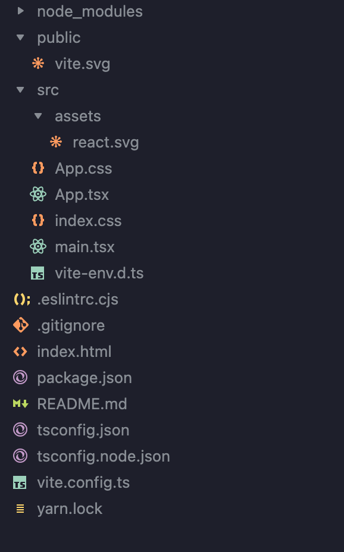

# Project Structure

Một project react lúc mới khởi tạo bằng vite CLI có cấu trúc mặc định như sau:

- node_modules: Chứa tất cả thư viện sử dụng cho dự án.

- public: Chứa các resource như font, image, video, sound,...

- src: Chứa source code chính của project. Trong src sẽ có những file hoặc folder được định nghĩa theo từng mục đích.

  - components: Chứa các component, có thể reuse lại ở khắp mọi nơi trong project

  - hooks: Chứa các custom hook

  - utils: Chứa các function tiện ích như format data, convert data, generate data,...

  - App.tsx: File chính dùng để khởi chạy project. Bản thân nó cũng là một component

  - App.css: File style cho App component

  - package.json: Chứa các thông tin, config script cũng như các package mà project đang dùng.

  - routers: Định nghĩa các route dùng để redirect tới các chức năng khác nhau mà project cung cấp

  - types: Chứa các định nghĩa kiểu dữ liệu khi project sử dụng Typescript

  - ...

> Tuỳ vào đặc thù dự án và các tính năng triển khai thì cấu trúc dự án React có thể sẽ thay đổi custom.

## Tham khảo

- https://scrimba.com/articles/react-project-structure/#:~:text=The%20structure%20is%20organized%20into,styles%20folder%20contains%20CSS%20styles

- https://legacy.reactjs.org/docs/faq-structure.html
