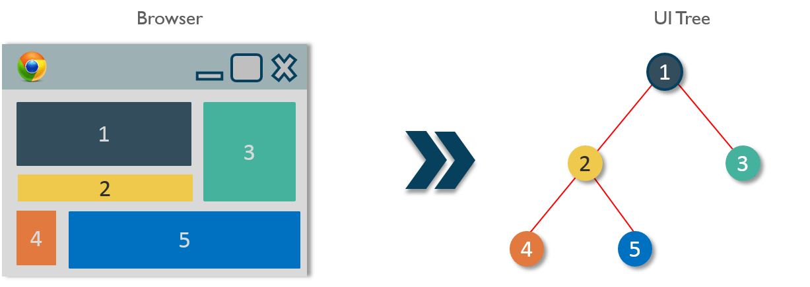

# Component

Component trong React được chia làm 2 loại:

- Container component (Smart component)

  - Trực tiếp xử lý dữ liệu (call api, convert data,...)

  - Chỉ quan tâm render cái gì ra UI chứ không quan tâm render bằng cách nào. 
  
    Vd: Container chỉ có dữ liệu là danh sách sản phẩm, thì container này không render, đưa dữ liệu cho component khác render.

  - Có thể chứa các component container con và các component khác

- Component (Dump component)

  - Nhận dữ liệu gì thì render dữ liệu đó, không quan tâm dữ liệu từ đâu tới.

  - Thường chỉ có prop, không có state

  - Tái sử dụng với các props khác nhau thì render khác nhau. Vd: Có 1 cái box, component cha truyền vào màu gì thì component con sẽ render ra box màu đó

Và được định nghĩa theo 2 cách:

- Class component

- Functional component (Stateless component)

## Data flow
- Dữ liệu trao đổi giữa các component trong react theo cơ chế "one way data flow". Chỉ đi một chiều và được truyền từ component cha xuống component con.

## Tham khảo

- https://dev.to/reenydavidson/understanding-react-components-5543
