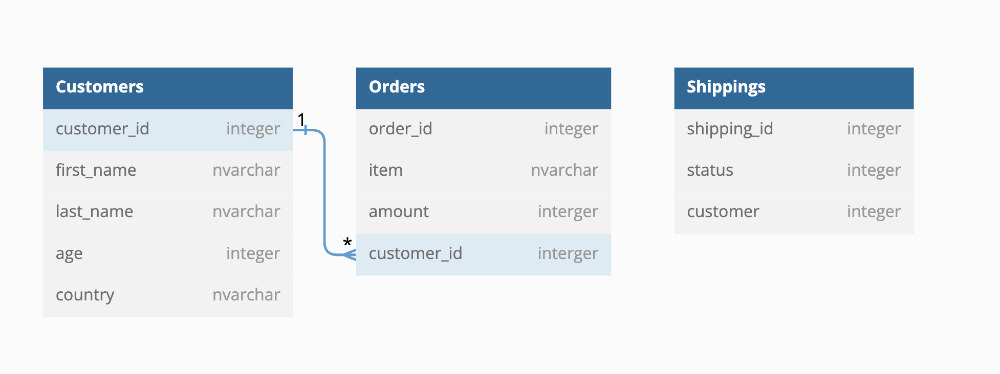
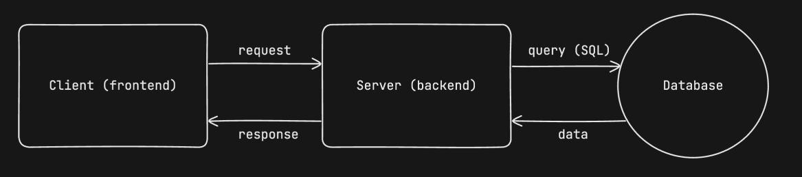
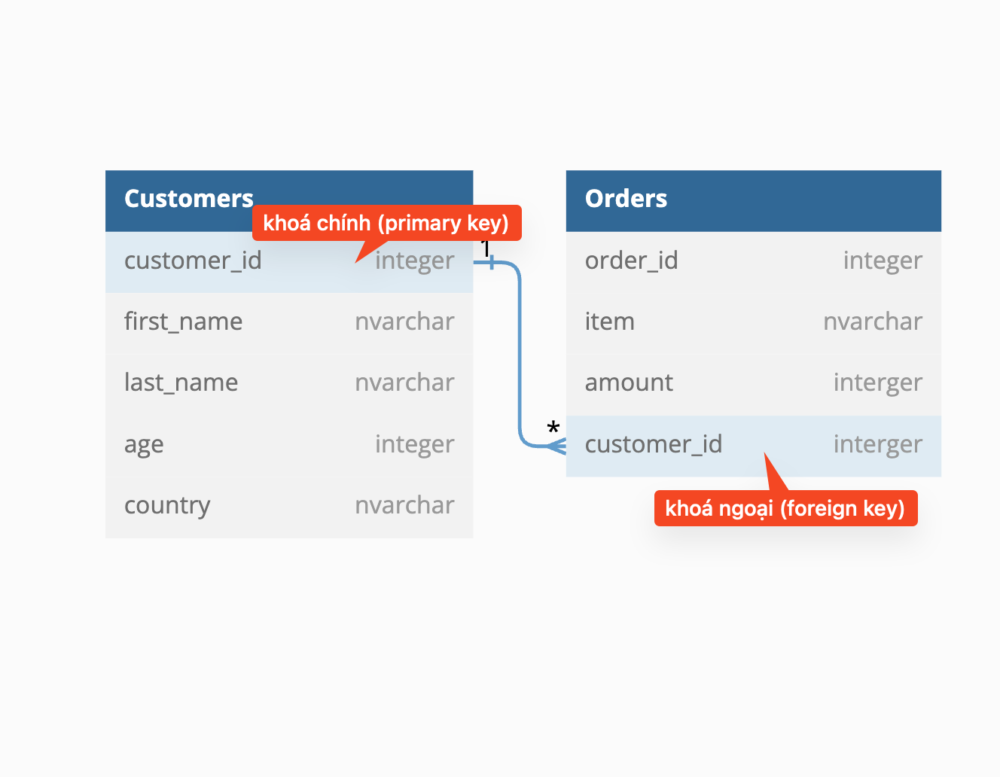

# SQL


## Client - Server - database

### Client

Đại diện cho máy khách bao gồm các thiết bị của người dùng cuối (laptop, điện thoại, smartwatch,...) có nhiệm vụ gửi request để lấy dữ liệu.

### Server

Đại diện cho máy chủ bao gồm các thiết bị dùng để chạy hệ thống, ứng dụng, xử lý các request gửi lên và trả về response cho client.

### Database

Nơi lưu trữ dữ liệu của toàn bộ hệ thống hoặc ứng dụng. Tuỳ vào loại database mà sẽ có những cách tổ chức dữ liệu khác nhau:

- Relational Database: Data được tổ chức theo dạng bảng (table) với các cột (column) và dòng (row) để lưu trữ và giữa các bảng có quan hệ với nhau.

  

- NoSQL Database: Data được tổ chức và lưu theo dạng key-value.

  ```json
  {
    "user_id": 100,
    "first_name": "Peter",
    "lastname": "Parker",
    "age": 40,
    "child": {
      "name": "Maria",
      "age": 10
    }
  }
  ```

Dữ liệu rất quan trọng nên Database thường xuyên được cập nhật bảo mật và bảo đảm về các vấn đề an ninh.

### Flow



- Client gửi request đến server để yêu cầu truy xuất dữ liệu

- Server sẽ căn cứ vào request của client và sử dụng SQL để thực hiện truy cập vào Database

- Database sẽ trả ra data thô cho server, sau đó server xử lý data và trả về cho client

## SQL

SQL - Ngôn ngữ truy vấn có cấu trúc dùng để truy cập dữ liệu và tương tác với cơ sở dữ liệu (database).
Ngôn ngữ truy vấn này có cú pháp gần với ngôn ngữ tự nhiên. Điều này cho phép tiếp cận và sử dụng dễ dàng hơn.

### Các câu lệnh SQL cơ bản

#### Comment

```sql
-- This is comment line in SQL.
```

#### SELECT

Dùng để truy xuất dữ liệu trong database.

Query một hoặc nhiều column trong một bảng hoặc từ nhiều bảng

```sql
SELECT column1, column2, ...
FROM table_name1, table_name2;
```

Query toàn bộ các row và column của một hoặc nhiều bảng:

```sql
SELECT * FROM table_name1, table_name2;
```

#### WHERE

Cho phép định nghĩa một điều kiện nào đó để query data. Kết hợp với các câu lệnh SQL khác để khoanh vùng tập dữ liệu đáp ứng điều kiện để tương tác.

Nếu không có WHERE mặc định các câu truy vấn (query) sẽ tác động lên toàn bộ dữ liệu mà ta không mong muốn.

```sql
SELECT column1, column2
FROM table_name
WHERE condition;
```

```sql
SELECT *
FROM Customers
WHERE Country='Mexico';
```

#### AND - OR - NOT

Kết hợp cùng với WHERE để các điều kiện query được triển khai chặt chẽ hơn và đa dụng hơn.

- **AND**: Yêu cầu query data phải thoả mãn hết tất cả các điều kiện của WHERE.

  ```sql
  SELECT column1, column2, ...
  FROM table_name
  WHERE condition1 AND condition2 AND condition3 ...;
  ```

- **OR**: Yêu cầu query data phải thoả mãn ít nhất một điều kiện của WHERE

  ```sql
  SELECT column1, column2, ...
  FROM table_name
  WHERE condition1 OR condition2 OR condition3 ...;
  ```

- **NOT**: Yêu cầu query data không tuân theo điều kiện của WHERE

  ```sql
  SELECT column1, column2, ...
  FROM table_name
  WHERE NOT condition;
  ```

#### ORDER BY

Sử dụng để sắp xếp dữ liệu lấy ra theo tứ tự tăng dần (mặc định) hoặc giảm dần.

- **Ascending** : (ASC) Tăng dần.

- **Descending**: (DESC) Giảm dần.

```sql
SELECT column1, column2, ...
FROM table_name
ORDER BY column1, column2, ... ASC|DESC;
```

#### INSERT

```sql
INSERT INTO table_name (column1, column2, column3, ...)
VALUES (value1, value2, value3, ...)
```

#### UPDATE

Cập nhật data nếu nó đang tồn tại trong table

```sql
UPDATE table_name
SET column1 = value1, column2 = value2, ...
WHERE condition;
```

> Nếu không có WHERE, lệnh UPDATE này sẽ tác động lên toàn bộ data đang có trong table.

#### DELETE

Xoá data nếu nó đang tồn tại trong table

```sql
DELETE FROM table_name WHERE condition;
```

#### DROP

- Drop database

  ```sql
  DROP DATABASE databasename;
  ```

- Drop table

  ```sql
  DROP TABLE table_name;
  ```

#### JOIN

Dùng để kết hợp các data từ một hoặc nhiều bảng để hỗ trợ việc query data. JOIN thông qua cặp khoá chính - khoá ngoại (primary key - foreign key).



```sql
SELECT *
FROM table_name1
JOIN table_name2
ON table_name1.column1 = table_name2.column2
WHERE condition
```

```sql
SELECT first_name, last_name
FROM Customers
JOIN Orders
ON Customers.customer_id = Orders.customer_id
```

## Tools

- SQL Editor Online: https://www.programiz.com/sql/online-compiler

- DB Diagram Online: https://dbdiagram.io/home

  ```sql
  Table Customers {
    customer_id integer
    first_name nvarchar
    last_name nvarchar
    age integer
    country nvarchar
  }

  Table Orders {
    order_id integer
    item nvarchar
    amount interger
    customer_id interger
  }

  Table Shippings {
    shipping_id integer
    status integer
    customer integer
  }

  ref: Customers.customer_id < Orders.customer_id
  ```

## Link tham khảo

- https://www.sqltutorial.org/sql-cheat-sheet

- https://www.w3schools.com/sql/default.asp
